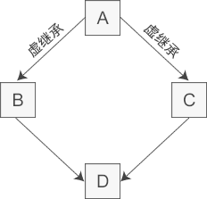

## 类继承

```cpp
// 基类
class Animal {
    // eat() 函数
    // sleep() 函数
};


//派生类
class Dog : public Animal {
    // bark() 函数
};
```

public是派生类对基类的继承类型，可以是public, protected, private中的一个，默认private.

> public:当一个类派生自公有基类时，基类的公有成员也是派生类的公有成员，基类的保护成员也是派生类的保护成员，基类的私有成员不能直接被派生类访问，但是可以通过调用基类的公有和保护成员来访问。
>
> protected: 当一个类派生自保护基类时，基类的公有和保护成员将成为派生类的保护成员。
>
> private: 当一个类派生自私有基类时，基类的公有和保护成员将成为派生类的私有成员。
>

### 3种类成员的访问权限

| 访问     | public | protected | private |
| -------- | ------ | --------- | ------- |
| 同一个类 | yes    | yes       | yes     |
| 派生类   | yes    | yes       | no      |
| 外部     | yes    | no        | no      |

### 3种派生类继承方式

| 基类成员\继承方式 | public                              | protected | private |
| ----------------- | ----------------------------------- | --------- | ------- |
| public            | public                              | protected | private |
| protected         | public                              | protected | private |
| private           | **基类的private成员在派生类不可用** | 不可用    | 不可用  |

使用`using`关键字可以改变派生类中继承的基类成员的访问类型

```cpp
//派生类Student
class Student : public People {
public:
    void learning();
public:
    using People::m_name;  //将protected改为public
    using People::m_age;  //将protected改为public
    float m_score;
private:
    using People::show;  //将public改为private
};
```

派生类不会继承基类的构造函数、析构函数、重载运算符和友元函数。

由于派生类无法访问基类的私有成员，必须通过共有的方法，因此派生类的构造函数

1. 首先创建基类对象
2. 派生类的构造函数应该通过成员初始化列表将基类信息传递给基类构造函数
3. 派生类的构造函数负责初始化派生类新增的成员

```
RatePlayer::RatePlayer(unsigned int r, const string &fn, const string &ln):TableTennisPlayer(fn,ln){
  rating = r;
}
```

如果省略成员初始化列表，将会默认调用参数为空的基类初始化函数。

派生类的对象可以通过成员运算符`.`直接访问基类的方法，只要方法不是私有的，

*继承时只要是同名函数，不管参数列表是否相同，基类的同名函数都会被隐藏。*

### 虚继承



虚继承的目的是让某个类做出声明，承诺愿意共享它的基类。其中，这个被共享的基类就称为虚基类（Virtual Base Class），本例中的 A 就是一个虚基类。在这种机制下，不论虚基类在继承体系中出现了多少次，在派生类中都只包含一份虚基类的成员。

```cpp
//间接基类A
class A{
protected:
    int m_a;
};

//直接基类B
class B: virtual public A{  //虚继承
protected:
    int m_b;
};

//直接基类C
class C: virtual public A{  //虚继承
protected:
    int m_c;
};

//派生类D
class D: public B, public C{
public:
    void seta(int a){ m_a = a; }  //正确
    void setb(int b){ m_b = b; }  //正确
    void setc(int c){ m_c = c; }  //正确
    void setd(int d){ m_d = d; }  //正确
private:
    int m_d;
};

int main(){
    D d;
    return 0;
}
```

### 重写(覆盖)和重载的区别

* 范围区别：对于类中函数的重载或者重写而言，重载发生在同一个类的内部，重写发生在不同的类之间（子类和父类之间）。
* 参数区别：重载的函数需要与原函数有相同的函数名、不同的参数列表，不关注函数的返回值类型；重写的函数的函数名、参数列表和返回值类型都需要和原函数相同，父类中被重写的函数需要有 virtual 修饰。
* virtual 关键字：重写的函数基类中必须有 virtual关键字的修饰，重载的函数可以有 virtual 关键字的修饰也可以没有。

隐藏和重写的区别：隐藏函数和被隐藏函数参数列表可以相同，也可以不同，但函数名一定相同；当参数不同时，无论基类中的函数是否被 virtual 修饰，基类函数都是被隐藏，而不是重写。

### 多继承

```cpp
// 派生类
class Rectangle: public Shape, public PaintCost{}
```

### 基类和派生类的关系

通常来讲，C++要求指针类型与赋值类型匹配，但是对继承来讲，基类的指针可以指向派生类的对象，基类的引用可以引用派生类，但是只能调用基类的方法，不能调用派生类的方法，

### 多态公有继承

C++ 多态继承意味着调用成员函数时，会根据调用函数的对象的类型来执行不同的函数。有两种方法可以实现多态：

- 在派生类中重新定义基类的方法
- 使用虚方法

在基类方法前使用`virtual`声明虚方法，此时派生类可以重新定义自己的具体的方法，如果基类没有具体的实现比如`virtual int area() = 0;`称为纯虚函数。`=0`告诉编译器没有函数主体。通常会为基类声明虚析构函数。

当类声明中包含纯虚函数时，则不能创建该类的对象，因为纯虚函数没有被实现，因此该类只能当做抽象基类被其他类继承。