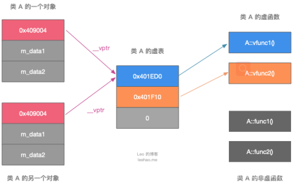
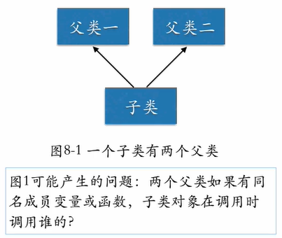

## 多态

**多态** 按字面的意思就是多种形态。当类之间存在层次结构，并且类之间是通过继承关联时，就会用到多态。

C++ 多态意味着调用成员函数时，会根据调用函数的对象的类型来执行不同的函数。

多态通过虚函数实现，子类可以重写父类的虚方法，在派生类中重新定义基类中定义的虚函数时，会告诉编译器不要静态链接到该函数。

我们想要的是在程序中任意点可以根据所调用的对象类型来选择调用的函数，这种操作被称为**动态链接** ，或**后期绑定** 。

> 1. 有继承关系
> 2. 子类重写父类的虚函数
> 3. 父类的指针或引用指向子类对象
>

如果子类定义了父类的同名函数(非虚函数)，这叫**覆盖**而不是重写，不属于多态，

### 虚函数

> 定义一个函数为虚函数，不代表函数为不被实现的函数。
> 定义他为虚函数是为了允许用基类的指针来调用子类的这个函数。
> 定义一个函数为纯虚函数，才代表函数没有被实现。
> 定义纯虚函数是为了实现一个接口，起到一个规范的作用，规范继承这个类的程序员必须实现这个函数。
>
> 虚就虚在所谓"推迟联编"或者"动态联编"上，一个类函数的调用并不是在编译时刻被确定的，而是在运行时刻被确定的。由于编写代码的时候并不能确定被调用的是基类的函数还是哪个派生类的函数，所以被成为"虚"函数。
>

如果使用对象的引用或指针来调用虚方法，程序将使用为对象类型定义的方法，而不是根据引用类型或是指针类型调用虚方法，因为基类的指针可以指向派生类。

**构造函数：** 构造函数不能是虚函数，创建派生类对象时，派生类构造函数会自动调用基类的构造函数，因此派生类的构造函数不会继承基类的构造函数，所以定义虚构造函数没有什么意义。另一种解释，使用基类的指针指向派生类对象，在创建派生类对象时已经调用派生类的构造函数了，所以，构造函数不需要是虚函数。

**析构函数：** 应该为基类定义虚析构函数，考虑一下情况，Employee是Singer的基类。需要在delete时调用基类和派生类的析构函数。

```cpp
Employee *pe = new Singer;
...
delete pe;

```

如果使用默认的静态联编，delete将调用Employee的析构函数，此时只能释放Singer中基类部分成员的内存，但不会释放派生类成员的内存，但如果基类是虚析构函数，则上述代码会先调用\~Singer()，再调用\~Employee()。

因此，即使基类不需要析构函数也应该定义空的虚析构函数。

#### 虚函数表

为了实现多态，C++使用了动态绑定技术，核心是虚函数表。

每个包含虚函数的类都有一个虚函数表，虚函数表是类共有的，对象的头部会包含一个(或多个)指向虚函数表的指针。

先看一下虚函数表的结构。虚函数表是一个函数指针的数组，其中只包含虚函数的指针，普通函数的调用不需要经过虚表。

```cpp
class A {
public:
    virtual void vfunc1();
    virtual void vfunc2();
    void func1();
    void func2();
private:
    int m_data1, m_data2;
};
```



派生类会继承基类的函数调用权，因此如果基类包含虚函数表，派生类也会有自己的虚函数表。

**利用虚表和虚表指针实现动态绑定**

```cpp
class A {
public:
    virtual void vfunc1();
    virtual void vfunc2();
    void func1();
    void func2();
private:
    int m_data1, m_data2;
};

class B : public A {
public:
    virtual void vfunc1();
    void func1();
private:
    int m_data3;
};

class C: public B {
public:
    virtual void vfunc2();
    void func2();
private:
    int m_data1, m_data4;
};
```


虚函数虽然是动态绑定，但是默认参数是静态绑定的，所以默认参数的使用需要看指针或者应用本身的类型，而不是对象的类型！

**多继承**


1. 对于多继承的派生类的对象，其不但继承了基类的对象，也继承了基类的虚函数表指针；
2. 派生类继承多个基类，派生类的对象模型其实就相当于将基类的对象模型继承下来了，只不过对于派生类独有的虚函数，那么他的虚函数指针将会按顺序存放在第一个虚表中最后的位置。
3. 最后再加上派生类自己成员

#### 虚函数表指针

C++中，一个类存在虚函数，那么编译器就会为这个类生成一个虚函数表，在虚函数表里存放的是这个类所有虚函数的地址。当生成类对象的时候，编译器会自动的将类对象的前四个字节设置为虚表的地址，而这四个字节就可以看作是一个指向虚函数表的指针。虚函数表可以看做一个函数指针数组。

C++的编译器应该是保证虚函数表的指针存在于对象实例中最前面的位置， 这意味着我们通过对象实例的地址得到这张虚函数表，然后就可以遍历其中函数指针，并调用相应的函数。

数函数表在声明类的时候就建立了，如果继承了多个父代，还会有多个虚函数表。

### 多继承下的虚函数表

#### 派生类中虚函数表的实现：

1. 先将基类中的虚表内容拷贝一份到派生类虚表中
2. 如果派生类重写了基类中某个虚函数，用派生类自己的虚函数替换虚表中基类的虚函数
3. 派生类自己新增加的虚函数按其在派生类中的声明次序增加到派生类虚表的最后

#### 对于多继承，没有虚函数覆盖的情况

继承几个父类就有几个虚函数表；

1. 每个父类都有自己的虚函数表。
2. 子类的成员函数被放到第一个父类的表中，


多个父类中有同名的函数，子类对象在调用时按照继承顺序调用第一个的。

#### 有虚函数覆盖

在有虚函数覆盖的情况下，每个父类的虚函数都会被替换成子类的虚函数指针，这样我们可以用任意父类指针指向子类。


对于多继承，可以两个父类会有同名函数



如果两个父类有同名函数，此时不能直接调用，需要指定作用域C.A::fun()

**菱形继承**

祖先类中的成员可能在子类出现两次。


为了避免祖先成员出现两次，我们使用虚继承：

1. 两个父类在继承时加 virtual public
2. 孙子类在构造时先调用祖先类的构造函数，再继承两个父类中拓展的成员。

### 纯虚函数

纯虚函数是在基类中声明的虚函数，它在基类中没有定义，但要求任何派生类都要定义自己的实现方法。在基类中实现纯虚函数的方法是在函数原型后加 **=0**

```
virtual void funtion1()=0
```

### 抽象类

**（1）抽象类的定义：** 称带有纯虚函数的类为抽象类。

**（2）抽象类的作用：** 抽象类的主要作用是将有关的操作作为结果接口组织在一个继承层次结构中，由它来为派生类提供一个公共的根，派生类将具体实现在其基类中作为接口的操作。所以派生类实际上刻画了一组子类的操作接口的通用语义，这些语义也传给子类，子类可以具体实现这些语义，也可以再将这些语义传给自己的子类。

**（3）使用抽象类时注意：**

抽象类只能作为基类来使用，其纯虚函数的实现由派生类给出。如果派生类中没有重新定义纯虚函数，而只是继承基类的纯虚函数，则这个派生类仍然还是一个抽象类。如果派生类中给出了基类纯虚函数的实现，则该派生类就不再是抽象类了，它是一个可以建立对象的具体的类。
抽象类是不能定义对象的。

但以下几种函数不能声明为虚函数：

* 静态成员函数：因为静态成员函数不属于某一个对象，所以将它声明为虚函数是没有意义的；
* 内联函数：因为内联函数的执行代码是确定的，与运行时多态相违背；
* 构造函数：因为构造函数是在对象创建时调用并完成对象的初始化，此时对象还没完全建立，因此语法上限制将构造函数声明为虚函数，但析构函数常常声明为虚函数。

### 构造函数中调用虚函数

可以。不过调用会屏蔽多态机制，最终会把基类中的该虚函数作为普通函数调用，而不会调用派生类中的被重写的函数。

这是因为在定义子类对象的时候，会先调用父类的构造函数，而此时虚函数表以及子类函数还没有被初始化，为了避免调用到未初始化的内存，C++标准规范中规定了在这种情况下，即在构造子类时调用父类的构造函数，而父类的构造函数中又调用了虚成员函数，这个虚成员函数即使被子类重写，也不允许发生多态的行为。所以使用的是静态绑定，调用了父类的函数。

简单的说**虚机制在构造函数中不起作用**