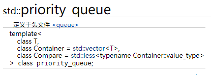

## map映射容器

map中存储的是pair对象。

在使用 map 容器存储多个键值对时，该容器会自动根据各键值对的键的大小，按照既定的规则进行排序。默认情况下，map 容器选用`std::less<T>`排序规则（其中 T 表示键的数据类型），其会根据键的大小对所有键值对做升序排序。

map有移动构造函数，所以可以使用返回临时对象的函数

```cpp
#创建一个会返回临时 map 对象的函数
std::map<std::string,int> disMap() {
    std::map<std::string, int>tempMap{ {"C语言教程",10},{"STL教程",20} };
    return tempMap;
}
//调用 map 类模板的移动构造函数创建 newMap 容器
std::map<std::string, int>newMap(disMap());
std::map<std::string, int>myMap{ {"C语言教程",10},{"STL教程",20} };
std::map<std::string, int>newMap(++myMap.begin(), myMap.end());
// 可以手动修改排序规则
std::map<std::string, int, std::greater<std::string> >myMap;
```

### map迭代器

map对应的是双向迭代器，这意味着它不支持随机访问。

遍历方法和其它容器相似，只不过map中的元素是pair类型

```cpp
 //调用 begin()/end() 组合，遍历 map 容器
    for (auto iter = myMap.begin(); iter != myMap.end(); ++iter) {
        cout << iter->first << " " << iter->second << endl;
    }
```

### 获取对应键的值

当然，map最大的作用是查找指定键的值，find() 成员方法，它能帮我们查找指定 key 值的键值对，如果成功找到，则返回一个指向该键值对的双向迭代器；反之，其功能和 end() 方法相同。

另外，map对运算符`[]`进行了重载，这意味着，类似于借助数组下标可以直接访问数组中元素，通过指定的键，我们可以轻松获取 map 容器中该键对应的值。

另外，如果指定键不存在，则返回数据类型的默认值。

可以通过`[]`向map中添加新元素，前提是key不存在。

与`[]`类似，`at()`也可以根据key获取value，但是如果key不存在，at()会抛出异常。

### 插入数据

1. 使用`[]`运算符插入
2. 使用`insert()`方法，返回迭代器和bool值，迭代器指向插入元素，bool表示是否插入成功。

```cpp
    //创建一个空 map 容器
    std::map<string, string> mymap;
   
    //创建一个真实存在的键值对变量
    std::pair<string, string> STL = { "STL教程","http://c.biancheng.net/stl/" };
   
    //创建一个接收 insert() 方法返回值的 pair 对象
    std::pair<std::map<string, string>::iterator, bool> ret;
   
    //插入 STL，由于 STL 并不是临时变量，因此会以第一种方式传参
    ret = mymap.insert(STL);
    cout << "ret.iter = <{" << ret.first->first << ", " << ret.first->second << "}, " << ret.second << ">" << endl;
    //以右值引用的方式传递临时的键值对变量
    ret = mymap.insert({ "C语言教程","http://c.biancheng.net/c/" });
    cout << "ret.iter = <{" << ret.first->first << ", " << ret.first->second << "}, " << ret.second << ">" << endl;
    //插入失败样例
    ret = mymap.insert({ "STL教程","http://c.biancheng.net/java/" });
    cout << "ret.iter = <{" << ret.first->first << ", " << ret.first->second << "}, " << ret.second << ">" << endl;
```

其中insert还支持同时插入多个键值对，而且insert效率更高。

3. map还支持emplace()和emplace_hint()

emplace接受两个参数，分别是key和value，没有别的用法，效率比insert更高。

### 自定义排序规则

```cpp
struct cmpByStringLength {
    bool operator()(const std::string& a, const std::string& b) const {
        return a.length() < b.length();
    }
};

// ...
std::map<std::string, std::string, cmpByStringLength> myMap;


// 还有种方式
auto comp = [](const string& a, const string& b) { return a.length() < b.length(); };
map<string, string, decltype(comp)> my_map(comp);

```

==为什么不能直接传一个bool函数??==

因为模板定义接收一个类对象而不是函数类型

