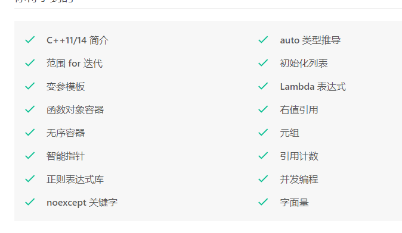

## 

## C++11新特性

### C++11语法糖

#### 可变参数模板

### 匿名函数

就是没有函数名，增加了一个获取外部变量的标记

```cpp
[capture list] (parameter list) -> return type
{
   function body;
};
```

["7.1 lambda函数"](siyuan://blocks/20210319101933-ll4iawd)

### 类型推导

#### auto类型推导

**auto不可用的情形**

* 不能用于类内的成员变量，因为非静态成员只有在对象初始化时才会创建，但是静态成员不能在类内部直接初始化，除非是静态常量成员，才允许在类内初始化。

```cpp
class Test{
    auto v1 = 0; //error  只有对象创建时才存在
    static auto v2 = 0;  // error 静态成员不允许在类内直接初始化
    static const auto v3 = 10;  // ok 静态常量可以在类内直接初始化
}
```

* 不能用于数组类型的推导
* 不能用于模板类型的自动推导

```cpp
template <typename T>
struct Test{}

int func()
{
    Test<double> t;
    Test<auto> t1 = t;           // error, 无法推导出模板类型
    return 0;
}
```

#### decltype类型推导

```cpp
int a = 10;
decltype(a) b = 99;                 // b -> int
decltype(a+3.14) c = 52.13;         // c -> double
decltype(a+b*c) d = 520.1314;       // d -> double
```

### 实例化一个对象的过程

1. 分配空间
   创建类对象首先要为该对象分配内存空间。不同的对象，为其分配空间的时机未必相同。全局对象、静态对象、分配在栈区域内的对象，在编译阶段进行内存分配；存储在堆空间的对象，是在运行阶段进行内存分配。
2. 初始化
   首先明确一点：初始化不同于赋值。初始化发生在赋值之前，初始化随对象的创建而进行，而赋值是在对象创建好后，为其赋上相应的值。这一点可以联想下上一个问题中提到：初始化列表先于构造函数体内的代码执行，初始化列表执行的是数据成员的初始化过程，这个可以从成员对象的构造函数被调用看的出来。
3. 赋值
   对象初始化完成后，可以对其进行赋值。对于一个类的对象，其成员变量的赋值过程发生在类的构造函数的函数体中。当执行完该函数体，也就意味着类对象的实例化过程完成了。（总结：构造函数实现了对象的初始化和赋值两个过程，对象的初始化是通过初始化列表来完成，而对象的赋值则才是通过构造函数的函数体来实现。）

### 构造函数初始化列表

```cpp
class CMyClass {
    CMyClass(int x, int y);
    int m_x;
    int m_y;
};

CMyClass::CMyClass(int x, int y) : m_y(y), m_x(m_y){}
```

**为什么用成员初始化列表会快一些？**
用户自定义类型如果使用类初始化列表，直接调用该成员变量对应的构造函数即完成初始化；如果在构造函数中初始化，因为 C++ 规定，*对象的成员变量的初始化动作发生在进入构造函数本体之前*，那么在执行构造函数的函数体之前首先调用默认的构造函数为成员变量设初值，在进入函数体之后，调用该成员变量对应的构造函数。因此，使用列表初始化会减少调用默认的构造函数的过程，效率高。<br />

类对象的初始化顺序：基类构造函数–>派生类成员变量的构造函数–>自身构造函数

而如果使用初始化列表，在进入自身构造函数前就可以用参数初始化变量的构造函数。

**必须使用初始化列表的情况：**

1. 需要初始化的成员变量是对象，而类没有默认构造函数。(本来对象是用默认构造函数初始化，然后再用=运算符赋值。
2. 初始化常量类成员或是引用类成员。
3. 子类初始化父类的私有成员，需要在初始化列表里显示调用父类的构造函数。

### 统一的列表初始化

> 所有的内置类型和自定义的类都可以用大括号初始化
>

```cpp
int x = {5};
double y {1.23};
Stump s1(1,2);
Stump s1 {1,2};  //创建对象也可以用列表调用构造函数
```

列表初始化可以避免缩窄，比如不允许将 `int a {3}`

`initializer_list`作为构造函数的参数，则初始化列表方法会自动调用该构造函数，传入的initializer_list提供begin和end两个方法，依赖这个特性，我们可以用列表初始化`vector`这种容器

```cpp
vector<int> v1(10);  // uninitialized vector with 10 elements
vector<int> v2{10,2};  // initialized v2 has 2 elements with 10 ,2
```

### 强制类型转换

* static_cast：用于数据的强制类型转换，强制将一种数据类型转换为另一种数据类型。
  * 用于基本数据类型的转换。
  * 用于类层次之间的基类和派生类之间 指针或者引用 的转换（不要求必须包含虚函数，但必须是有相互联系的类），进行上行转换（派生类的指针或引用转换成基类表示）是安全的；进行下行转换（基类的指针或引用转换成派生类表示）由于没有动态类型检查，所以是不安全的，最好用 dynamic_cast 进行下行转
  * 可以将空指针转化成目标类型的空指针。
  * 可以将任何类型的表达式转化成 void 类型。
* const_cast：强制去掉常量属性，**不能用于去掉变量的常量性**，只能用于去除指针或引用的常量性，将常量指针转化为非常量指针或者将常量引用转化为非常量引用（注意：表达式的类型和要转化的类型是相同的）。
* reinterpret_cast：改变指针或引用的类型、将指针或引用转换为一个足够长度的整型、将整型转化为指针或引用类型。
* dynamic_cast：
  * 其他三种都是编译时完成的，动态类型转换是在程序运行时处理的，运行时会进行类型检查。
  * 只能用于带有**虚函数的基类或派生类的指针或者引用对**象的转换，转换成功返回指向类型的指针或引用，转换失败返回 NULL；不能用于基本数据类型的转换。
  * 在向上进行转换时，即派生类类的指针转换成基类类的指针和 static_cast 效果是一样的，（注意：这里只是改变了指针的类型，指针指向的对象的类型并未发生改变）。

### 新的声明​

* auto: 自动类型推断
* decltype: 将变量的类型声明为表达式的类型

```cpp
int x;
decltype(x) y;  // y的类型和x相同
```

* 允许返回类型后置，以使用decltype推断返回值类型，【不常用】
* 模板别名
  之前创建别名用typedef

之前创建别名用typedef

```cpp
typedef long long int ll;
//C++11中新的方法
using ll=long long int;
// 新的别名可以用来部分模板的部分具体化，比如
template<typename T>
using arr12 = std::array<T,12>;
// 此时下面两种声明等价
array<double,12> a1;arr12<double> a2;
```

* nullptr 空指针
  之前用0表示空指针，nullptr提供了更安全的类型

之前用0表示空指针，nullptr提供了更安全的类型

### 枚举类

传统的枚举方式，在同一个作用域内的两个枚举成员不能同名，新的枚举方式通过显示限定，避免名称冲突

```cpp
enum Old1 {yes,no,maybe};
enum class New1 {never, somtimes};
enum struct New2 {never, lever};
cout << New1::never << New2::never;
```

### 类相关的新特性

* explicit  (明确的)
  不允许单个参数的构造函数引起的*隐式类型转换*
  C++11中扩展了explicit的功能，可以使用在转换函数
  ```cpp
  class Plebe{
  	operator int() const;
  	explicit double() const
  };
  ```

### 可变参数模板

能表示0到任意个数、任意类型的参数。

```cpp
template <typename... T>
void fun(T... args);
cout << sizeof...(args) << endl; //sizeof...打印变参的个数
```

递归方式展开参数包。

```cpp
//递归终止函数
void print() {
   cout << "empty" << endl;
}
//展开函数
template <class T, class ...Args>
void print(T head, Args... rest) {
   cout << "parameter " << head << endl;
   print(rest...);
}
```

逗号表达式展开参数包：

### STL方面

* 基于范围的for循环
  对于数组、带有begin() end()的类和STL容器，可以使用基于范围的for循环
* 摒弃了`export`

### Thread

### functional

新的头文件`#include<functional>`，其中有`std::function`函数模板类和`std::bind`函数模板。

C++中的可调用对象有

* 一个函数指针，参考 C++ 函数指针和函数类型；
* 一个具有operator()成员函数的类的对象；
* 可被转换成函数指针的类对象；
* 一个类成员函数指针；

不同的可调用对象可能有相同的操作形式，而函数模板类各种调用对象的操作。

```cpp
// 普通函数
int add(int a, int b){return a+b;} 

// lambda表达式
auto mod = [](int a, int b){ return a % b;}

// 函数对象类
struct divide{
    int operator()(int denominator, int divisor){
        return denominator/divisor;
    }
};
std::function<int(int ,int)>  a = add; 
std::function<int(int ,int)>  b = mod ; 
std::function<int(int ,int)>  c = divide(); 
```

`std::function`可以取代函数指针的作用，因为它可以延迟函数的执行，特别适合作为回调函数使用。它比普通函数指针更加的灵活和便利。

可将`std::bind`函数看作一个通用的函数适配器，它接受一个可调用对象，生成一个新的可调用对象来“适应”原对象的参数列表。

std::bind主要有以下两个作用：

* 将可调用对象和其参数绑定成一个仿函数；
* 只绑定部分参数，减少可调用对象传入的参数。

```cpp
double my_divide (double x, double y) {return x/y;}
auto fn_half = std::bind (my_divide,_1,2);  
std::cout << fn_half(10) << '\n';                        // 5
```

### 类型萃取

类型萃取使用模板技术来萃取类型（包含自定义类型和内置类型）的某些特性，用以判断该类型是否含有某些特性，从而在泛型算法中来对该类型进行特殊的处理用来提高效率或者其他。

### 新的类功能

* 继承构造函数
  派生类可以使用using使用基类的成员函数，包括构造函数
* 管理虚方法
  * 派生类使用`override`在参数列表后表示这是要覆盖一个虚函数，如果没有虚函数被覆盖，将会报错
  * `final`放在参数列表后表示这个虚方法不能被覆盖。
*

## C++14新特性

## C++17新特性

### C++11/14/17 常用的语言特性和类库

* 统一的类成员初始化语法与 std::initializer_list
* 注解标签（attributes）
* final/override/=default/=delete 语法
* auto 关键字
* Range-based 循环语法
* 结构化绑定
* stl 容器新增的实用方法
* std::thread
* 线程局部存储 thread_local
* 线程同步原语 std::mutex、std::condition_variable 等
* 原子操作类
* 智能指针类
* std::bind/std::function

**《深入理解 C++11：C++11 新特性解析与应用》**1

https://zhuanlan.zhihu.com/p/75347892