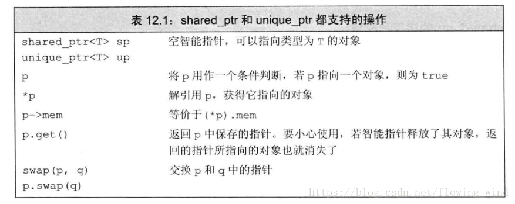
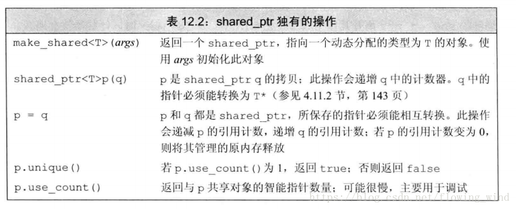

> 在 C++ 中没有垃圾回收机制，必须自己释放分配的内存，否则就会造成内存泄露。解决这个问题最有效的方法是使用智能指针（smart pointer）。`智能指针是存储指向动态分配（堆）对象指针的类，用于生存期的控制，能够确保在离开指针所在作用域时，自动地销毁动态分配的对象，防止内存泄露。智能指针的核心实现技术是引用计数，每使用它一次，内部引用计数加1，每析构一次内部的引用计数减1，减为0时，删除所指向的堆内存。`
>

在使用`new`从堆(自由存储区)分配内存后，等到不在使用时，智能指针可以自动分配内存，C++11有三种智能指针

| 指针类别     | 支持   | 备注                                  |
| ------------ | ------ | ------------------------------------- |
| `unique_ptr` | C++ 11 | 拥有独有对象所有权语义的智能指针      |
| `shared_ptr` | C++ 11 | 拥有共享对象所有权语义的智能指针      |
| `weak_ptr`   | C++ 11 | 到 std::shared_ptr 所管理对象的弱引用 |

weak_ptr到shared_ptr所管理对象的弱引用，不会引起智能指针引用计数器的增加。

> **比如下图这种情况：对象1和对象2都由智能指针管理，对象1的智能指针成员指向对象2，对象2的智能指针成员指向对象1。**
>

> **那么，在离开对象1和对象2的作用域时，对象1和对象2的引用是没有了，但是对象的智能指针成员还是互相引用着，这样就造成了**循环引用**，导致资源无法释放。**
>

循环引用

> **上面循环引用问题的解决办法就是使用 weak_ptr，weak_ptr是一种弱引用（与 shared_ptr对比而言），弱引用不会引起智能指针的引用计数增加。**
>

`std::unique_ptr`是独占类型的智能指针，不允许其他智能指针共享。

```cpp
// 通过构造函数初始化对象
unique_ptr<int> ptr1(new int(10));
// error, 不允许将一个unique_ptr赋值给另一个unique_ptr
unique_ptr<int> ptr2 = ptr1;
```

std::unique_ptr 是通过指针占有并管理另一对象，并在 unique_ptr 离开作用域时释放该对象的智能指针。在下列两者之一发生时用关联的删除器释放对象：

* 销毁了管理的 unique_ptr 对象，比如作用域外
* 通过 operator= 或 reset() 赋值另一指针给管理的 unique_ptr 对象。

`shared_ptr` 是通过指针保持对象共享所有权的智能指针。多个 shared_ptr 对象可占有同一对象。下列情况之一出现时销毁对象并解分配其内存：

* 最后剩下的占有对象的 shared_ptr 被销毁；
* 最后剩下的占有对象的 shared_ptr 被通过 operator= 或 reset() 赋值为另一指针。

```cpp
unique_ptr p = std::make_unique<int>();
```

智能指针的使用类似于常规指针，但是可以自动释放所指向的对象，在\<memory>中定义了两种智能指针，

* shared_ptr: 允许多个指针指向同一个对象，可以如下定义`shared_ptr<string> p1`
* unique_ptr: 独占所指向的对象。





最安全的分配动态内存的方法就是使用`make_shared`函数，在动态内存中分配一个对象并初始化它，返回指向此对象的shared_ptr，可以代替new操作，不需要手动delete

```cpp
shared_ptr<int> p3 = make_shared<int>(42);
shared_ptr<string> p4 = make_shared<string>(10,'9');
shared_ptr<int> p5 = make_shared<int>();
```

当进行拷贝和赋值时，每个shared_ptr都会记录有多少个其他shared_ptr指向相同的对象。

```cpp
auto p = make_shared<int>(42);
auto q(p);
```

我们可以认为每个shared_ptr都有一个关联的计数器，通常称其为引用计数，无论何时我们拷贝一个shared_ptr，计数器都会递增。当我们给shared_ptr赋予一个新值或是shared_ptr被销毁（例如一个局部的shared_ptr离开其作用域）时，计数器就会递减，一旦一个shared_ptr的计数器变为0,它就会自动释放自己所管理的对象。

## 智能指针的原理与实现

智能指针类将一个计数器与类指向的对象相关联，引用计数跟踪该类有多少个对象共享同一指针。
每次创建类的新对象时，初始化指针并将引用计数置为1；
当对象作为另一对象的副本而创建时，拷贝构造函数拷贝指针并增加与之相应的引用计数；
对一个对象进行赋值时，赋值操作符减少左操作数所指对象的引用计数（如果引用计数为减至0，则删除对象），并增加右操作数所指对象的引用计数；
调用析构函数时，构造函数减少引用计数（如果引用计数减至0，则删除基础对象）。

### 实现

```cpp
template<typename T>
class SmartPointer {
private:
    T* _ptr;
    size_t* _count;
public:
    SmartPointer(T* ptr = nullptr) :
            _ptr(ptr) {
        if (_ptr) {
            _count = new size_t(1);
        } else {
            _count = new size_t(0);
        }
    }

    SmartPointer(const SmartPointer & ptr) {  //拷贝构造函数
        if (this != &ptr) {
            this->_ptr = ptr._ptr;
            this->_count = ptr._count;
            (*this->_count)++;
        }
    }

    SmartPointer& operator=(const SmartPointer& ptr) {  // 重载赋值运算符
        // 赋值运算符总应该返回this，以保证连续赋值 a=b=c;
        if (this->_ptr == ptr._ptr) {
            return *this;
        }

        if (this->_ptr) {   // 当前指针被覆盖，可能需要删除
            (*this->_count)--;
            if (this->_count == 0) {
                delete this->_ptr;
                delete this->_count;
            }
        }

        this->_ptr = ptr._ptr;
        this->_count = ptr._count;
        (*this->_count)++;
        return *this;
    }

    T& operator*() {  // 返回指针指向值的引用
        assert(this->_ptr == nullptr);
        return *(this->_ptr);

    }

    T* operator->() {  // 返回地址
        assert(this->_ptr != nullptr);  
        return this->_ptr;
    }

    ~SmartPointer() {
        (*this->_count)--;
        if (*this->_count < 0) {
            delete this->_ptr;
            delete this->_count;
        }
    }

    size_t use_count(){
        return *this->_count;
    }
};
```

**使用智能指针类**

```cpp
int main() {
    {
        SmartPointer<int> sp(new int(10));
        SmartPointer<int> sp2(sp);
        SmartPointer<int> sp3(new int(20));
        sp2 = sp3;
        std::cout << sp.use_count() << std::endl;
        std::cout << sp3.use_count() << std::endl;
    }
    //delete operator
}
```