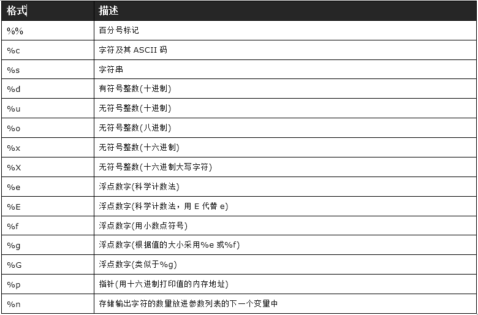
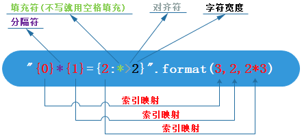

### Python字符串格式化

Python中字符串一般有两种格式化方式，一是用`%`占位符，在python2中比较普遍，另一种是用`format`函数。

#### %占位符

```python
age = 29
print("my age is %d" %age)
```



#### format方法

不需要记住占位符，使用`{}`占位。可以根据序号和别名匹配。

```python
print("{server}{1}:{0}".format(8888,'192.168.1.100',server='Web Server Info :'))
#Web Server Info :192.168.1.100:8888
```

传入的可以是元组

```python
print("{0[0]}.{0[1]}".format(('baidu','com')))
#baidu.com　
```

可以做对齐和填充。

