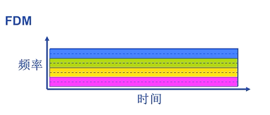

## 计算机网络

计算机网络：自治，互联的计算机集合。

### 分组交换

端系统之间交换的信息称为**报文**(message)，通常将长报文划分成较小的数据块，称为**分组**(packet)，分组以链路的最大传输速率到目的端。

**统计多路复用**

一般来讲分组交换比报文交换更好，因为分组交换多个节点之间是并行的，而报文交换必须收到整个报文之后才能继续向后转发，是串行的。

##### 存储转发

交换机在传输该分组的第一个bit之前必须接收到全部分组。

### 电路交换

电路交换一般不会共享，是独占的。

和分组交换不同，电路交换预留一部分传输资源，通过频分复用或时分复用实现共享。

频分复用：
每个用户占用不同的频率

时分复用：时间被划分为固定的时间帧，每个帧又被划分为时隙，每个用户占用不同的时隙

### 比较分组交换和电路交换

### 协议分层

| 分层       | 作用                                                | 协议                                                |
| ---------- | --------------------------------------------------- | --------------------------------------------------- |
| 物理层     | 通过媒介传输比特，确定机械及电气规范（比特 Bit）    | RJ45、CLOCK、IEEE802.3（中继器，集线器）            |
| 数据链路层 | 将比特组装成帧和点到点的传递（帧 Frame）            | PPP、FR、HDLC、VLAN、MAC（网桥，交换机）            |
| 网络层     | 负责数据包从源到宿的传递和网际互连（包 Packet）     | IP、ICMP、ARP、RARP、OSPF、IPX、RIP、IGRP（路由器） |
| 运输层     | 提供端到端的可靠报文传递和错误恢复（ 段Segment）    | TCP、UDP、SPX                                       |
| 会话层     | 建立、管理和终止会话（会话协议数据单元 SPDU）       | NFS、SQL、NETBIOS、RPC                              |
| 表示层     | 对数据进行翻译、加密和压缩（表示协议数据单元 PPDU） | JPEG、MPEG、ASII                                    |
| 应用层     | 允许访问OSI环境的手段（应用协议数据单元 APDU）      | FTP、DNS、Telnet、SMTP、HTTP、WWW、NFS              |

#### 

#### 应用层 ：

为特定应用程序提供数据传输服务，例如 HTTP、DNS 等/协议。数据单位为**报文**。

#### 传输层 ：

为进程提供通用数据传输服务。由于应用层协议很多，定义通用的传输层协议就可以支持不断增多的应用层协议。运输层包括两种协议：传输控制协议 TCP，提供面向连接、可靠的数据传输服务，数据单位为报文段；用户数据报协议 UDP，提供无连接、尽最大努力的数据传输服务，数据单位为用户**数据报**。TCP 主要提供完整性服务，UDP 主要提供及时性服务。

#### 网络层 ：

为主机提供数据传输服务。而传输层协议是为主机中的进程提供数据传输服务。网络层把传输层传递下来的报文段或者用户数据报封装成**分组。**路由器是网络层

#### 数据链路层 ：

网络层针对的还是主机之间的数据传输服务，而主机之间可以有很多链路，链路层协议就是为同一链路的主机提供数据传输服务。数据链路层把网络层传下来的分组**封装成帧**。交换机是链路层，负责根据MAC地址存储转发。

#### 物理层 ：

考虑的是怎样在传输媒体上传输数据**比特流**，而不是指具体的传输媒体。物理层的作用是尽可能屏蔽传输媒体和通信手段的差异，使数据链路层感觉不到这些差异。 集线器是物理层，作用域比特，负责将一个端口的数据发送到所有端口。

### HTTP状态码：

* 200 OK：表明请求被正常处理。
* 204 NO Content：代表服务器接收的请求已成功处理，但在返回的报文中不包含实体的主体部分。
* 206 Partial Content：表明客户端进行了范围请求，而服务器成功执行了这部分的GET请求。
* 301 Moved Permanetly：永久重定向，请求的资源已经分配了新的URI，以后使用资源现在所指的URI。
* 302 Found：临时重定向，请求的资源已经分配了新的URI，希望用户能使用新的URI。
* 303 See Other：与302状态码有相似功能，只是它希望客户端在请求一个URI的时候，能通过GET方法重定向到另一个URI上。
* 304 Not Modified：发送附带条件的请求时，条件不满足时返回，与重定向无关
* 307 Temporary Redirect：临时重定向，与302类似，只是强制要求使用POST方法。
* 400 Bad Request：请求报文语法有误，服务器无法识别。
* 401 Unauthorized：请求需要认证。
* 403 Forbidden：请求的对应资源禁止被访问。
* 404 Not Found：服务器无法找到对应资源。
* 500 Internal Server Error：服务器内部错误。
* 503 Service Unavailable：服务器正超负载或者停机维护，无法处理请求。