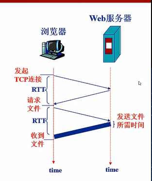
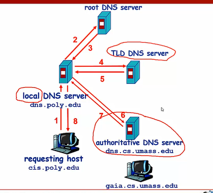

## 应用层

### 应用层的协议原理

| 应用       | 应用层协议       | 支持的传输层协议 |
| ---------- | ---------------- | ---------------- |
| 电子邮件   | SMTP             | TCP              |
| 远程终端   | Telnet           | TCP              |
| Web        | HTTP             | TCP              |
|            | TFTP             | UDP              |
| 文件传输   | FTP              | TCP              |
| 流式多媒体 | HTTP（bilibili） | TCP              |
| 网络电话   | SIP              | UDP或TCP         |

### Web和HTTP

URL: uniform resoure locator  统一资源定位器  Scheme://host:port:path

HTTP: 超文本传输协议，用来请求web对象，HTTP是**无状态的协议**，只会根据请求发送相应而不会存储客户端的任何信息。HTTP基于的TCP是全双工的，可以互相发连接。

HTTP响应报文通过空行分隔header和body


#### 非持续连接：

客户端请求一个URL的过程：

1. 客户向端口80发起TCP连接，在客户端与服务器分别有一个socket与该连关联
2. 客户端经由它的socket向服务端发送HTTP请求报文
3. 服务端的套接字接受报文请求，在响应中封装并返回对象
4. 服务器通知TCP断开连接，客户端收到完整的返回对象后中断TCP连接
5. 客户端接受文件后，解析文件，对其它对象重复发送请求

定义往返时间Round Trip Time(RTT)



#### 持续连接：

持续连接使用单个TCP连接传输多个对象，客户端Socket可以一个接一个的发出对象请求而不必等待回答。

#### Cookie

为了记录用户信息，提供与用户身份相关的内容，引入了cookie.服务端返回内容时会在响应报文的head中增加一个set-cookie字段，得到cookie后客户端在请求时会将cookie放到请求报文头。

#### Web缓存

session是会话。

缓存器工作流程：

- 浏览器建立到缓存器的TCP连接
- Web检查本地是否存在要求对象的缓存
- 不存在就向源服务器请求
- 源服务器返回对象后在本地存储一个副本，并返回给浏览器

那么问题就是怎么判断缓存器当前的本地副本是最新的，这和搜索引擎的爬虫有些类似，但缓存器的解决更加简单

1. 缓存器在向源服务器请求时，返回的head带有`Last-Modified`字段，表示最后修改时间
2. 缓存器想要检查自己的内容有没有过期，可以发送一个条件get，带有`If-Modified-Since`，
3. 如果内容没有改变，源服务器返回状态码304 Not Modified，

### FTP

### DNS

Domain Name System

由分层的DNS服务器实现的分布式数据库，是一个使得主机能够查询分布式数据库的应用层协议，使用UDP协议。

分层的设计大致有3层

- 根服务器
- 定义域名服务器com, org, edu
- 权威DNS服务器，公司的服务器

一次普通的迭代查询



还有递归查询，一般不会这样，给其他服务器带来负担。

#### DNS缓存

缓存记录

{Name, Value, Type, TTL}

Type:

- A 具体的域名，例如foo.com
- NS 一个域 foo.com，值记录了该域名的权威DNS服务器的名,dns.foo.com
-

### P2P应用

没有永远在线的服务器

高度可伸缩

任意节点之间可以直接通讯

节点间间歇性接入网络

节点可能改变IP地址

### socket套接字编程

不同主机间进程使用套接字通信，由操作系统系统，上联应用进程，下接网络协议栈，是应用层与传输层之间 的接口。

Socket是一个逻辑上的概念，可以看作是网络环境中进程间通信的API。

套接字使用（IP地址:端口号）表示。

#### Sock_stream

```
使用TCP协议，提供可靠数据服务
```

#### Sock_dgram

```
使用UDP协议，使用无连接的服务
```

#### Sock_raw

```
原始套接字，不仅内核处理
```

要通过互联网进行通信，至少需要一对套接字，其中一个运行于客户端，我们称之为 Client Socket，另一个运行于服务器端，我们称之为 Server Socke