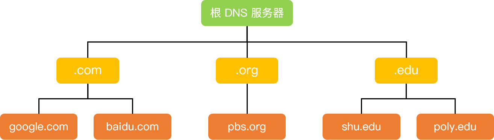
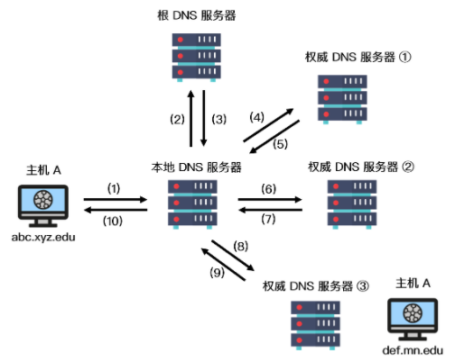

### DNS的工作流程

> **主机向本地域名服务器的查询一般是采用递归查询，而本地域名服务器向根域名的查询一般是采用迭代查询。** 递归查询主机向本地域名发送查询请求报文，而本地域名服务器不知道该域名对应的IP地址时，本地域名会继续向根域名发送查询请求报文，不是通知主机自己向根域名发送查询请求报文。迭代查询是，本地域名服务器向根域名发出查询请求报文后，根域名不会继续向顶级域名服务器发送查询请求报文，而是通知本地域名服务器向顶级域名发送查询请求报文。
>
> 简单来说，递归查询就是，小明问了小红一个问题，小红不知道，但小红是个热心肠，小红就去问小王了，小王把答案告诉小红后，小红又去把答案告诉了小明。迭代查询就是，小明问了小红一个问题，小红也不知道，然后小红让小明去问小王，小明又去问小王了，小王把答案告诉了小明。
>

1. 在浏览器中输入www.baidu.com域名，操作系统会先检查自己本地的hosts文件是否有这个域名的映射关系，如果有，就先调用这个IP地址映射，完成域名解析。
2. 如果hosts文件中没有，则查询本地DNS解析器缓存，如果有，则完成地址解析。
3. 如果本地DNS解析器缓存中没有，则去查找本地DNS服务器，如果查到，完成解析。
4. 如果没有，则本地服务器会向根域名服务器发起查询请求。根域名服务器会告诉本地域名服务器去查询哪个顶级域名服务器。
5. 本地域名服务器向顶级域名服务器发起查询请求，顶级域名服务器会告诉本地域名服务器去查找哪个权限域名服务器。
6. 本地域名服务器向权限域名服务器发起查询请求，权限域名服务器告诉本地域名服务器www.baidu.com所对应的IP地址。
7. 本地域名服务器告诉主机www.baidu.com所对应的IP地址。

端口号53  长度超过512字节时使用TCP

 *DNS 既使用 TCP 又使用 UDP。*

当进行区域传送（主域名服务器向辅助域名服务器传送变化的那部分数据）时会使用 TCP，因为数据同步传送的数据量比一个请求和应答的数据量要多，而 TCP 允许的报文长度更长，因此为了保证数据的正确性，会使用基于可靠连接的 TCP。

当客户端向 DNS 服务器查询域名 ( 域名解析) 的时候，一般返回的内容不会超过 UDP 报文的最大长度，即 512 字节。用 UDP 传输时，不需要经过 TCP 三次握手的过程，从而大大提高了响应速度，但这要求域名解析器和域名服务器都必须自己处理超时和重传从而保证可靠性。

### Domain Name System

由分层的DNS服务器实现的分布式数据库，是一个使得主机能够查询分布式数据库的应用层协议，使用UDP协议。

分层的设计大致有3层

- 根服务器
- 定义域名服务器com, org, edu
- 权威DNS服务器，公司的服务器

一次普通的迭代查询

* **递归查询**：如果主机所询问的本地域名服务器不知道被查询域名的 IP 地址，那么本地域名服务器就以 DNS 客户端的身份，向其他根域名服务器继续发出查询请求报文，即替主机继续查询，而不是让主机自己进行下一步查询，如上图步骤（1）和（10）。
* **迭代查询：**当根域名服务器收到本地域名服务器发出的迭代查询请求报文时，要么给出所要查询的 IP 地址，要么告诉本地服务器下一步应该找哪个域名服务器进行查询，然后让本地服务器进行后续的查询，如上图步骤（2）~（9）。

还有递归查询，一般不会这样，给其他服务器带来负担。

#### DNS缓存

缓存记录

{Name, Value, Type, TTL}

Type:

- A 具体的域名，例如foo.com
- NS 一个域 foo.com，值记录了该域名的权威DNS服务器的名,dns.foo.com
-