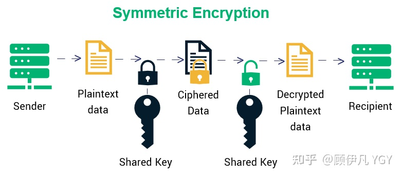
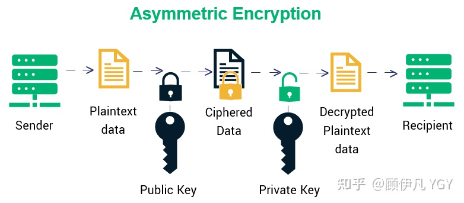
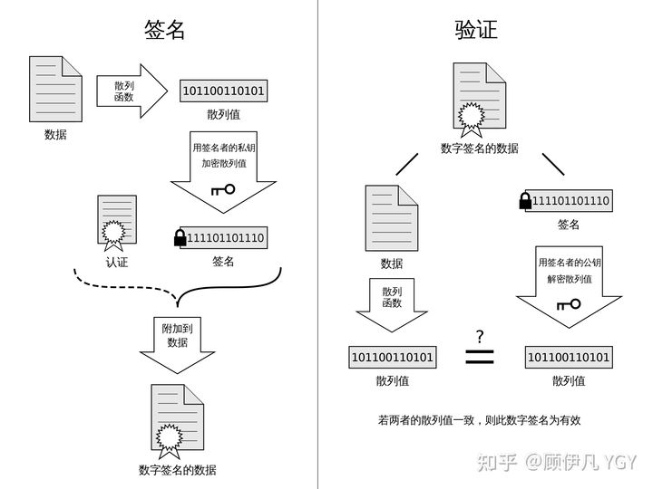

HTTPS 并不是新协议，而是让 HTTP 先和 SSL（Secure Sockets Layer）通信，再由 SSL 和 TCP 通信，也就是说 HTTPS 使用了隧道进行通信。

## 动机

HTTP是明文传输的，中间可能被窃听和修改，而非对称加密计算代价比较大，**对称加密**比较合适。

但对称加密需要一个共享的密钥，这个密钥需要用**非对称加密**的方法传输。

服务器有自己的公钥和私钥，客户端需要用服务器的公钥加密消息，然后服务器用自己的私钥解密，但是客户端怎么能知道服务器的公钥呢?

为了避免中间人的攻击，我们需要一套机制来安全的传输服务器的公钥，这就是**证书**。

网站在使用HTTPS前，需要向CA机构申领一份数字证书，数字证书里含有证书持有者信息、公钥信息等。服务器把证书传输给浏览器，浏览器从证书里获取公钥就行了，证书就如身份证，证明“该公钥对应该网站”。而这里又有一个显而易见的问题，“证书本身的传输过程中，如何防止被篡改”？证书使用数字签名来防止被篡改。

*数字签名的制作和验证过程*

**数字签名的制作过程：**

1. CA机构拥有非对称加密的私钥和公钥。
2. CA机构对证书明文数据T进行hash。
3. 对hash后的值用私钥加密，得到数字签名S。

## HTTPS 流程

① 客户端发起一个 HTTPS 请求，并连接到服务器的 443 端口，发送的信息主要包括自身所支持的算法列表和密钥长度等；

② 服务端将自身所支持的所有加密算法与客户端的算法列表进行对比并选择一种支持的加密算法，然后将它和其它密钥组件一同发送给客户端。

③ 服务器向客户端发送一个包含数字证书的报文，该数字证书中包含证书的颁发机构、过期时间、服务端的公钥等信息。

④ 最后服务端发送一个完成报文通知客户端 SSL 的第一阶段已经协商完成。

⑤ SSL 第一次协商完成后，客户端发送一个回应报文，报文中包含一个客户端生成的随机密码串，称为 pre_master_secre，并且该报文是经过证书中的公钥加密过的。

⑥ 紧接着客户端会发送一个报文提示服务端在此之后的报文是采用pre_master_secre 加密的。

⑦ 客户端向服务端发送一个 finish 报文，这次握手中包含第一次握手至今所有报文的整体校验值，最终协商是否完成取决于服务端能否成功解密。

⑧ 服务端同样发送与第 ⑥ 步中相同作用的报文，已让客户端进行确认，最后发送 finish 报文告诉客户端自己能够正确解密报文。

当服务端和客户端的 finish 报文交换完成之后，SSL 连接就算建立完成了，之后就进行和 HTTP 相同的通信过程，唯一不同的是在 HTTP 通信过程中并不是采用明文传输，而是采用对称加密的方式，其中对称密钥已经在 SSL 的建立过程中协商好了。

## 每次进行HTTPS请求时都必须在SSL/TLS层进行握手传输密钥吗？

这也是我当时的困惑之一，显然每次请求都经历一次对称密钥传输过程非常耗时，那怎么达到只传输一次呢？

服务器会为每个浏览器（或客户端软件）维护一个session ID，在TLS握手阶段传给浏览器，浏览器生成好密钥传给服务器后，服务器会把该密钥存到相应的session ID下，之后浏览器每次请求都会携带session ID，服务器会根据session ID找到相应的密钥并进行解密加密操作，这样就不必要每次重新制作、传输密钥了！