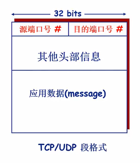

## 多路复用与多路分用

> 多路复用与多路分用将网络层提供的主机到主机的交付服务扩展到进程到进程的交付服务。
>

### 多路分用

> **接收**传输层根据头部信息将收到的segment交给对应的socket
>

对于每个网络进程都有一个或多个socket，它是网络和进程传递数据的门户，每个socket使用端口号做标识，在报文段中存储了源端口号和目的端口号，共占32bit，因此端口号的范围是0-65535，其中前1K个是保留端口号。

传输层的报文有以下格式：

### 多路复用

> **发送**从多个socket接收数据，为每块数据封装上头部信息，生成segment，交给网络层。
>

### UDP的多路复用和分用

UDP套接字是无连接的，使用二元组来标识(目的IP地址，目的端口号)，因此不同IP和端口的连接会被定向到同一个socket。

主机A中的一个进程具有多个socket，其中一个具有端口号19157，他要发送给主机B中的一个进程，具有UDP端口号46428。主机A的传输层创建传输层报文段，具有源端口号19157，目的端口号46428，网络层将报文段封装到一个IP数据报中，并尽力交给主机B，主机B收到后，根据目的端口号46428找到对应的socket，完成分用。

==UDP如何区分不同主机?== 八成是在网络层区分的吧。

### TCP的多路复用和分用

TCP的socket用四元组标识：(源地址，源端口号，目的地址，目的端口号)

TCP协议是面向连接的，一对一的。因此源地址或源端口不同的报文会被会被定向的两个不同的socket。

> 在UDPserver中，一个进程对应一个套接字，可以服务于多个client
> 在TCPserver中，一个进程对应多个套接字，每个套接字对应一个client的请求。
>