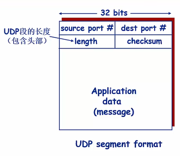

## User Datagram Protocol

> 用户数据报协议，在IP协议的基础上增加了复用、分用和错误校验。
>

* UDP在简单的IP协议的基础上增加了复用分用和错误校验
* Best effort，可能丢失，非按序到达
* 由于没有拥塞控制，可以更精确的确定合适发送数据，用于不接受延迟但能容忍丢失的场景
* 无需建立连接，速度更快
* 没有连接状态，开销更小
* 首部开销更小
* 应用程序可以在自身增加可靠性机制实现UDP的可靠数据传输

### UDP报文结构

length记录了包括首部在内的UDP报文段的长度，以字节为单位。

#### 校验和

发送方：

- 将内容段视为16-bit的整数，包括内容和头部
- 计算所有整数的和，按位取反得到校验和，如果有溢出就回卷(加上进位的数字)
- 将校验和放入checksum字段

接收方：

- 将全部的16bit整数求和运算，如果没有差错，结果应该是1111....
-

## UDP为什么不可靠

UDP 只有一个 socket 接收缓冲区，没有 socket 发送缓冲区，即只要有数据就发，不管对方是否可以正确接收。而在对方的 socket 接收缓冲区满了之后，新来的数据报无法进入到 socket 接受缓冲区，此数据报就会被丢弃，因此 UDP 不能保证数据能够到达目的地，此外，UDP 也没有流量控制和重传机制，故UDP的数据传输是不可靠的。

和 TCP 建立连接时采用三次握手不同，UDP 中调用 connect 只是把对端的 IP 和 端口号记录下来，并且 UDP 可多多次调用 connect 来指定一个新的 IP 和端口号，或者断开旧的 IP 和端口号（通过设置 connect 函数的第二个参数）。和普通的 UDP 相比，调用 connect 的 UDP 会提升效率，并且在高并发服务中会增加系统稳定性。

当 UDP 的发送端调用 bind 函数时，就会将这个套接字指定一个端口，若不调用 bind 函数，系统内核会随机分配一个端口给该套接字。当手动绑定时，能够避免内核来执行这一操作，从而在一定程度上提高性能。