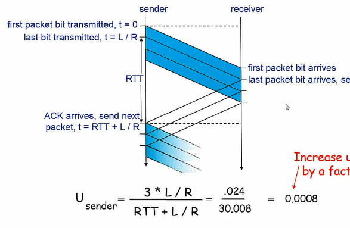
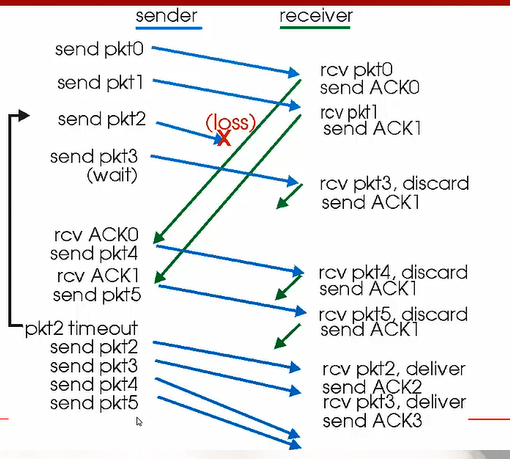
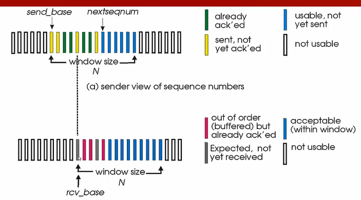

## 可靠数据传输

可靠数据传输的要求：不错、不丢、不乱。

### rdt2.0在bit差错信道中的可靠数据传输

> 假定信道中只会产生bit位的错误，不会丢包
>

- 差错检测
  比如使用校验和
- 接收方反馈
  肯定确认或否定确认
- 发送方重传
  重传有差错的分组

> 此时仍有一个问题：我们没有考虑到接收方的反馈ACK和NAK有可能产生错误
>

### rdt2.1 反馈可能出错

发送方对分组编号，对于停等协议这种简单的情况只需要1bit的序号，如果发送方接收到ACK，那么就改变序号，传输下一个分组，如果没有收到ACK，那么就重传分组，这样接收方就可以判断这个分组是否是重传。

### rdt2.2 没有NAK

此时，如果我们要求ACK必须包含0或1的分组号，那么其实就可以省略NAK回复，因为没有没有被确认的就需要被重传

### rdt3.0 在有bit差错和丢包信道中的可靠传输

在这个信道中，接收方可能会丢包或是ACK丢失，此时发送方可在等待一段时间后重传，此时可能产生重复分组，不过我们可以通过序号区分。

- 每发送一个分组就启动一个定时器
- 超时后重传

此时我们用了校验和、序号、定时器、肯定和否定确认。

### 流水线可靠数据传输协议

rdt3.0的线路利用率很低，本质是因为它的停等协议，发送一个分组后需要等待接收方的回传或是超时。流水线机制的原理是：不等待回传，同时发送多个分组。

此时我们需要更大的序号范围和更大的存储空间用来缓存分组。

为了实现流水线协议，我们使用滑动窗口协议。

**窗口**

- 允许使用的序列号范围
- 窗口尺寸N，最多有N个等待确认的消息

**滑动窗口**

- 随着协议运行，窗口在序列号空间内向前滑动

### Go-Back-N(GBN)协议

滑动窗口可以将分组分成4部分，采用累计确认的方式

**对于发送方**

- 接受ACK(n)，表示包括n之前的所有分组都已经接收到。
- 超时Timeout(n)， n分组超时，重传n之后的所有分组

**对于接收方**

- 如果一个序号为n的分组被接收到，且前一个交付给上层的分组是n-1，发送ACK(n)
- 其他情况丢弃该分组，发送ack(n-1)，因此ACK可能重复发送。

> 在n丢失而接受到n+1的情况下，n+1分组会被丢失，这是因为发送方会重传n之后的分组，此时接收方不需要缓存任何失序的分组，此时接收方需要维护下一个需要接受的序号，而发送方需要维护窗口的上下界和nextseqnum。
>

**有一个问题**

ACK的序号和pkt的序号是1-1对应的吗?

如果在收到ACK0后，滑动窗口向后移动一个单位，send_base改变，此时首位变成了pkt1,而之后会收到ACK1，滑动窗口怎么判断现在的0位是发送时的1位呢???pkt的序号是一直增加的吗??ACK的序号是一直增加的吗??

如果有send_base确实可以确定现在接收到的ACK确认信息的位置，但是也不能一直增加吧。。。。

他妈的，好像就是一直增加的。参考[https://media.pearsoncmg.com/aw/ecs_kurose_compnetwork_7/cw/content/interactiveanimations/go-back-n-protocol/index.html](https://media.pearsoncmg.com/aw/ecs_kurose_compnetwork_7/cw/content/interactiveanimations/go-back-n-protocol/index.html)

### selective repeat选择重传

和GBN不同，选择重传要求要求对每个分组都发送ACK，此时接收方需要把乱序的分组保存起来。

此时接收方也需要有窗口

考虑到序列号太少时，窗口太大会使得接收方无法区分收到的分组，因此，窗口大小必须小于等于序号长度的一半。

### 可靠传输机制及其用途的总结

| 机制       | 用途和说明                                     |
| ---------- | ---------------------------------------------- |
| 校验和     | 检测分组中的bit错误                            |
| 定时器     | 负责分组丢失时重传，会产生冗余分组             |
| 序号       | 接收方用来对流水线中的分组排序，检测丢失和重复 |
| 确认       | 接收方用来确认收到分组                         |
| 否定确认   | 接收方告诉发送方接收到的分组有误               |
| 窗口流水线 | 允许不经过确认一次发送多个分组                 |