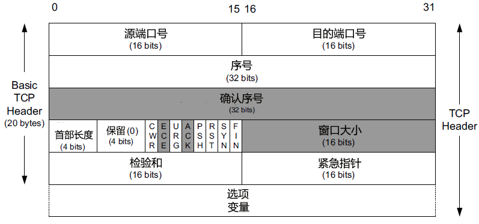
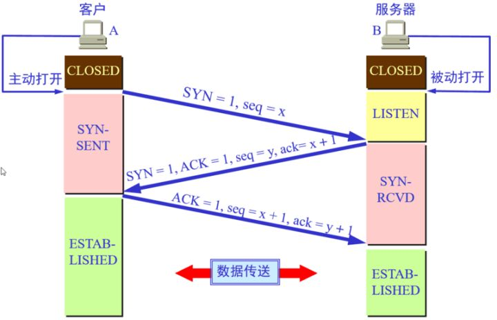
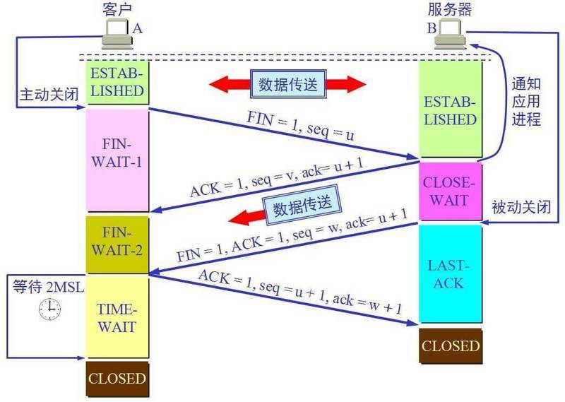
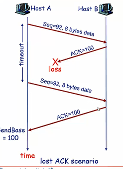
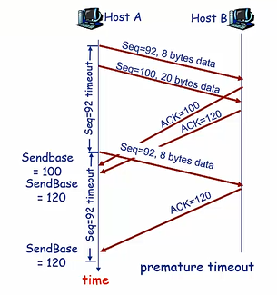
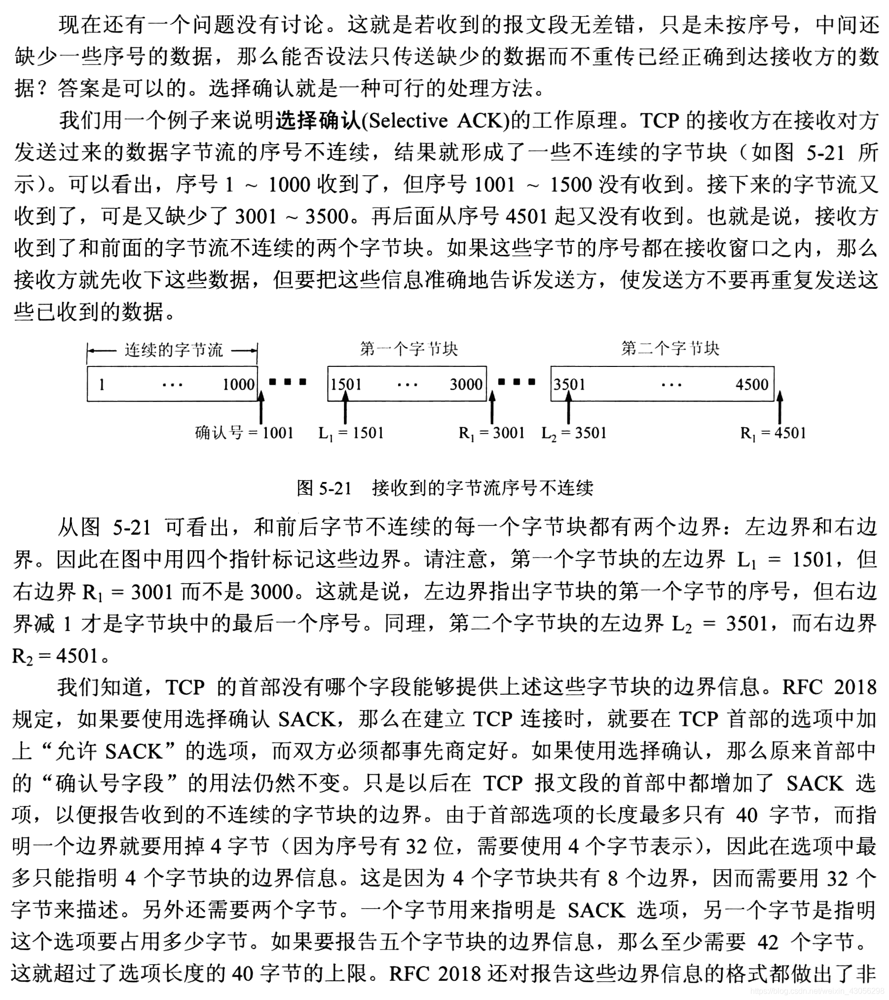

> TCP是面向连接的可靠传输协议，为了实现可靠数据传输，TCP利用了差错检测、重传、累计确认、定时器、用于序号和确认号的首部字段。
>
> TCP连接状态保留在两个端系统中，对中间的路由器完全是不可见的。
>

## TCP黏包问题

TCP是基于字节流的传输服务（UDP 基于报文的），流 意味着 TCP 所传输的数据是没有边界的。所以可能会出现两个数据包黏在一起的情况。

服务器在接收数据的时候有如下几种情况：

* 一次接收到了客户端发送过来的一个完整的数据包
* 一次接收到了客户端发送过来的 N 个数据包，由于每个包的长度不定，无法将各个数据包拆开
* 一次接收到了一个或者 N 个数据包 + 下一个数据包的一部分，还是很悲剧，无法将数据包拆开
* 一次收到了半个数据包，下一次接收数据的时候收到了剩下的一部分 + 下个数据包的一部分，更悲剧，头大了
* 另外，还有一些不可抗拒的因素：比如客户端和服务器端的网速不一样，发送和接收的数据量也会不一致

在数据库最前增加一个固定大小的头部字段，此时TCP数据包括数据头+数据块

* 数据头：存储当前数据包的总字节数
* 数据块：存储数据包内容

## TCP如何保证可靠

* **数据分块：**应用数据被分割成 TCP 认为最适合发送的数据块。
* **序列号和确认应答：**TCP 给发送的每一个包进行编号，在传输的过程中，每次接收方收到数据后，都会对传输方进行确认应答，即发送 ACK 报文，这个 ACK 报文当中带有对应的确认序列号，告诉发送方成功接收了哪些数据以及下一次的数据从哪里开始发。除此之外，接收方可以根据序列号对数据包进行排序，把有序数据传送给应用层，并丢弃重复的数据。
* **校验和：** TCP 将保持它首部和数据部分的检验和。这是一个端到端的检验和，目的是检测数据在传输过程中的任何变化。如果收到报文段的检验和有差错，TCP 将丢弃这个报文段并且不确认收到此报文段。
* **流量控制：** TCP 连接的双方都有一个固定大小的缓冲空间，发送方发送的数据量不能超过接收端缓冲区的大小。当接收方来不及处理发送方的数据，会提示发送方降低发送的速率，防止产生丢包。TCP 通过滑动窗口协议来支持流量控制机制。
* **拥塞控制：** 当网络某个节点发生拥塞时，减少数据的发送。
* **ARQ协议：** 也是为了实现可靠传输的，它的基本原理就是每发完一个分组就停止发送，等待对方确认。在收到确认后再发下一个分组。
* **超时重传：** 当 TCP 发出一个报文段后，它启动一个定时器，等待目的端确认收到这个报文段。如果超过某个时间还没有收到确认，将重发这个报文段。

## TCP段结构

* 源端口：表示发送端端口号，字段长 16 位，2 个字节
* 目的端口：表示接收端端口号，字段长 16 位，2 个字节
* 序号（sequence number）：字段长 32 位，占 4 个字节，序号的范围为 [0，4284967296]。
  * 由于 TCP 是面向字节流的，在一个 TCP 连接中传送的字节流中的每一个字节都按顺序编号
  * 首部中的序号字段则是指本报文段所发送的数据的第一个字节的序号，这是随机生成的。
  * 序号是循环使用的，当序号增加到最大值时，下一个序号就又回到了 0
* 确认序号（acknowledgement number）：占 32 位（4 字节），TCP采用累积确认。确认方的ACK=发送方seq+1。表示之前收到的报文都确认接收了。
* 8个标志位
  * ACK：该位设为 1，确认应答的字段有效，TCP 规定除了最初建立连接时的 SYN 包之外该位必须设为 1；
  * SYN：用于建立连接，该位设为 1，表示希望建立连接，并在其序列号的字段进行序列号初值设定；
  * FIN：该位设为 1，表示今后不再有数据发送，希望断开连接。

## 三次握手

三次握手的本质是确认通信双方收发数据的能力，另外，为了实现可靠数据传输，我们需要通信双方维护彼此的序列号，所以三次握手也是互换序列号的过程。

1. 第一次握手，客户端向发起连接请求(标志位SYN=1)，同时携带自己随机生成的序号`seq=x`
2. 第二次握手，服务端收到客户端的报文，发现`SYN=1`说明这是一个连接请求，随机生成序号`seq=y`，给客户端回复报文，包含标志位(SYN=1,ACK=1)，seq=y, ack=x+1。
3. 第三次握手，客户端根据收到的ACK=1和ack=x+1确认自己的连接请求报文已经被接受，同时SYN=1说明服务端接受连接请求，此时连接已经建立，SYN不需要置为1，ACK=1，ack=y+1, seq=x+1。第三次握手可以携带数据，不携带数据的ACK报文(只是确认用)是不占用序列号的.
   如果**携带数据**，下次客户端发送的报文就是服务器返回的ack号
   如果**不携带数据**，那么第三次握手不消耗seq号，下次的报文还是第三次握手的seq号

### 第三次握手的目的

1. 假设第一次握手被延误了，那么客户端一直没有服务端的反馈，就会放弃这个SYN报文，而之后服务端又收到了之前延误的SYN报文，误认为这是个新的连接请求，就会发送SYNACK报文，此时服务端就建立了一条没什么用的TCP连接。
2. 假设第二次握手包丢失，服务端已经建立连接了，而客户端并没有建立连接。

### TCP 为什么要进行三次握手？

【答案一】因为信道不可靠，而 TCP 想在不可靠信道上建立可靠地传输，那么三次通信是理论上的最小值。（而 UDP 则不需建立可靠传输，因此 UDP 不需要三次握手。）

> [Google Groups . TCP 建立连接为什么是三次握手？{技术}{网络通信}](https://groups.google.com/forum/#!msg/pongba/kF6O7-MFxM0/5S7zIJ4yqKUJ)
>

【答案二】因为双方都需要确认对方收到了自己发送的序列号，确认过程最少要进行三次通信。

> [知乎 . TCP 为什么是三次握手，而不是两次或四次？](https://www.zhihu.com/question/24853633/answer/115173386)
>

【答案三】为了防止已失效的连接请求报文段突然又传送到了服务端，因而产生错误。

> [《计算机网络（第 7 版）-谢希仁》](https://gitee.com/huihut/interview/raw/master/images/TCP-transport-connection-management.png)
>

## 四次挥手

客户和服务器都可以主动发起FIN报文。

1. 第一次挥手，客户端向服务端发送连接释放报文，标志位FIN=1，seq=x
2. 第二次挥手，服务端发送ACK报文，之后可以发送剩余部分数据
3. 第三次挥手，服务端发送FIN报文，由于在这期间客户端没有发送数据，所以这期间的ack都是`x+1`
4. 第四次挥手，客户端发送ACK报文，但这时客户端不会马上释放TCP连接，而是等待2MSL(最长报文寿命的两倍时间)，之后才释放连接，而服务端收到第四次的ACK就可以立即释放连接。

SYN报文和FIN报文，即使不携带数据，也要占用序列号。

### 为什么第四次挥手后要等待

因为第四次挥手的报文有可能丢失，服务端没有收到ACK报文会重发第三次挥手，客户端需要保持连接2MSL来响应服务端的FIN报文。

【问题一】TCP 为什么要进行四次挥手？ / 为什么 TCP 建立连接需要三次，而释放连接则需要四次？

【答案一】因为 TCP 是全双工模式，客户端请求关闭连接后，客户端向服务端的连接关闭（一二次挥手），服务端继续传输之前没传完的数据给客户端（数据传输），服务端向客户端的连接关闭（三四次挥手）。所以 TCP 释放连接时服务器的 ACK 和 FIN 是分开发送的（中间隔着数据传输），而 TCP 建立连接时服务器的 ACK 和 SYN 是一起发送的（第二次握手），所以 TCP 建立连接需要三次，而释放连接则需要四次。

【问题二】为什么 TCP 连接时可以 ACK 和 SYN 一起发送，而释放时则 ACK 和 FIN 分开发送呢？（ACK 和 FIN 分开是指第二次和第三次挥手）

【答案二】因为客户端请求释放时，服务器可能还有数据需要传输给客户端，因此服务端要先响应客户端 FIN 请求（服务端发送 ACK），然后数据传输，传输完成后，服务端再提出 FIN 请求（服务端发送 FIN）；而连接时则没有中间的数据传输，因此连接时可以 ACK 和 SYN 一起发送。

【问题三】为什么客户端释放最后需要 TIME-WAIT 等待 2MSL 呢？

【答案三】

1. 为了保证客户端发送的最后一个 ACK 报文能够到达服务端。若未成功到达，则服务端超时重传 FIN+ACK 报文段，客户端再重传 ACK，并重新计时。
2. 防止已失效的连接请求报文段出现在本连接中。TIME-WAIT 持续 2MSL 可使本连接持续的时间内所产生的所有报文段都从网络中消失，这样可使下次连接中不会出现旧的连接报文段。

### 如果已经建立了连接，但是客户端突然出现故障了怎么办？

TCP设有一个保活计时器，客户端如果出现故障，服务器不能一直等下去，白白浪费资源。服务器每收到一次客户端的请求后都会重新复位这个计时器，时间通常是设置为2小时，若两小时还没有收到客户端的任何数据，服务器就会发送一个探测报文段，以后每隔75秒钟发送一次。若一连发送10个探测报文仍然没反应，服务器就认为客户端出了故障，接着就关闭连接。

## TCP的可靠数据传输

网络层服务(IP)是不可靠的，可能产生bit错误，丢包和乱序。

- 流水线机制
- 累积确认
- TCP使用单一重传计时器
- 超时和重复ACK可以触发重传
- 忽略流量控制和拥塞控制

TCP客户端的发送过程

- 从应用层收到数据
  - 创建segment
  - 序列号是segment第一个字节的编号
  - 开启计时器
  - 设置超时时间
- 超时
  - 重传超时的segment
  - 重启计时器
- 收到ACK
  - 确认segment
  - 更新sendbase
  - 重启计时器

#### 可能的情况

1. 由于ACK丢失引起的重传
   
2. 由于ACK超时引起的重传，此时不会重传Seq100
   
3. 和第二种情况一样，只是ACK100丢失，但是ACK120没有丢失，此时由于累积确认，都会被确认。

## 估计往返时间

为了检测超时，我们必须知道报文段的往返时间RTT，通常的实现，RTT的计算是通过采样估计的，即任意报文从发送到收到该报文的确认的时间。

## 快速重传

在TCP中，如果发生超时，超时的时间间隔将会重新设置(加倍)，因此如果频繁超时，会导致超时间隔很大。此时检测分组丢失要等待很长时间。为了在超时事件发生前快速重传，假设发送方接收到3个重复的ACK确认号，则触发重传机制。**那么接收方为什么会发送重复的ACK呢**

对于接收方。

* 如果期望的顺序报文段500ms内没有达到，则发送ACK
* 如果比期望序列号更大的报文达到，则发送冗余ACK

- 通过重复ACK检测分组丢失。
  如果发送方接收到3个重复的ACK，则认为之后的段丢失，此时可以快速重传。

### 选择确认

### 选择重传

虽然是累积确认，但TCP的接收方会缓存乱序到达的报文，因此TCP使用的是选择重传，而不是回退N步。

## 计时器

TCP中有七种计时器，分别为：

1. 建立连接定时器：顾名思义，该定时器是在建立 TCP 连接的时候使用的，在 TCP 三次握手的过程中，发送方发送 SYN 时，会启动一个定时器（默认为 3 秒），若 SYN 包丢失了，那么 3 秒以后会重新发送 SYN 包，直到达到重传次数。
2. 重传定时器：该计时器主要用于 TCP 超时重传机制中，当TCP 发送报文段时，就会创建特定报文的重传计时器，并可能出现两种情况：
   1. 若在计时器截止之前发送方收到了接收方的 ACK 报文，则撤销该计时器；
   2. 若计时器截止时间内并没有收到接收方的 ACK 报文，则发送方重传报文，并将计时器复位。
3. 坚持计时器：我们知道 TCP 通过让接受方指明希望从发送方接收的数据字节数（窗口大小）来进行流量控制，当接收端的接收窗口满时，接收端会告诉发送端此时窗口已满，请停止发送数据。此时发送端和接收端的窗口大小均为0，直到窗口变为非0时，接收端将发送一个 确认 ACK 告诉发送端可以再次发送数据，但是该报文有可能在传输时丢失。若该 ACK 报文丢失，则双方可能会一直等待下去，为了避免这种死锁情况的发生，发送方使用一个坚持定时器来周期性地向接收方发送探测报文段，以查看接收方窗口是否变大。
4. 延迟应答计时器：延迟应答也被称为捎带 ACK，这个定时器是在延迟应答的时候使用的，为了提高网络传输的效率，当服务器接收到客户端的数据后，不是立即回 ACK 给客户端，而是等一段时间，这样如果服务端有数据需要发送给客户端的话，就可以把数据和 ACK 一起发送给客户端了。
5. 保活定时器：该定时器是在建立 TCP 连接时指定 SO_KEEPLIVE 时才会生效，当发送方和接收方长时间没有进行数据交互时，该定时器可以用于确定对端是否还活着。
6. FIN_WAIT_2 定时器：当主动请求关闭的一方发送 FIN 报文给接收端并且收到其对 FIN 的确认 ACK后进入 FIN_WAIT_2状态。如果这个时候因为网络突然断掉、被动关闭的一端宕机等原因，导致请求方没有收到接收方发来的 FIN，主动关闭的一方会一直等待。该定时器的作用就是为了避免这种情况的发生。当该定时器超时的时候，请求关闭方将不再等待，直接释放连接。
7. TIME_WAIT 定时器：我们知道在 TCP 四次挥手中，发送方在最后一次挥手之后会进入 TIME_WAIT 状态，不直接进入 CLOSE 状态的主要原因是被动关闭方万一在超时时间内没有收到最后一个 ACK，则会重发最后的 FIN，2 MSL（报文段最大生存时间）等待时间保证了重发的 FIN 会被主动关闭的一段收到且重新发送最后一个 ACK 。还有一个原因是在这 2 MSL 的时间段内任何迟到的报文段会被接收方丢弃，从而防止老的 TCP 连接的包在新的 TCP 连接里面出现。