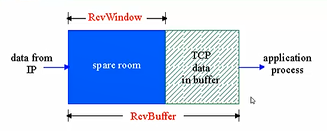
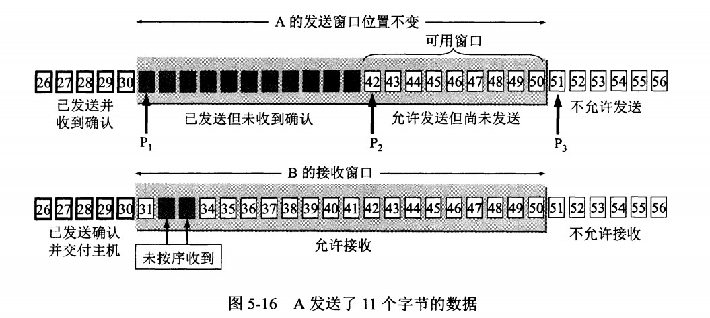

## 流量控制

由于TCP使用了选择重传，因此两侧主机需要设置接收缓存，但TCP接收到正确按序的字节后会放入接收缓存，关联的应用程序会从接收缓存中读取数据。此时如果读取太慢，发送方发送太快，就会使得接收缓存溢出。

**流量控制**使得发送方的发送数据与接收方的读取速率匹配，两侧主机维护一个**接收窗口**，用来表示还有多少可用缓存空间。

- receiver通过在segment头部字段将rcvWindow告诉sender，说明还剩的缓冲区大小
- sender限制自己已经发送但还未接受ACK的数据不能超过空闲RcvWindow
- 实际上在rcvWindow=0时，sender仍然可以发送一个很小的信息，询问是否产生空余

## 如果接收方窗口满了怎么办

接收方返回给发送方的 ACK 包中会包含自己的接收窗口大小，若接收窗口已满，此时接收方返回给发送方的接收窗口大小为 0，此时发送方会等待接收方发送的窗口大小直到变为非 0 为止，然而，接收方回应的 ACK 包是存在丢失的可能的，为了防止双方一直等待而出现死锁情况，此时就需要坚持计时器来辅助发送方周期性地向接收方查询，以便发现窗口是否变大【坚持计时器参考问题】，当发现窗口大小变为非零时，发送方便继续发送数据。

### TCP滑动窗口

窗口是缓存的一部分，用来暂时存放字节流。发送方和接收方各有一个窗口，接收方通过 TCP 报文段中的窗口字段告诉发送方自己的窗口大小，发送方根据这个值和其它信息设置自己的窗口大小。

发送窗口内的字节都允许被发送，接收窗口内的字节都允许被接收。如果发送窗口左部的字节已经发送并且收到了确认，那么就将发送窗口向右滑动一定距离，直到左部第一个字节不是已发送并且已确认的状态；接收窗口的滑动类似，接收窗口左部字节已经发送确认并交付主机，就向右滑动接收窗口。

接收窗口只会对窗口内最后一个按序到达的字节进行确认，例如接收窗口已经收到的字节为 {31, 34, 35}，其中 {31} 按序到达，而 {34, 35} 就不是，因此只对字节 31 进行确认。发送方得到一个字节的确认之后，就知道这个字节之前的所有字节都已经被接收。

