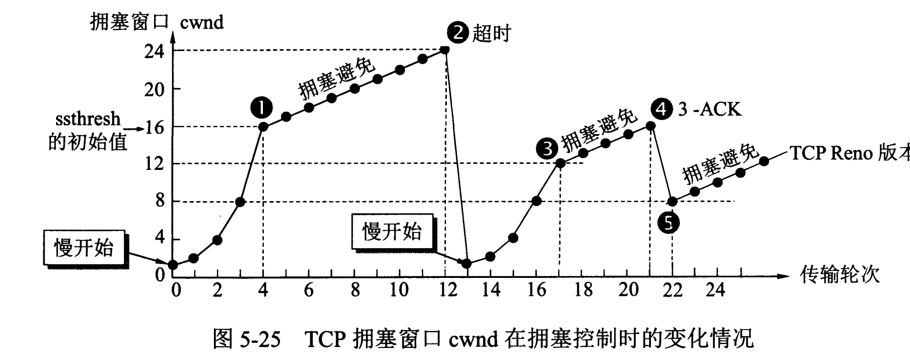
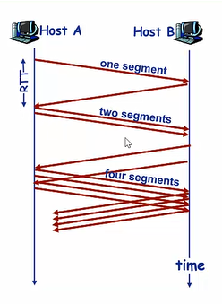
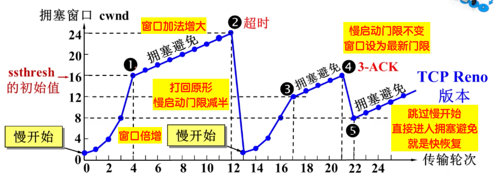

> 由于数据发送的太多或太快以至于网络无法处理
>

表现

* 分组丢失(路由器缓存溢出)
* 分组延迟过大(在路由器缓存中排队)

方法

* 如何限制sender的发送速率
* 如何感知拥塞
* 用何种算法限制发送速率

### 拥塞控制方法

TCP 主要通过四个算法来进行拥塞控制：慢开始、拥塞避免、快重传、快恢复。

发送方需要维护一个叫做拥塞窗口（cwnd）的状态变量，注意拥塞窗口与发送方窗口的区别：拥塞窗口只是一个状态变量，实际决定发送方能发送多少数据的是发送方窗口。

- 端到端的拥塞控制
  - 不需要网络层的支持
  - 端系统通过丢包和时延来判断拥塞情况
  - TCP就是端到端的控制方法
- 网络辅助的拥塞控制(不讲)
  - 路由器显式的向发送方反馈网络拥塞信息

### TCP中的拥塞控制

由于IP层不会显式的反馈网络信息，所以TCP只能使用端到端的拥塞控制。

为了限制sender的发送速率，我们需要解决一下三个问题

- TCP如何限制sender的发送速率
- sender如何感知路径上的拥塞
- 感知到拥塞时使用什么算法改变发送速率

由于TCP是全双工协议，两侧端系统都会维护一个缓存窗口，在流量控制中，sender维护lastByteSent和LastByteAcked表示最后发送的分组和最后确认的分组，那么两个数据的差就是已经发送还没确认的数据，这个数据必须小于接收窗口，使用这种策略可以做流量控制。

在拥塞控制中，sender维护一个额外的变量，*拥塞窗口cwnd*，他要求sender发送的数据必须小于$min(cwnd,rwnd)$，rwnd是接收缓存，我们假设他足够大，那么

$$
LastBytesent-LastByteAcked \leq cwnd
$$

因此对于第一个问题，我们使用发送窗口限制发送速率。

对于第二个问题，之前有讲过，在出现丢包时(超时，三次重复ACK)，我们认为发生了拥塞。

对于第三个问题有些复杂，TCP使用了慢启动、拥塞避免、快速恢复。

#### 慢启动

在TCP连接开始建立时，通常cwnd会设置为一个很小的值(一个MSS【最大报文长度】)，也就是说窗口大小是1，慢启动*每接受到一个ACK确认cwnd就增加1*。注意，每接受一个ACK，cwnd就+1，这实际上是指数级增加

这样一来，每经过一个RTT(往返时间)，cwnd就增加一倍。在遇到拥塞时，记录慢启动阈值ssthresh=cwnd/2，也就是上次没有发生拥塞的窗口大小。

在发生拥塞时可以有3种处理方式：

- 超时，将cwnd设置为1，并重新开始慢启动，ssthresh=cwnd/2
- 当cwnd=ssthresh，可能拥塞，进入拥塞避免
- 3个冗余ACK，执行快速重传并进入快速恢复。

#### 拥塞避免

在拥塞避免状态，cwnd的值大约是ssthresh，此时很有可能发生拥塞，因此TCP不会翻倍，而是在每个RTT时间将cwnd增加一个MSS(由于RTT【报文往返时间】是不固定的，可以通过每收到一个ACK，就增加MSS/cwnd字节实现)

#### 快速恢复

快速恢复是TCP拥塞控制的一个推荐但不必须的构件。

对于每个冗余的ACK，cwnd都会增加一个MSS，最终，当接收到引起快速恢复的丢失报文ACK时，进入拥塞避免。

如果在快速恢复中出现超时事件，cwnd=1，并且ssthresh=cwnd/2

慢开始和快恢复的快慢指的是 cwnd 的设定值，而不是 cwnd 的增长速率。慢开始 cwnd 设定为 1，而快恢复 cwnd 设定为 ssthresh。

## TCP 拥塞控制采用的四种算法【Leetbook】

### 慢开始

当发送方开始发送数据时，由于一开始不知道网络负荷情况，如果立即将大量的数据字节传输到网络中，那么就有可能引起网络拥塞。一个较好的方法是在一开始发送少量的数据先探测一下网络状况，即由小到大的增大发送窗口（拥塞窗口 cwnd）。慢开始的慢指的是初始时令 cwnd为 1，即一开始发送一个报文段。如果收到确认，则 cwnd = 2，之后每收到一个确认报文，就令 cwnd = cwnd* 2。

但是，为了防止拥塞窗口增长过大而引起网络拥塞，另外设置了一个慢开始门限 ssthresh。

① 当 cwnd < ssthresh 时，使用上述的慢开始算法；

② 当 cwnd > ssthresh 时，停止使用慢开始，转而使用拥塞避免算法；

③ 当 cwnd == ssthresh 时，两者均可。

### 拥塞避免

拥塞控制是为了让拥塞窗口 cwnd 缓慢地增大，即每经过一个往返时间 RTT （往返时间定义为发送方发送数据到收到确认报文所经历的时间）就把发送方的 cwnd 值加 1，通过让 cwnd 线性增长，防止很快就遇到网络拥塞状态。

当网络拥塞发生时，让新的慢开始门限值变为发生拥塞时候的值的一半,并将拥塞窗口置为 1 ,然后再次重复两种算法（慢开始和拥塞避免）,这时一瞬间会将网络中的数据量大量降低。

### 快重传

快重传算法要求接收方每收到一个失序的报文就立即发送重复确认，而不要等到自己发送数据时才捎带进行确认，假定发送方发送了 Msg 1 ~ Msg 4 这 4 个报文，已知接收方收到了 Msg 1，Msg 3 和 Msg 4 报文，此时因为接收到收到了失序的数据包，按照快重传的约定，接收方应立即向发送方发送 Msg 1 的重复确认。 于是在接收方收到 Msg 4 报文的时候，向发送方发送的仍然是 Msg 1 的重复确认。这样，发送方就收到了 3 次 Msg 1 的重复确认，于是立即重传对方未收到的 Msg 报文。由于发送方尽早重传未被确认的报文段，因此，快重传算法可以提高网络的吞吐量。

### 快恢复

快恢复算法是和快重传算法配合使用的，该算法主要有以下两个要点：

① 当发送方连续收到三个重复确认，执行乘法减小，慢开始门限 ssthresh 值减半；

② 由于发送方可能认为网络现在没有拥塞，因此与慢开始不同，把 cwnd 值设置为 ssthresh 减半之后的值，然后执行拥塞避免算法，线性增大 cwnd。

