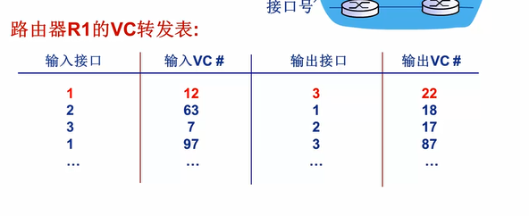
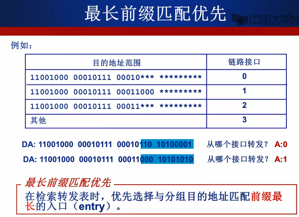

## 虚电路和数据报网络

### 虚电路

> 从源主机到目的主机，建立逻辑连接，类似于之前的电路交换，但是在传输时会利用电路的全部带宽。
>

虚电路的组成：

1. 源主机和目的主机之前的一系列链路和路由器。
2. VC号，沿着该路径的每段链路的号码。
3. 路径中路由器转发表的表项

为了建立虚电路，链路中的每个主机、路由器都需要维护链路中的连接关系。

属于一条虚电路的分组会在首部携带一个VC号，因为虚电路中的每条路径上可能有不同的VC号，因此经过中间路由器需要用新的VC号代替传输分组的VC号，该VC号通过转发表获得。

虚电路的建立拆除 **略**

### 数据报网络

分组直接加上目的地址推送到网络中，路由器有一个目的地址到链路端口的转发表，根据转发表将分组转发到合适的地址。

使用最长前缀匹配优先的策略。

转发表会通过路由选择算法修改，在虚电路网络中，只要建立或是拆除一条连接，路由器的转发表就会更新。**因特网使用数据报网络。**