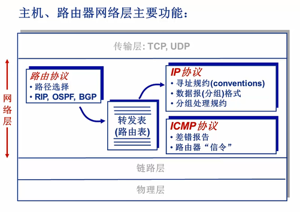
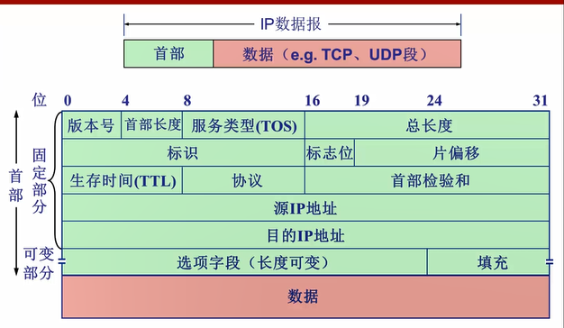
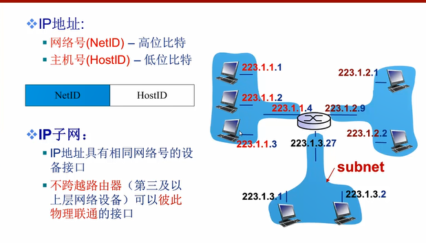
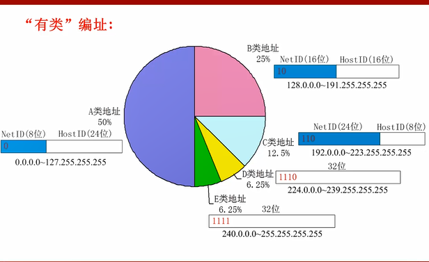
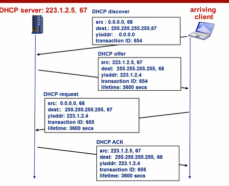

## Internet protocol

IP 协议（Internet Protocol）又称互联网协议，是支持网间互联的数据包协议。该协议工作在网络层，主要目的就是为了提高网络的可扩展性，和传输层 TCP 相比，IP 协议提供一种无连接/不可靠、尽力而为的数据包传输服务，其与TCP协议（传输控制协议）一起构成了TCP/IP 协议族的核心。IP 协议主要有以下几个作用：

* **寻址和路由：**在IP 数据包中会携带源 IP 地址和目的 IP 地址来标识该数据包的源主机和目的主机。IP 数据报在传输过程中，每个中间节点（IP 网关、路由器）只根据网络地址进行转发，如果中间节点是路由器，则路由器会根据路由表选择合适的路径。IP 协议根据路由选择协议提供的路由信息对 IP 数据报进行转发，直至抵达目的主机。
* **分段与重组：**IP 数据包在传输过程中可能会经过不同的网络，在不同的网络中数据包的最大长度限制是不同的，IP 协议通过给每个 IP 数据包分配一个标识符以及分段与组装的相关信息，使得数据包在不同的网络中能够传输，被分段后的 IP 数据报可以独立地在网络中进行转发，在到达目的主机后由目的主机完成重组工作，恢复出原来的 IP 数据包。

网络层的内部组成

IP数据报格式

**首部长度**占用4个bit，能够表示的最大数是15，因此这里的长度1是指1行，一行是32bit。

协议指示IP数据报封装的是TCP UDP还是ICMP

### IP数据报分片

最大传输单元(MTU)：在链路层中不同的协议可以承载不一样大的分组，

- 路由器只负责分片，不负责组装，
- IP分组可以不接受分组，此时会被丢弃

为了组装多片分组，总长度字段、标识和IP、标志位、片偏移被用来标志和组装分组。

### IP编址

32bit的编号，用来标识路由器和主机的**接口**。

IP地址：

- 网络号 --高比特位
- 主机号 --低比特位

因此高网络号组成了IP子网，同一个子网的所有接口的网络号相同，子网中的主机一般是不跨越路由器的，可以直接相互通信。

根据网络号和主机号的范围，可以分为5类网络。

子网地址和子网掩码可以确定子网的大小(可以分配的子网空间)

### DHCP

DHCP动态主机配置协议用来为主机分配IP地址和子网掩码和默认网关以及本地DNS地址，其中网关表示它第一跳的路由器地址。

- 客户机通过`DHCP发现报文`发现DHCP服务器，UDP协议，端口67，目的地址255.255.255.255，源地址0.0.0.0，该报文使用链路层广播到子网连接的所有主机上。
- 服务器使用`DHCP提供报文`响应，此时的响应也必须使用广播地址255.255.255.255，报文包含为客户分配的IP地址，网络掩码和IP地址租用期，一个子网可能有多个DHCP服务器。
- 客户从多个服务器中选择一个，并发送`DHCP请求报文`，回显配置参数
- 服务器发送`DHCP ACK报文`，响应DHCP请求报文。