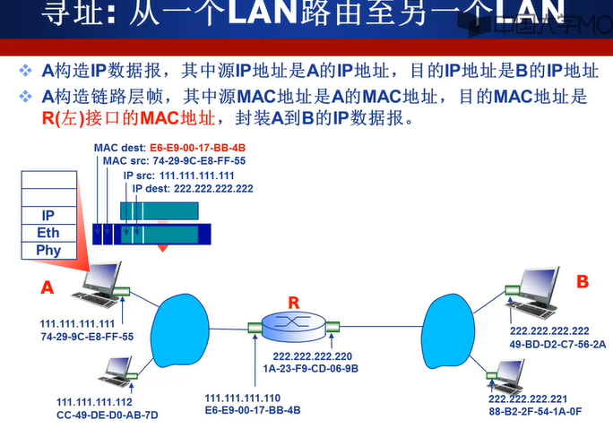
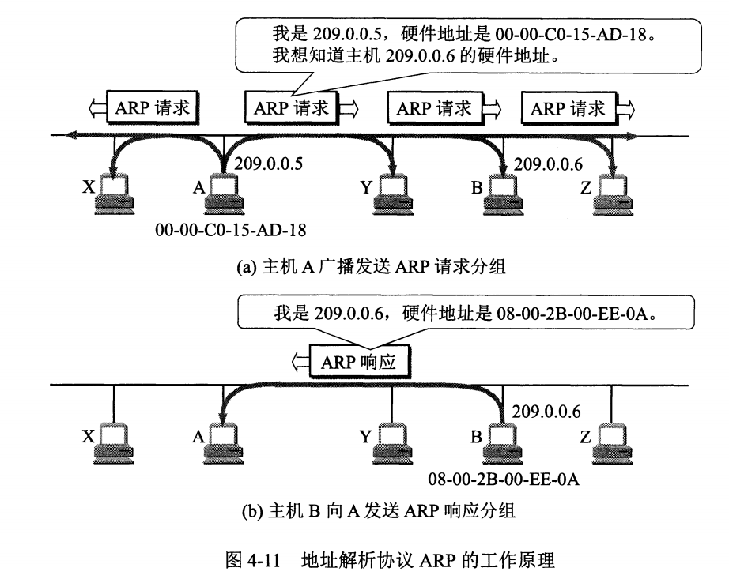

## 地址解析协议

TCP/IP模型中属于IP层（网络层），在OSI模型中属于链路层。

> IP地址用来标识网络层的分组，用于分组转发，用于第三层
>
> 链路层实现具体每段链路之间的通信。因此在通信过程中，IP 数据报的源地址和目的地址始终不变，而 MAC 地址随着链路的改变而改变。
> MAC地址用于局域网内标识一个帧从哪个接口出发，到达物理连接的另一个接口，6byte。用于在链路层，同一个局域网内发送数据。
>

ARP协议用于同一个局域网内，假设A要给同一局域网内的B发送数据，他需要知道B的MAC地址，但是B的MAC地址不在ARP表中，此时A会用ARP广播查询分组，其中包含B的IP地址，目的MAC地址是B的IP地址，B收到后回复自己的MAC地址。

### 一台主机要向局域网外的另一台主机发送网络层数据报时

假设主机A要向主机B发送数据，它的目的IP是B的IP地址，目的MAC是子网内的路由器左接口的MAC地址，到达路由器R后，根据转发表从R右侧接口发出，此时目的MAC地址修改成了主机B的MAC地址。

**转发表只能告诉路由器从哪个接口发出，却不能确定那个接口该接收，而MAC地址确定那个接口接收**

### 为什么要有MAC地址，没有会怎么样?

信息传递时候，需要知道的其实是两个地址：

* 终点地址（Final destination address）
* 下一跳的地址（Next hop address）

IP地址本质上是终点地址，它在跳过路由器（hop）的时候不会改变，而MAC地址则是下一跳的地址，每跳过一次路由器都会改变。

这就是为什么还要用MAC地址的原因之一，它起到了记录下一跳的信息的作用。

交换机的转发表，，不能通过IP转发吗????

