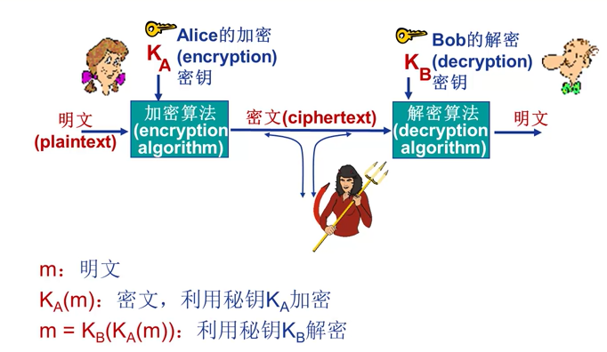
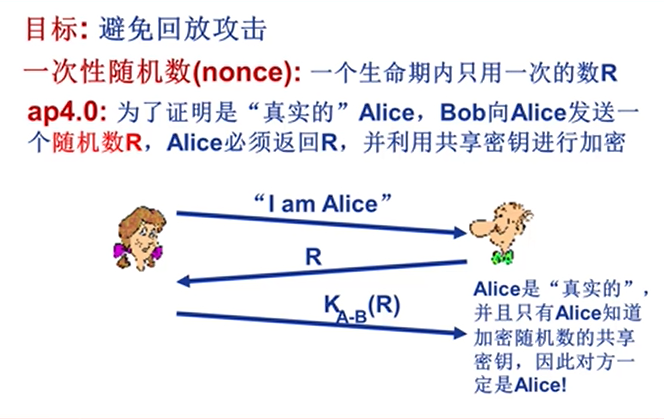
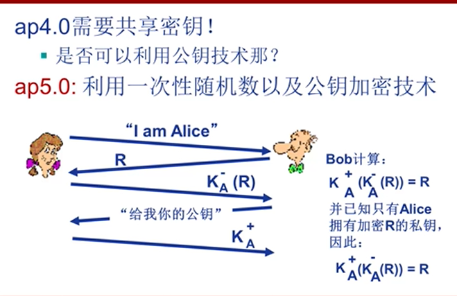

## 网络安全

通常的加密传输过程

此时，如果加密密钥和解密密钥相同，则成为**对称加密**，

### 对称加密

使用同一个密钥加密和解密。

### 公开密钥加密

> 每个端都有两个密钥，公开密钥是公开，任何人都可以知道；私有秘钥只有自己知道，此时如果Alice要给Bob发送消息，就需要用Bob的公开密钥加密，此时只有Bob的私有秘钥可以解密密文。
>

### 数字签名

和手写签名一样，数字签名需要满足

- 可以证实数字签名确实是由某人签署的
- 且只有那个人可以签署

公钥加密可以满足上述需求，由于公钥和私钥是可以互换的，因此Bob可以用它的私钥加密一个文档，如果我们可以用Bob的公钥解密它，就可以证明这段文本是由Bob确认的。为了降低计算代价，Bob通常是对文档的散列值做签名。

### 公钥认证

公钥加密的一个问题是公钥分发，在没有建立加密连接的前提下，Bob怎么安全的把自己的公钥发送给Alice?

> 我们可以用数字签名做公钥认证，用来证实一个公钥属于一个特定实体。假设Trudy用自己的私钥加密一段文本，并说明他就是Bob，而Alice是没办法确定他是不是Bob的，因为
>

为了证实Bob的公钥确实由Bob发出，我们需要一个**认证中心**，用来将公钥和特定的实体绑定。

认证中心的作用：

- 认证一个实体的真实身份
- 认证后，CA会生成一个把身份和实体的公钥绑定的证书，然后CA对证书进行数字签名

有了认证中心后，Bob向Alice发送订单时就可以附带自己的CA证书，Alice用CA的公钥来核对证书并提取Bob的公钥，那如果是Trudy发送自己的证书呢?并声称自己是Bob呢?应该还有个身份ID才对

### 端点鉴别

> 在网络中进行端到端的身份鉴别
>

在mail，Telnet，FTP等协议中，我们通过密码鉴别用户身份，但是这些密码是通过明文发送的，因此有可能被局域网中的其他用户嗅探到，因此一种简单的想法是对口令进行加密。

虽然使用加密口令可以方式口令被被Trudy得知，但是不能防止被窃听，攻击者可以重放分组。

为了避免回访攻击，我们增加一个一次性随机数R，Bob生成随机数R发送给Alice，Alice通过对称加密后返回给Bob，由此可以避免重放攻击。但这要求我们在此之前必须先共享对称密钥。

为了省去提前共享对称密钥，我们可以使用公钥加密。

