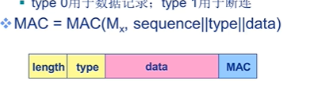

## 安全套接字层

我们可以将上一节讲的对应用层加密的思想应用到传输层，SSL用于对TCP的加密，这里的加密包括机密性、数据完整性和端点鉴别。

### 简化SSL的过程

#### 握手

> Alice和Bob利用证书、私钥鉴别彼此，交换共享密钥
>

1. Bob与Alice创建一条TCP连接
2. 通过证书验证是否是真实的Alice
3. Bob发送给Alice一个主密钥(用Alice的公钥加密)，根据这个主密钥生成SSL会话需要的一系列密钥

#### 密钥派生

> 利用共享密钥派生出一组密钥
>

此时Bob和Alice已经得到了主密钥，可以用作后序对话的对称密钥，但是通常我们认为使用不同的密钥会更加安全，因此Alice和Bob会使用主密钥生成4个密钥。

- $E_b$，用于客户向服务器发送数据的密钥
- $M_b$，用于客户向服务器发送数据的MAC密钥
- $E_a$，用于加密服务器向客户发送的数据
- $M_a$，用于服务器向客户发送数据的MAC密钥

MAC密钥用于验证数据完整性。

#### 数据传输

> 将待传输的数据分割成一系列的记录
>

虽然TCP是字节流协议，但是为了进行完整性检验，我们通常将字节流分割为一系列的记录

- 每个记录携带一个MAC
- 接收方对每个记录进行完整性检验

为了完成上述任务，我们需要接收方从数据中识别出MAC，通常我可以使用length+data+MAC这种结构存储数据流。这里的MAC可以是MD5或sha这种散列函数。

在MAC中可以添加序列号来抵御重放攻击

#### 连接关闭

> 断开连接也应该是安全的，比如增加一个type=0用于记录，type=1用于控制
>

### 完整的SSL描述

#### SSL握手

1. 客户发送它支持的密码算法列表，包含一个不重数
2. 服务器中列表中选择一种对称算法，一种公钥算法，一种MAC算法，将选择以及证书和一个不重数返回给客户
3. 客户验证证书，提取公钥，生成前主密钥(PMS)，用服务器公钥加密PMS，发送给服务器
4. 使用相同的密钥导出函数，客户和服务器独立的从PMS和不重数中计算主密钥MS，然后MS被切片生成两个密码和两个MAC密钥，此后所有客户和服务器间的通信都需要被加密和鉴别
5. 客户发送所有握手报文的MAC
6. 服务器发送所有握手报文的MAC。这两步是为了方式握手被篡改

#### SSL握手简单版

1. 用户向web服务器发起一个安全连接的请求
2. 服务器返回经过CA认证的数字证书，证书里面包含了服务器的public key
3. 用户拿到数字证书，用自己浏览器内置的CA证书解密得到服务器的public key
4. 用户用服务器的public key加密一个用于接下来的对称加密算法的密钥，传给web服务器
   因为只有服务器有private key可以解密，所以不用担心中间人拦截这个加密的密钥
5. 服务器拿到这个加密的密钥，解密获取密钥，再使用对称加密算法，和用户完成接下来的网络通信