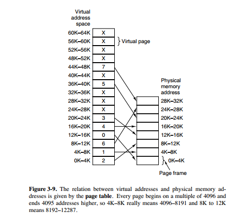

### 分页和分段

分页和分段都是将进程离散的装入内存空间，提高内存利用率。

* 页式存储：用户空间划分为大小相等的部分称为页（page），内存空间划分为同样大小的区域称为页框，分配时以页为单位，按进程需要的页数分配，逻辑上相邻的页物理上不一定相邻，页表存储页号和物理块号之间的对应关系；
* 分段是为了满足在编程方面的需求，主程序段，子程序段，数据段，堆栈段，都是一个相对独立的逻辑单位，便于动态链接和数据段的增长。

#### 分页和分段的区别

* 分页对程序员是透明的，但是分段需要程序员显式划分每个段。
* 分页的地址空间是一维地址空间，分段是二维的。
* 页的大小不可变，段的大小可以动态改变。
* 分页主要用于实现虚拟内存，从而获得更大的地址空间；分段主要是为了使程序和数据可以被划分为逻辑上独立的地址空间并且有助于共享和保护。

对程序员的透明性：分页透明，但是分段需要程序员显式划分每个段。

地址空间的维度：分页是一维地址空间，分段是二维的。

大小是否可以改变：页的大小不可变，段的大小可以动态改变。

出现的原因：分页主要用于实现虚拟内存，从而获得更大的地址空间；分段主要是为了使程序和数据可以被划分为逻辑上独立的地址空间并且有助于共享和保护。

### 虚拟内存

每个程序都拥有自己的地址空间，这个地址空间被分成大小相等的页，这些页被映射到物理内存；但不需要所有的页都在物理内存中，当程序引用到不在物理内存中的页时，由操作系统将缺失的部分装入物理内存。这样，对于程序来说，逻辑上似乎有很大的内存空间，只是实际上有一部分是存储在磁盘上，因此叫做虚拟内存。

虚拟内存的目的是为了让物理内存扩充成更大的逻辑内存，从而让程序获得更多的可用内存。

为了更好的管理内存，操作系统将内存抽象成地址空间。每个程序拥有自己的地址空间，这个地址空间被分割成多个块，每一块称为一页。这些页被映射到物理内存，但不需要映射到连续的物理内存，也不需要所有页都必须在物理内存中。当程序引用到不在物理内存中的页时，由硬件执行必要的映射，将缺失的部分装入物理内存并重新执行失败的指令。

从上面的描述中可以看出，虚拟内存允许程序不用将地址空间中的每一页都映射到物理内存，也就是说一个程序不需要全部调入内存就可以运行，这使得有限的内存运行大程序成为可能。例如有一台计算机可以产生 16 位地址，那么一个程序的地址空间范围是 0~64K。该计算机只有 32KB 的物理内存，虚拟内存技术允许该计算机运行一个 64K 大小的程序。

### 页面置换算法

* **最佳页面置换算法** OPT（Optimal replacement algorithm）：置换以后不需要或者最远的将来才需要的页面，是一种理论上的算法，是最优策略；
* **先进先出** FIFO：置换在内存中驻留时间最长的页面。缺点：有可能将那些经常被访问的页面也被换出，从而使缺页率升高；
* **第二次机会算法** SCR：按FIFO选择某一页面，若其访问位为1，给第二次机会，并将访问位置0；
* **时钟算法** Clock：SCR中需要将页面在链表中移动（第二次机会的时候要将这个页面从链表头移到链表尾），时钟算法使用环形链表，再使用一个指针指向最老的页面，避免了移动页面的开销；
* **最近未使用算法** NRU（Not Recently Used）：检查访问位R、修改位M，优先置换R=M=0，其次是（R=0, M=1）；
* **最近最少使用算法** LRU（Least Recently Used）：置换出未使用时间最长的一页；实现方式：维护时间戳，或者维护一个所有页面的链表。当一个页面被访问时，将这个页面移到链表表头。这样就能保证链表表尾的页面是最近最久未访问的。
* **最不经常使用算法** LFU：置换出一定时期内被访问次数最少的页面。

#### **颠簸现象：**

颠簸本质上是指频繁的页调度行为。进程发生缺页中断时必须置换某一页。然而，其他所有的页都在使用，它置换一个页，但又立刻再次需要这个页。因此会不断产生缺页中断，导致整个系统的效率急剧下降，这种现象称为颠簸。内存颠簸的解决策略包括：

* 修改页面置换算法；
* 降低同时运行的程序的数量；
* 终止该进程或增加物理内存容量。