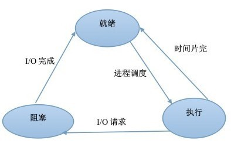

### 进程和线程的区别

* 进程(Process)是OS进行资源分配的基本单位，线程(Thread)是CPU调度的基本单位，在不同进程的线程进行切换时会导致进程的切换。
* 线程依赖于进程而存在，一个进程至少有一个线程；
* 进程有自己的独立地址空间，线程共享所属进程的地址空间；
* 进程是拥有系统资源的一个独立单位，而线程自己基本上不拥有系统资源，只拥有一点在运行中必不可少的资源(如程序计数器,一组寄存器和栈)，和其他线程共享本进程的相关资源如内存、I/O、cpu等；
* 在进程切换时，涉及到整个当前进程CPU环境的保存环境的设置以及新被调度运行的CPU环境的设置，而线程切换只需保存和设置少量的寄存器的内容，并不涉及存储器管理方面的操作，可见，进程切换的开销远大于线程切换的开销；
* 线程之间的通信更方便，同一进程下的线程共享全局变量等数据，而进程之间的通信需要以进程间通信(IPC)的方式进行；
* 多线程程序只要有一个线程崩溃，整个程序就崩溃了，但多进程程序中一个进程崩溃并不会对其它进程造成影响，因为进程有自己的独立地址空间，因此多进程更加健壮

*考虑实现Linux中的进程和线程，起码看一下Linux中的实现方式*

### 进程之间的私有和共享资源

* 私有：地址空间、堆、栈、寄存器、全局变量
* 共享：代码段，公共数据，进程目录，进程 ID

### 线程之间的私有和共享资源

* 私有：栈，寄存器，程序计数器
* 共享：堆，地址空间，全局变量，静态变量

### 多线程与多进程的对比

| 对比维度       | 多进程                                                           | 多线程                                                         | 总结     |
| -------------- | ---------------------------------------------------------------- | -------------------------------------------------------------- | -------- |
| 数据共享、同步 | 数据共享复杂，需要用 IPC；数据是分开的，同步简单                 | 因为共享进程数据，数据共享简单，但也是因为这个原因导致同步复杂 | 各有优势 |
| 内存、CPU      | 占用内存多，切换复杂，CPU 利用率低                               | 占用内存少，切换简单，CPU 利用率高                             | 线程占优 |
| 创建销毁、切换 | 创建销毁、切换复杂，速度慢                                       | 创建销毁、切换简单，速度很快                                   | 线程占优 |
| 编程、调试     | 编程简单，调试简单                                               | 编程复杂，调试复杂                                             | 进程占优 |
| 可靠性         | 进程间不会互相影响                                               | 一个线程挂掉将导致整个进程挂掉                                 | 进程占优 |
| 分布式         | 适应于多核、多机分布式；如果一台机器不够，扩展到多台机器比较简单 | 适应于多核分布式                                               | 进程占优 |

| 优劣 | 多进程                                   | 多线程                                   |
| ---- | ---------------------------------------- | ---------------------------------------- |
| 优点 | 编程、调试简单，可靠性较高               | 创建、销毁、切换速度快，内存、资源占用小 |
| 缺点 | 创建、销毁、切换速度慢，内存、资源占用大 | 编程、调试复杂，可靠性较差               |

### 进程间的通信方式

* 管道(Pipe)
  * 管道是半双工的，数据只能向一个方向流动；需要双方通信时，需要建立起两个管道；
  * 一个进程向管道中写的内容被管道另一端的进程读出。写入的内容每次都添加在管道缓冲区的末尾，并且每次都是从缓冲区的头部读出数据；
  * 只能用于父子进程或者兄弟进程之间(具有亲缘关系的进程)
* 命名管道
  * 命名管道以磁盘文件的方式存在，可以实现本机任意两个进程通信。
* 消息队列
  * 消息队列是消息的链接表，包括Posix消息队列和System V消息队列。有足够权限的进程可以向队列中添加消息，被赋予读权限的进程则可以读走队列中的消息。消息队列克服了信号承载信息量少，管道只能承载无格式字节流以及缓冲区大小受限等缺点。
* 信号(Signal)
  * 信号可以在任何时候发给某一进程，而无需知道该进程的状态。
    * SIGHUP：用户从终端注销，所有已启动进程都将收到该进程。系统缺省状态下对该信号的处理是终止进程。
    * SIGINT：程序终止信号。程序运行过程中，按Ctrl+C键将产生该信号。
    * SIGKILL：用户终止进程执行信号。shell下执行kill -9发送该信号。
    * SIGCLD：子进程退出信号。如果其父进程没有忽略该信号也没有处理该信号，则子进程退出后将形成僵尸进程。
* 共享内存
  * 共享内存就是映射一段能被其他进程所访问的内存，这段共享内存由一个进程创建，但多个进程都可以访问。共享内存是最快的 IPC 方式，它是针对其他进程间通信方式运行效率低而专门设计的。它往往与其他通信机制，如信号量，配合使用，来实现进程间的同步和通信。
* 信号量(Semaphore)
  * 信号量是一个计数器，可以用来控制多个进程对共享资源的访问。它常作为一种锁机制，防止某进程正在访问共享资源时，其他进程也访问该资源。因此，主要作为进程间以及同一进程内不同线程之间的同步手段。
* 套接字(Socket)
  * 与其他通信机制不同的是，它可用于不同机器间的进程通信。可以用本地回环网络用于本地进程间的通信

[扩展阅读](https://www.jianshu.com/p/c1015f5ffa74)

#### fork()

进程在调用`fork()`函数后会产生子进程，子进程会有自己的页表(虚拟地址空间)，子进程的地址空间由父进程拷贝出来，因此父进程的数据在子进程都有一份拷贝。


但是子进程的修改不会影响父进程。父进程中被分配的文件描述符都会拷贝到子进程中，在子进程中可以使用它们打开对应的文件。

根据`fork`的返回值判断当前是在父进程还是子进程。否则之后的代码会被执行两遍。

#### 管道

管道的本质其实就是内核中的一块内存，对管道的操作就是文件的IO操作，管道的两端分别对应两个文件描述符，对管道的操作（读、写）默认是阻塞的。管道中的数据只能读一次，做一次读操作之后数据也就没有了（读数据相当于出队列）。管道对应的内核缓冲区大小是固定的，默认为 4k（也就是队列最大能存储 4k 数据）。


父进程创建管道，通过文件描述符 fd3 写管道，通过 fd4 读管道，然后再通过 fork() 创建出子进程，那么在父进程中被分配的文件描述符 fd3， fd4也就被拷贝到子进程中，子进程通过 fd3可以将数据写入到内核的管道中，通过fd4将数据从管道中读出来。

##### 匿名管道

```cpp
    // 1. 创建匿名管道, 得到两个文件描述符
    int fd[2];
    int ret = pipe(fd);
    if(ret == -1)
    {
        perror("pipe");
        exit(0);
    }
```

##### 命名管道

匿名管道保存在内存中，而有名管道在磁盘上有实体文件，但是*文件大小永远为0*，数据也是存储到内存的缓冲区，管道文件只是保存文件描述符。

```cpp
// write.cpp
// 1. 创建有名管道文件
int ret = mkfifo("./testfifo", 0664);
// 2. 打开管道文件
// 因为要写管道, 所有打开方式, 应该指定为 O_WRONLY
// 如果先打开写端, 读端还没有打开, open函数会阻塞, 当读端也打开之后, open解除阻塞
int wfd = open("./testfifo", O_WRONLY);
// 写管道
sprintf(buf, "hello, fifo, 我在写管道...%d\n", i);
write(wfd, buf, strlen(buf));

// read.cpp
// 1. 打开管道文件
// 因为要read管道, so打开方式, 应该指定为 O_RDONLY
// 如果只打开了读端, 写端还没有打开, open阻塞, 当写端被打开, 阻塞就解除了
int rfd = open("./testfifo", O_RDONLY);
// 读是阻塞的, 如果管道中没有数据, read自动阻塞
      // 有数据解除阻塞, 继续读数据
int len = read(rfd, buf, sizeof(buf));
printf("读出的数据: %s\n", buf);
```

#### 共享内存

在所有进程间通信的方式中共享内存的效率是最高的。使用之前需要让进程和共享内存进行关联，得到共享内存的起始地址之后就可以直接进行读写操作了。共享内存不同于内存映射区，它不属于任何进程，并且不受进程生命周期的影响。

**进程使用共享内存进行通信的流程**

```cpp
1. 调用linux的系统API创建一块共享内存
    - 这块内存不属于任何进程, 默认进程不能对其进行操作
  
2. 准备好进程A, 和进程B, 这两个进程需要和创建的共享内存进行关联
    - 关联操作: 调用linux的 api
    - 关联成功之后, 得到了这块共享内存的起始地址
      
3. 在进程A或者进程B中对共享内存进行读写操作
    - 读内存: printf() 等;
	- 写内存: memcpy() 等;

4. 通信完成, 可以让进程A和B和共享内存解除关联
    - 解除成功, 进程A和B不能再操作共享内存了
    - 共享内存不受进程生命周期的影响的
  
5. 共享内存不在使用之后, 将其删除
    - 调用linux的api函数, 删除之后这块内存被内核回收了
```

```cpp
//************* 写共享内存 ***********/
// 1. 创建共享内存, 大小为4k
int shmid = shmget(1000, 4096, IPC_CREAT|0664);
if(shmid == -1){perror("shmget error");	return -1;}

// 2. 当前进程和共享内存关联
void* ptr = shmat(shmid, NULL, 0);
if(ptr == (void *) -1){	perror("shmat error");	return -1;}

// 3. 写共享内存
const char* p = "hello, world, 共享内存真香...";
memcpy(ptr, p, strlen(p)+1);
// 解除关联
shmdt(ptr);
//********* 读共享内存 *************/
// 1. 创建共享内存, 大小为4k
int shmid = shmget(1000, 0, 0);
if(shmid == -1){perror("shmget error");return -1;}

// 2. 当前进程和共享内存关联
void* ptr = shmat(shmid, NULL, 0);
if(ptr == (void *) -1){perror("shmat error");return -1;}

// 3. 读共享内存
printf("共享内存数据: %s\n", (char*)ptr);
```

#### 消息队列

消息队列的使用方式和共享内存类似

```cpp
/****************** 发送消息 *************/
//建立消息队列
msgid = msgget((key_t)1234, 0666 | IPC_CREAT);
//向消息队列中写消息，直到写入end
//输入数据
printf("Enter some text: ");
fgets(buffer, BUFSIZ, stdin);
data.msg_type = 1;    //注意2
strcpy(data.text, buffer);
//向队列发送数据
if(msgsnd(msgid, (void*)&data, MAX_TEXT, 0) == -1){
	fprintf(stderr, "msgsnd failed\n");
	exit(EXIT_FAILURE);
}
/************ 接收消息 *************/
//建立消息队列
msgid = msgget((key_t)1234, 0666 | IPC_CREAT);
//从队列中获取消息，直到遇到end消息为止
if(msgrcv(msgid, (void*)&data, BUFSIZ, msgtype, 0) == -1){
	fprintf(stderr, "msgrcv failed with errno: %d\n", errno);
}
printf("You wrote: %s\n",data.text);
//遇到end结束
if(strncmp(data.text, "end", 3) == 0)
        running = 0;
```

### 进程同步

同步：多个进程因合作使得进程的执行有一定的顺序，比如在生产和消费物资。

互斥：多个进程在同一时刻只有一个进程能进入临界区。比如生产者和消费者互斥的访问缓冲区。

- 生产者-消费者问题
  ```cpp
  // 定义信号量 full记录缓冲区物品数量 empty代表缓冲区空位数量 mutex为互斥量
  semaphore full = 0, empty = n, mutex = 1;
  // 生产者进程
  void producer(){
  	do{
     	  P(empty);
  	  P(mutex);
       // 生产者进行生产
     	  V(mutex);
     	  V(full);
   	} while(1);
  }
  void consumer(){
  	do{
  	  P(full);
  	  P(mutex);
      	// 消费者进行消费
  	  V(mutex);
  	  V(empty);
   	} while(1);
  }
  ```

#### 进程同步的方法

1、临界区：通过对多线程的串行化来访问公共资源或一段代码，速度快，适合控制数据访问。

优点：保证在某一时刻只有一个线程能访问数据的简便办法。

缺点：虽然临界区同步速度很快，但却只能用来同步本进程内的线程，而不可用来同步多个进程中的线程。

2、互斥量：为协调共同对一个共享资源的单独访问而设计的。互斥量跟临界区很相似，比临界区复杂，互斥对象只有一个，只有拥有互斥对象的线程才具有访问资源的权限。

优点：使用互斥不仅仅能够在同一应用程序不同线程中实现资源的安全共享，而且可以在不同应用程序的线程之间实现对资源的安全共享。

缺点：互斥量是可以命名的，也就是说它可以跨越进程使用，所以创建互斥量需要的资源更多，所以如果只为了在进程内部是用的话使用临界区会带来速度上的优势并能够减少资源占用量。

通过互斥量可以指定资源被独占的方式使用，但如果有下面一种情况通过互斥量就无法处理，比如现在一位用户购买了一份三个并发访问许可的数据库系统，可以根据用户购买的访问许可数量来决定有多少个线程/进程能同时进行数据库操作，这时候如果利用互斥量就没有办法完成这个要求，信号量对象可以说是一种资源计数器。

3、信号量：为控制一个具有有限数量用户资源而设计。它允许多个线程在同一时刻访问同一资源，但是需要限制在同一时刻访问此资源的最大线程数目。互斥量是信号量的一种特殊情况，当信号量的最大资源数=1就是互斥量了。

优点：适用于对Socket（套接字）程序中线程的同步。

缺点: 信号量机制必须有公共内存，不能用于分布式操作系统，这是它最大的弱点；

信号量机制功能强大，但使用时对信号量的操作分散， 而且难以控制，读写和维护都很困难，加重了程序员的编码负担；

核心操作P-V分散在各用户程序的代码中，不易控制和管理，一旦错误，后果严重，且不易发现和纠正。

4、事件： 用来通知线程有一些事件已发生，从而启动后继任务的开始。

优点：事件对象通过通知操作的方式来保持线程的同步，并且可以实现不同进程中的线程同步操作。

### 内核级线程和用户级线程

**内核级线程：**这类线程依赖于内核，又称为内核支持的线程或轻量级进程。无论是在用户程序中的线程还是系统进程中的线程，它们的创建、撤销和切换都由内核实现。比如英特尔i5-8250U是4核8线程，这里的线程就是内核级线程

**用户级线程：**它仅存在于用户级中，这种线程是不依赖于操作系统核心的。应用进程利用线程库来完成其创建和管理，速度比较快，操作系统内核无法感知用户级线程的存在。

### 进程的几种状态

- 就绪：进程获得除CPU以外的所有资源
- 运行：占用CPU
- 阻塞：缺少某个资源



### 进程调度策略

- 批处理系统
  - 先来先服务
  - 短作业优先
  - 最短剩余时间优先
    短作业优先的强占版本
  - 高响应比优先
    响应比 = 1+等待时间/处理时间 没有饥饿问题
- 交互式系统
  * 时间片轮转
  * 优先级调度
    动态优先级和静态优先级
  * 多级反馈队列调度
    一个进程需要执行 100 个时间片，如果采用时间片轮转调度算法，那么需要交换 100 次，为了避免频繁调度产生的开销，多级队列中每个队列的时间片长度依次递增。只有上一个队列没有进程在排队，才可以调度当前队列上的进程。
  * 
  * <br />

**优先级反转**

假设：中优先级的进程将低优先级的进程抢占，那么低优先级的进程不会释放被占用的其它资源，如果此时有高优先级的进程需要低优先级进程的资源，就必须等待。

解决方案：

* 优先级天花板(priority ceiling)：当任务申请某资源时，把该任务的优先级提升到可访问这个资源的所有任务中的最高优先级，这个优先级称为该资源的优先级天花板。简单易行。
* 优先级继承(priority inheritance)：当任务A申请共享资源S时，如果S正在被任务C使用，通过比较任务C与自身的优先级，如发现任务C的优先级小于自身的优先级，则将任务C的优先级提升到自身的优先级，任务C释放资源S后，再恢复任务C的原优先级。

### 僵尸进程

> 一个子进程结束后，它的父进程并没有等待它（调用wait或者waitpid），那么这个子进程将成为一个僵尸进程。僵尸进程是一个已经死亡的进程，但是并没有真正被销毁。它已经放弃了几乎所有内存空间，没有任何可执行代码，也不能被调度，仅仅在进程表中保留一个位置，记载该进程的进程ID、终止状态以及资源利用信息(CPU时间，内存使用量等等)供父进程收集，除此之外，僵尸进程不再占有任何内存空间。这个僵尸进程可能会一直留在系统中直到系统重启。
>
> 危害：占用进程号，而系统所能使用的进程号是有限的；占用内存。
>
> 以下情况不会产生僵尸进程：
>
> * 该进程的父进程先结束了。每个进程结束的时候，系统都会扫描是否存在子进程，如果有则用Init进程接管，成为该进程的父进程，并且会调用wait等待其结束。
> * 父进程调用wait或者waitpid等待子进程结束（需要每隔一段时间查询子进程是否结束）。wait系统调用会使父进程暂停执行，直到它的一个子进程结束为止。waitpid则可以加入`WNOHANG`(wait-no-hang)选项，如果没有发现结束的子进程，就会立即返回，不会将调用waitpid的进程阻塞。同时，waitpid还可以选择是等待任一子进程（同wait），还是等待指定pid的子进程，还是等待同一进程组下的任一子进程，还是等待组ID等于pid的任一子进程；
> * 子进程结束时，系统会产生`SIGCHLD`(signal-child)信号，可以注册一个信号处理函数，在该函数中调用waitpid，等待所有结束的子进程（注意：一般都需要循环调用waitpid，因为在信号处理函数开始执行之前，可能已经有多个子进程结束了，而信号处理函数只执行一次，所以要循环调用将所有结束的子进程回收）；
> * 也可以用`signal(SIGCLD, SIG_IGN)`(signal-ignore)通知内核，表示忽略`SIGCHLD`信号，那么子进程结束后，内核会进行回收
>

### 孤儿进程

> 一个父进程已经结束了，但是它的子进程还在运行，那么这些子进程将成为孤儿进程。孤儿进程会被Init（进程ID为1）接管，当这些孤儿进程结束时由Init完成状态收集工作。
>

### 进程同步方式

> 为什么需要线程同步：线程有时候会和其他线程共享一些资源，比如内存、数据库等。当多个线程同时读写同一份共享资源的时候，可能会发生冲突。因此需要线程的同步，多个线程按顺序访问资源。
>

* **互斥量** Mutex：互斥量是内核对象，只有拥有互斥对象的线程才有访问互斥资源的权限。因为互斥对象只有一个，所以可以保证互斥资源不会被多个线程同时访问；当前拥有互斥对象的线程处理完任务后必须将互斥对象交出，以便其他线程访问该资源；
* **信号量** Semaphore：信号量是内核对象，它允许同一时刻多个线程访问同一资源，但是需要控制同一时刻访问此资源的最大线程数量。信号量对象保存了**最大资源计数** 和**当前可用资源计数** ，每增加一个线程对共享资源的访问，当前可用资源计数就减1，只要当前可用资源计数大于0，就可以发出信号量信号，如果为0，则将线程放入一个队列中等待。线程处理完共享资源后，应在离开的同时通过`ReleaseSemaphore`函数将当前可用资源数加1。如果信号量的取值只能为0或1，那么信号量就成为了互斥量；
* **事件** Event：允许一个线程在处理完一个任务后，主动唤醒另外一个线程执行任务。事件分为手动重置事件和自动重置事件。手动重置事件被设置为激发状态后，会唤醒所有等待的线程，而且一直保持为激发状态，直到程序重新把它设置为未激发状态。自动重置事件被设置为激发状态后，会唤醒**一个** 等待中的线程，然后自动恢复为未激发状态。
* **临界区** Critical Section：任意时刻只允许一个线程对临界资源进行访问。拥有临界区对象的线程可以访问该临界资源，其它试图访问该资源的线程将被挂起，直到临界区对象被释放。

### 协程

> 协程是一种用户态的轻量级线程，协程的调度完全由用户控制。协程拥有自己的寄存器上下文和栈。协程调度切换时，将寄存器上下文和栈保存到其他地方，在切回来的时候，恢复先前保存的寄存器上下文和栈，直接操作栈则基本没有内核切换的开销，可以不加锁的访问全局变量，所以上下文的切换非常快。
>

1. 一个线程可以拥有多个协程，一个进程也可以单独拥有多个协程，这样python中则能使用多核CPU。
2. 线程进程都是同步机制，而协程则是异步
3. 协程能保留上一次调用时的状态，每次过程重入时，就相当于进入上一次调用的状态

**Python中的全局锁，怎么实现并行的?**

### 进程的异常控制：陷入、中断、异常、信号

**陷入**是为了实现*系统调用*，当进程调用系统命令时，会中断当前控制流，陷入到内核态，执行系统调用，并将结果返回给进程，同时退回到用户态。

**中断**由外部硬件产生，比如IO设备发出的中断，定时器引起的中断，调试程序的断点造成的中断。

**异常**是执行当前指令产生的错误。

**信号**用来通知进程发生了某种系统事件。

### 用户态和内核态

* 用户态只能受限地访问内存，且不允许访问外围设备，没有占用CPU的能力，CPU资源可以被其它程序获取；
* 内核态可以访问内存所有数据以及外围设备，也可以进行程序的切换。

所有用户程序都运行在用户态，但有时需要进行一些内核态的操作，比如从硬盘或者键盘读数据，这时就需要进行系统调用，使用**陷阱指令** ，CPU切换到内核态，执行相应的服务，再切换为用户态并返回系统调用的结果。

目的：可能是为了安全，毕竟危险的系统调用可以拒绝，也方便权限管理；也有可能是为了资源的统一调用，不然程序自己管理资源，容易冲突；也为了开发的方便，系统即使底层更新，只要接口不变，程序就可以依然运行在新系统上。