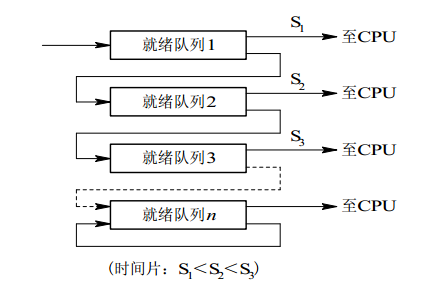

## 进程调度

* 先来先服务：
  非抢占式的调度算法，按照请求的顺序进行调度。有利于长作业，但不利于短作业，因为短作业必须一直等待前面的长作业执行完毕才能执行，而长作业又需要执行很长时间，造成了短作业等待时间过长。另外，对I/O密集型进程也不利，因为这种进程每次进行I/O操作之后又得重新排队。
* 短作业优先：
  非抢占式的调度算法，按估计运行时间最短的顺序进行调度。长作业有可能会饿死，处于一直等待短作业执行完毕的状态。因为如果一直有短作业到来，那么长作业永远得不到调度。
* 最短剩余时间优先：
  最短作业优先的抢占式版本，按剩余运行时间的顺序进行调度。 当一个新的作业到达时，其整个运行时间与当前进程的剩余时间作比较。如果新的进程需要的时间更少，则挂起当前进程，运行新的进程。否则新的进程等待。
* 时间片轮转：
  将所有就绪进程按 FCFS 的原则排成一个队列，每次调度时，把 CPU 时间分配给队首进程，该进程可以执行一个时间片。当时间片用完时，由计时器发出时钟中断，调度程序便停止该进程的执行，并将它送往就绪队列的末尾，同时继续把 CPU 时间分配给队首的进程。
  时间片轮转算法的效率和时间片的大小有很大关系：因为进程切换都要保存进程的信息并且载入新进程的信息，如果时间片太小，会导致进程切换得太频繁，在进程切换上就会花过多时间。 而如果时间片过长，那么实时性就不能得到保证。
* 优先级调度：
  为每个进程分配一个优先级，按优先级进行调度。为了防止低优先级的进程永远等不到调度，可以随着时间的推移增加等待进程的优先级。
* 多级反馈队列
  一个进程需要执行 100 个时间片，如果采用时间片轮转调度算法，那么需要交换 100 次。
  多级队列是为这种需要连续执行多个时间片的进程考虑，它设置了多个队列，每个队列时间片大小都不同，例如 1,2,4,8,..。进程在第一个队列没执行完，就会被移到下一个队列。这种方式下，之前的进程只需要交换 7 次。
  每个队列优先权也不同，最上面的优先权最高。因此只有上一个队列没有进程在排队，才能调度当前队列上的进程。
  可以将这种调度算法看成是时间片轮转调度算法和优先级调度算法的结合。
  

## 死锁

### 死锁条件

> 在两个或者多个并发进程中，每个进程持有某种资源而又等待其它进程释放它们现在保持着的资源，在未改变这种状态之前都不能向前推进，称这一组进程产生了死锁(deadlock)。
>

**条件：** 互斥、请求和保持、不可剥夺、循环等待。

### 如何处理死锁

1. 鸵鸟策略：不处理死锁，发生死锁后就释放死锁进程占用的资源。
2. 死锁检测和恢复：不阻止死锁，在检测到死锁发生时，进行恢复，可以通过资源分配图检测死锁的发生。
   利用抢占恢复，利用回滚恢复，通过杀死进程恢复。
3. 死锁预防：通过破坏4个条件之一
4. 死锁避免：通过银行家算法分配资源，拒绝进入不安全状态。

忽略该问题。例如鸵鸟算法，检测到死锁后释放死锁线程占用的所有资源。

利用银行家算法，仔细地对资源进行动态分配，以避免死锁。

破坏互斥条件：例如假脱机打印机技术允许若干个进程同时输出，唯一真正请求物理打印机的进程是打印机守护进程。

破坏请求保持条件：一种实现方式是规定所有进程在开始执行前请求所需要的全部资源。

破坏不可剥夺条件：

循环等待等待：给资源统一编号，进程只能按编号顺序来请求资源。

### 死锁避免

银行家算法：检查系统是否处于安全状态，只有处于安全状态时才会进行资源分配。安全状态一定不会死锁，不安全状态不一定导致死锁。

需要 可利用资源向量、最大需求矩阵、分配矩阵、需求矩阵。

## 生产者消费者问题

有限缓冲区问题


要求：

* 在缓冲区为空时，消费者不能再进行消费
* 在缓冲区为满时，生产者不能再进行生产
* 在一个线程进行生产或消费时，其余线程不能再进行生产或消费等操作，即保持线程间的同步
* 注意条件变量与互斥锁的顺序

需要一个互斥锁保证同时只能有一个进程访问缓冲区。

### 伪代码实现

```cpp
var items = 0, space = 10, mutex = 1;
var in = 0, out = 0;
item buf[10] = { NULL };

producer {
    while( true ) {
        wait( space );  // 等待缓冲区有空闲位置， 在使用PV操作时，条件变量需要在互斥锁之前
        wait( mutex );  // 保证在product时不会有其他线程访问缓冲区

        // product
        buf.push( item, in );  // 将新资源放到buf[in]位置 
        in = ( in + 1 ) % 10;
      
        signal( mutex );  // 唤醒的顺序可以不同
        signal( items );  // 通知consumer缓冲区有资源可以取走
    }
}

consumer {
    while( true ) {
        wait( items );  // 等待缓冲区有资源可以使用
        wait( mutex );  // 保证在consume时不会有其他线程访问缓冲区

        // consume
        buf.pop( out );  // 将buf[out]位置的的资源取走
        out = ( out + 1 ) % 10;

        signal( mutex );  // 唤醒的顺序可以不同
        signal( space );  // 通知缓冲区有空闲位置
    }
}
```

### C++实现

```cpp
#include <iostream>
#include <string.h>
#include <pthread.h>
#include <unistd.h>
using namespace std;

int current = 0;  // producer运行加1，consumer运行减1
int buf[10];
int in = 0, out = 0;
int items = 0, spaces = 10;
bool flag;  // 标记线程结束运行
pthread_mutex_t mutex = PTHREAD_MUTEX_INITIALIZER;
pthread_cond_t notfull = PTHREAD_COND_INITIALIZER;  // 缓冲区不满
pthread_cond_t notempty = PTHREAD_COND_INITIALIZER;  // 缓冲区不空

void *producer( void *arg ) {
    while( flag ) {
        pthread_mutex_lock( &mutex );  // 为保证条件变量不会因为多线程混乱，所以先加锁
        while( !spaces ) {  // 避免“惊群”效应，避免因其他线程实现得到事件而导致该线程“假醒”
            pthread_cond_wait( &notfull, &mutex );
        }
        buf[in] = current++;
        in = ( in + 1 ) % 10;
        items++;
        spaces--;

        printf( "producer %zu , current = %d\n", pthread_self(), current );
        for( int i = 0; i < 10; i++ ) {
            printf( "%-4d", buf[i] );
        }
        printf( "\n\n" );

        pthread_cond_signal( &notempty );
        pthread_mutex_unlock( &mutex );
    }
    pthread_exit( NULL );
}

void *consumer( void *arg ) {
    while( flag ) {
        pthread_mutex_lock( &mutex );
        while( !items ) {
            pthread_cond_wait( &notempty, &mutex );
        }
        buf[out] = -1;
        out = ( out + 1 ) % 10;
        current--;
        items--;
        spaces++;

        printf( "consumer %zu , current = %d\n", pthread_self(), current );
        for( int i = 0; i < 10; i++ ) {
            printf( "%-4d", buf[i] );
        }
        printf( "\n\n" );

        pthread_cond_signal( &notfull );
        pthread_mutex_unlock( &mutex );
    }
    pthread_exit( NULL );
}

int main() {
    memset( buf, -1, sizeof(buf) );
    flag = true;
    pthread_t pro[10], con[10];
    int i = 0;

    for( int i = 0; i < 10; i++ ) {
        pthread_create( &pro[i], NULL, producer, NULL );
        pthread_create( &con[i], NULL, consumer, NULL );
    }

    sleep(1);  // 让线程运行一秒
    flag = false;

    for( int i = 0; i < 10; i++ ) {
        pthread_join( pro[i], NULL );
        pthread_join( con[i], NULL );
    }

    return 0;
} 
```

## 读者写者问题

```cpp
typedef int semaphore;
semaphore count_mutex = 1;
semaphore data_mutex = 1;
int count = 0;

void reader() {
    while(TRUE) {
        down(&count_mutex);
        count++;
        if(count == 1) down(&data_mutex); // 第一个读者需要对数据进行加锁，防止写进程访问
        up(&count_mutex);
        read();
        down(&count_mutex);
        count--;
        if(count == 0) up(&data_mutex);
        up(&count_mutex);
    }
}

void writer() {
    while(TRUE) {
        down(&data_mutex);
        write();
        up(&data_mutex);
    }
}
```