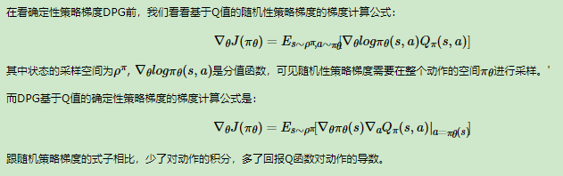
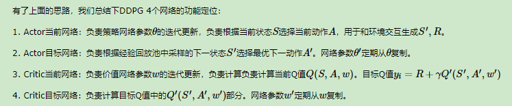

## 深度确定性策略梯度

> 确定性策略是和随机策略相对而言的，对于某一些动作集合来说，它可能是连续值，或者非常高维的离散值，这样动作的空间维度极大。如果我们使用随机策略，即像DQN一样研究它所有的可能动作的概率，并计算各个可能的动作的价值的话，那需要的样本量是非常大才可行的。于是有人就想出使用确定性策略来简化这个问题
>

作为随机策略，在相同的策略，在同一个状态处，采用的动作是基于一个概率分布的，即是不确定的。而确定性策略则决定简单点，虽然在同一个状态处，采用的动作概率不同，但是最大概率只有一个，如果我们只取最大概率的动作，去掉这个概率分布，那么就简单多了。即作为确定性策略，相同的策略，在同一个状态处，动作是唯一确定的，即策略变成

$$
\pi_\theta(s) = a
$$

上面就是确定性策略梯度，主要是为了解决连续动作空间维度大的问题，这样会有探索能力低的问题。

