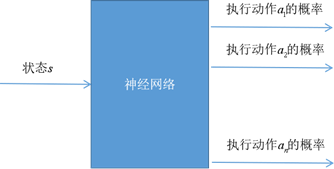

策略梯度的方法可以参考论文阅读笔记 ["Policy Gradient"](siyuan://blocks/20201219103705-1oyik4a)

## Questions

* policy gradient怎么表示非确定性策略

---

## 策略梯度

一个非确定性策略应该输出的是某个状态下执行某个动作的概率，可是在**连续动作**的情况下，他应该怎么输出*不同动作的概率呢*?或者直接输出动作的话，应该是确定的。

$$
\pi (a|s) = p(a|s)
$$

我们希望构造一个目标函数，目标函数的输入应该是我们的策略，之后通过梯度上升提高目标。

$$
\boldsymbol{\theta}_{t+1}=\boldsymbol{\theta}_{t}+\alpha \nabla_{\boldsymbol{\theta}} L\left(\boldsymbol{\theta}_{t}\right)
$$

符号约定

* $\pi(a|s)$：随机策略
* $\mu(s)$：确定性策略
* $V(s)$：状态值函数
* $Q(s,a)$：动作值函数
* $R(s_t,a_t)$：在状态$s_t$执行动作$a_t$得到的及时回报
* $G(s_t,a_t)$：在状态$s_t$执行动作$a_t$直到结束得到的累计回报

### 目标函数

#### 平均奖励

多用于没有起始状态和终止状态的问题。

 它定义为各个时刻回报值的均值，是按照策略π执行，时间长度n趋向于+∞时回报均值的极限

$$
\begin{aligned}
J(\pi) &=\lim _{n \rightarrow+\infty} \frac{1}{n} \mathrm{E}\left[r_{1}+r_{2}+\ldots+r_{n} \mid \pi\right] \\
&=\sum_{s} p_{\pi}(s) \sum_{a} \pi(a \mid s) R(a, s)
\end{aligned}
$$

状态的概率，状态下执行某个动作的概率和对应的立即回报，上述概率应该是通过采样得到的吧。

#### 起始状态目标函数

用于有起始状态和终止状态的问题。

定义为从起始状态$s_0$开始，执行策略$\pi$得到的累计回报。

$$
J(\pi)=\mathrm{E}\left[\sum_{t=1}^{+\infty} \gamma^{t} r_{t} \mid s_{0}, \pi\right]
$$

也就是一条有终止路径上的折扣累积和。

### 策略梯度定理

策略梯度定理（policy gradient theorem）指出，无论是平均奖励还是起始状态形式的目标函数，对任意的马尔可夫决策过程trajectory，目标函数对策略参数的梯度均为如下形式

$$
\begin{aligned}
\nabla_{\boldsymbol{\theta}} J(\pi)&=\nabla_\theta \sum_{s} p_{\pi}(s) \sum_{a} Q_{\pi}(s, a) \nabla_{\boldsymbol{\theta}} \pi(a \mid \boldsymbol{s} ; \boldsymbol{\theta}) \\
&= \mathbb{E}_{s \sim \pi} \left[ \sum_a Q_\pi(s_t,a) \nabla_\pi(a|s_t,\theta) \right]
\end{aligned}
$$

$$
\begin{aligned}
\nabla_{\theta} J(\theta) & \propto \sum_{s \in \mathcal{S}} d^{\pi}(s) \sum_{a \in \mathcal{A}} Q^{\pi}(s, a) \nabla_{\theta} \pi_{\theta}(a \mid s) \\
&=\sum_{s \in \mathcal{S}} d^{\pi}(s) \sum_{a \in \mathcal{A}} \pi_{\theta}(a \mid s) Q^{\pi}(s, a) \frac{\nabla_{\theta} \pi_{\theta}(a \mid s)}{\pi_{\theta}(a \mid s)} \\
&=\mathbb{E}_{\pi}\left[Q^{\pi}(s, a) \nabla_{\theta} \ln \pi_{\theta}(a \mid s)\right]
\end{aligned}
$$

$p_\pi(s)$ 是在马尔科夫链中在策略$\pi$下状态的平稳分布【指的是在策略$\pi$下任意时间$t$状态$s$出现的概率期望】，不同状态出现的概率和应该是1.

假设你可以沿着马尔科夫链永远的移动，最终，随着时间的推移，我们达到一个状态的概率是平稳的。

下面的公式是用期望代替概率和。

### 策略梯度实现

["PG_1_REINFORCE"](siyuan://blocks/20210726154107-qdpqlly) (Monte-Carlo policy gradient)

["PG_2_Actor-Critic"](siyuan://blocks/20210726154118-wuid2e3) 使用Critic网络替换蒙特卡洛法估计值函数

["PG_3_Off-Policy Policy Gradient"](siyuan://blocks/20210726154146-a5peohd)