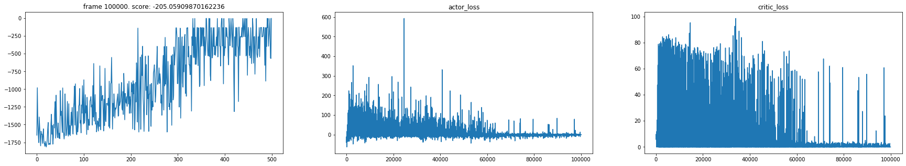

## Actor-Critic

不多废话，直接参考[这篇](https://nbviewer.jupyter.org/github/MrSyee/pg-is-all-you-need/blob/master/01.A2C.ipynb#)，或者这个仓库[pg-is-all-you-need](https://github.com/MrSyee/pg-is-all-you-need)

在["PG_0_Policy Gradient"](siyuan://blocks/20201222220453-qucvpd8)里我们用蒙特卡洛法计算每一步的价值，但是在一个trajectory里有很多动作，我们不清楚那么动作对最后的结果有用，所以REINFORCE算法的方差很大。在Actor-Critic里，我们用Critic做策略评估，来估计动作值函数。

* Critic用来近似动作值函数$Q_{w}(s, a) \approx Q^{\pi_{\theta}}(s, a)$或价值函数$V_w(s) \approx  V^{\pi_\theta}(s)$
* Actor 以Critic指导的方向更新策略的参数

考虑之前的策略梯度更新公式

$$
\theta \leftarrow \theta+\alpha \gamma^{t}  \nabla_{\theta} \ln \pi_{\theta}\left(a_{t} \mid s_{t}\right)G_{t}
$$

分值函数$ \nabla_{\theta} \ln \pi_{\theta}\left(a_{t} \mid s_{t}\right)$不需要变，我们只需要更改$G_t$，这里不再用蒙特卡洛法估计，而是从Critic得到。

$$
\theta=\theta+\alpha \nabla_{\theta} \log \pi \theta\left(S_{t}, A\right) \delta
$$

关于Critic部分，我们可以参考DQN，使用一个Q网络来估计每个动作的Q值。

## 可选的评估点

之前我们用$G_t$来评估状态的奖励，但Actor-Critic还可以选择其它的评估方式

* 基于状态价值：感觉这里的状态价值和$G_t$并没有什么区别
* 基于动作价值：在DQN我们是用动作价值函数来做评估的
* 基于时序差分算法：可以应用于没有完整序列的情况，$A(S, A, w, \beta)=Q(S, A, w, \alpha, \beta)-V(S, w, \alpha)$
* 基于优势函数：优势函数即动作值函数和状态值函数的差$A(S, A, w, \beta)=Q(S, A, w, \alpha, \beta)-V(S, w, \alpha)$
* 基于TD$(\gamma)$误差：用TD($\gamma)$误差和效用迹的乘积，[扩展阅读](https://www.cnblogs.com/pinard/p/9529828.html)
*

## Actor-Critic算法流程

1. 初始化网络状态
2. For t = 1 ... T:
   1. 初始化状态$s$
   2. 在Actor网络中根据$s$得到动作$a$，和环境交互得到下一个状态$s\prime$和奖励$r_t$
   3. 在Critic网络中输入$s$和$s\prime$，得到状态值$V(s)$和$V(s\prime)$
   4. 使用均方误差更新Critic网络$\sum\left(r+\gamma V\left(S^{\prime}\right)-V(S, w)\right)^{2}$
   5. 计算TD误差$\delta=r_t+\gamma V\left(s^{\prime}\right)-V(s)$
   6. 更新Actor网络参数$\theta=\theta+\alpha \nabla_{\theta} \log \pi \theta\left(S_{t}, A\right) \delta$

对于Actor的分值函数$\nabla_{\theta} \log \pi_{\theta}\left(S_{t}, A\right)$，如果是离散动作的，可以选softmax，如果是连续动作，可以选高斯函数。

## 疑问

Critic是怎么更新的，在DQN里是采样更新的，在Critic里是根据当前的奖励和之后的奖励估计的

## 代码

