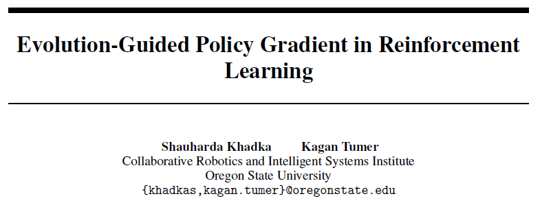

## Abstract

> 强化学习面临的问题
>

## Background Konwledge

#### 强化学习的3个问题：

**时序信誉分配下的稀疏奖励**

时序差分的方法用自举的方式解决这个问题。

Multi-step returns 也可以解决这个问题，但它多用于on-policy方法。

off-policy的multi-step learning方法也可以是稳定的，但需要搭配importance sampling, Retrace, V-trace

**缺少有效探索**

**超参数敏感**

## Proposed method

在DDPG的基础上改进。包括四种网络和经验池。

使用基于种群的方法，种群中有K个actor，额外还有一个actor和critic。

## Discussion

讨论一下启发和不足