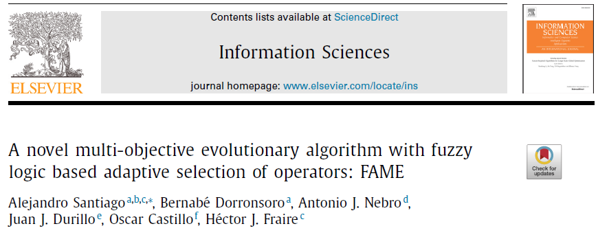
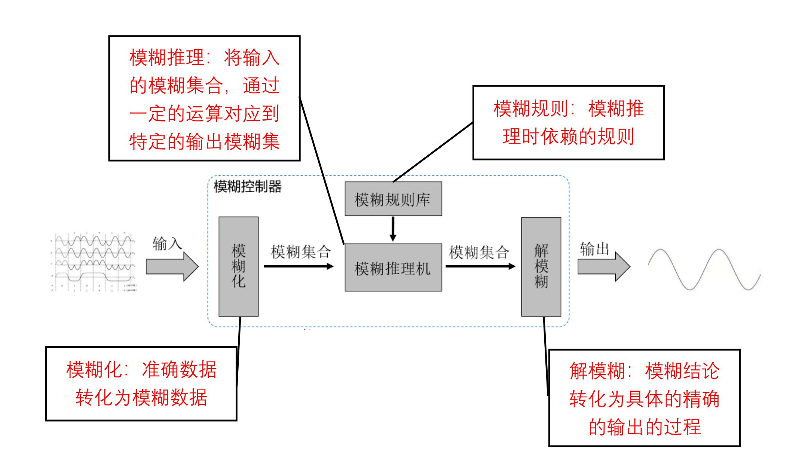
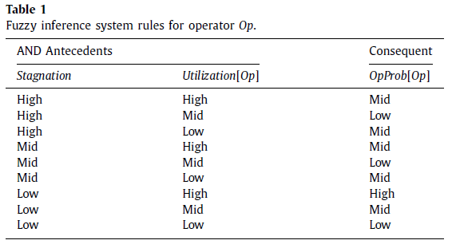
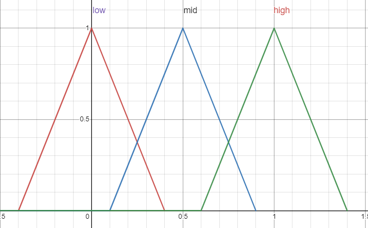

## Abstract

> 几句话介绍
>

## Background Konwledge

### 模糊逻辑系统

不同于非0即1，可以存在模糊地带，没有一个明显的界限。为了描述模糊的程度，我们隶属度的概念：0到1之间的数值，表示事件属于0或属于1的大小，隶属度可以通过隶属函数来确定。

需要指出的是，模糊逻辑系统有两项基本原则。一是模糊逻辑的含义是让计算机以一种接近人类行为的方式去解决问题。二是模糊逻辑的本质是一切都和程度有关。

基本概念：

- 模糊集
  将隶属度对应到某个特定的值，比如对于体重的模糊集合可能是
  这样对于一个具体的输入值，太瘦的隶属度是0，理想的隶属度是0.75，超重的隶属度是0.15，我们就可以推断这个人的体重是理想的。
- 隶属度
- 隶属函数
  隶属函数用于从输入值计算隶属度，本文中使用的是三角形隶属函数。
  $$
  \mu_{A}(x)=\left\{\begin{array}{lll}
  0 & \text { if } & x \leq a \\
  \frac{x-a}{b-a} & \text { if } & a \leq x \leq b \\
  \frac{c-x}{c-b} & \text { if } & b \leq x \leq c \\
  0 & \text { if } & c \leq x
  \end{array} .\right.
  $$
- 去模糊
  当你想用精确数值作为模糊系统的输出数据时，就需要解模糊的过程。在前面我们说过，每条规则都会得到某个输出模糊集合中的隶属程度。在推理得到的模糊集合中取一个最能代表这个模糊集合的单值的过程称作解模糊。常用的方法有最大隶属度法、最大平均法、面积均分法和重心法。本文用的是重心法
- 模糊规则
  将明确的输入都模糊化后，接着要做的是构建一组规则，以某种逻辑方式结合输入数据，生成某些输出结果。和传统逻辑运算一样，我们引入模糊逻辑运算符交集（AND）、联集（OR）以及补集（NOT）。对于模糊变量来说，OR逻辑运算符被定义为操作数中的最大值，AND逻辑运算符被定义成操作数中的最小值，NOT运算符则是1减去操作数的隶属度。在传统逻辑的布尔系统中，每条规则会逐一运算，直到有条规则为真为止，然后就开始运行此结论。在模糊逻辑的系统中，所有的规则都会同时进行运算，每条规则都会运行（因为每条规则都是部分真），然而，运行的强度或程度则各不相同。每条规则的前提的逻辑运算结果，会产生该规则结论的强度。换句话说，每条规则的强度代表的是输出的模糊集合中的隶属程度。

**流程：**

模糊流程由三个基本步骤组成，分别是：

模糊化：根据隶属度函数从具体的输入得到对模糊集隶属度的过程；

推理方法：从模糊规则和输入对相关模糊集的隶属度得到模糊结论的方法；

去模糊化：将模糊结论转化为具体的、精确的输出的过程。

输入（采集明确数据）→ 模糊化（根据隶属度函数，如分段函数、分布函数，再从具体的输入，得到 隶属度模糊集合（特征数据）） → 模糊规则库 + 推理方法 → 模糊结论 → 去模糊化

使用滑动窗口平滑算子的概率波动。

## Questions

**停滞变量有什么用?**

**密度估计器SSD有什么作用**

似乎类似拥挤距离，用来维护Archive。

**怎么去模糊的?**

取质心做逆模糊。

**这里的轮盘赌不太一样：**

将所有算子的概率聚合成一个Sum，然后随机选择一个算子，从sum中减去它的概率，如果sum<=0，就应用这个算子。

## Proposed method

### 模糊推理系统

step1. 初始随机生成种群，并设置SSD=0，将非支配解添加到Archive。设置重组算子的概率=1

step2.1 使用类似锦标赛的方法选择父代，先根据支配关系选择，在根据SSD值选择

step2.2 选择和应用重组算子，使用轮盘赌机制，之后算子的应用会增加$\frac{1}{windowSize}$，窗口计数器会增加1

step2.3 更新Archive，如果子代是非支配的，增加到Archive；否则，停滞变量增加$\frac{1}{windowSize}$。

step2.4 使用模糊推理系统，当$window==windowSize$，通过算子的值和停止变量更新所有运算符的应用概率，然后重置$window=Stagnation=0$。

step2.5 使用新产生的子代更新种群。

## Discussion

讨论一下启发和不足