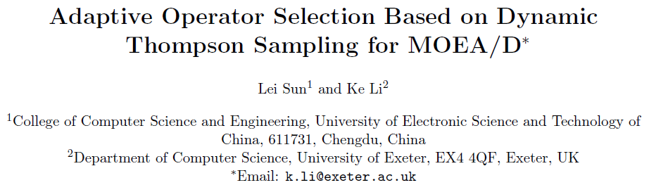
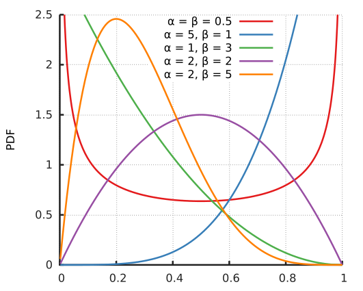
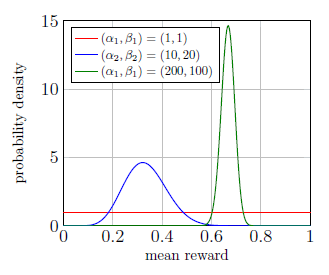
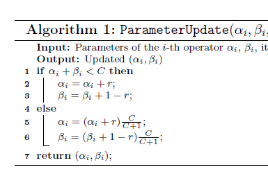

> AOS is formulated as a multi-armed the bandit problem, dynamic Thompson sampling (DYTS) is     applied to adapt the bandit learning model.每个arm对应一个reward distribution
> operator selection：根据DYTS对算子的reward distribution采样
> 参数更新
>

由于不同的搜索时期会有不同的最佳算子，所以AOS实际上是一个动态环境的多臂赌博机问题，本文利用动态汤普森采样策略来解决非平稳环境下的探索利用困境。

## Adaptive Operator Selection

AOS 根据最近的搜索结果为当前个体选择最合适的reproduction operator，主要有credit assignment 和operator selection两部分。

credit assignment: 根据算子最近的表现给算子reward。

operator selection：根据算子的quality，为当前个体选择合适的算子。

## Multi-armed bandit

每个arm都有一个暗藏reward distribution，主要是一个探索和利用困境问题，尤其是动态多臂赌博机，每个arm的分布都是随时间而变化的，之前采样的估计可能就不准确。

## Beta distribution and Thompson Sampling

Thompson Sampling是解决二值MAB的有效方法，对于二值MAB来讲，每个动作的reward只能是0或1，所以我们可以使用多次reward的均值 $\theta$ 作为这个arm下次得到reward的概率，所以对于k臂赌博机：

$$
\mathbb {P}(r_i=1|a_i,\theta)=\theta_i; \qquad\theta=(\theta_i,\cdots,\theta_k)
$$

对于 $\theta$ 我们的先验分布（prior distribution）是Beta分布，而每个arm reward的分布是以 $\theta$ 为参数的Bernoulli分布。

我们可以假设K臂赌博机的参数 $\theta$ 符合Beta分布，它是一种定义在 $(0,1)$ 区间的连续概率分布，有两个参数 $\alpha, \beta > 0$ ，概率密度函数为：

$$
f(x ; \alpha, \beta)=\frac{x^{\alpha-1}(1-x)^{\beta-1}}{\int_{0}^{1} u^{\alpha-1}(1-u)^{\beta-1} d u}=\frac{\Gamma(\alpha+\beta)}{\Gamma(\alpha) \Gamma(\beta)} x^{\alpha-1}(1-x)^{\beta-1}=\frac{1}{B(\alpha, \beta)} x^{\alpha-1}(1-x)^{\beta-1}
$$



期望 $\mu=\mathrm{E}(X)=\frac{\alpha}{\alpha+\beta}$ ，众数 $M_o= \frac{\alpha-1}{\alpha+\beta-2}$ 。我们可以大体理解就是 $\alpha$ 越大，1的概率越大； $\beta$ 越大，0的概率越大。

所谓的Thompson Sampling就是为每个动作建立一个beta分布，多次采样调整beta分布的参数。步骤如下：

**Thompson Sampling**

```ABAP
1. 为每个arm建立一个初始beta分布。
2. 对每个分布采样，得到θ，根据θ建立伯努利分布。 
3. 对伯努利分布采样，更新对应beta分布的参数。
4. 重复上述过程。 
```

## MOEA/D-DYTS

为每个arm初始化一个独立的奖励分布，我们使用一个包含 $\alpha$ 和 $\beta$ 的Beta分布来表示arm的奖励分布。

$$
\mathcal{P}^{\text {Beta}}\left(\theta_{i}\right)=\frac{\Gamma\left(\alpha_{i}+\beta_{i}\right)}{\Gamma\left(\alpha_{i}\right) \Gamma\left(\beta_{i}\right)} \theta_{i}^{\alpha_{i}-1}\left(1-\theta_{i}\right)^{\beta_{i}-1}
$$

对于一个给定的动作，根据执行动作的奖励更新beta分布的参数。

$$
\alpha_i = \alpha_i + r_i, \quad \beta_i = \beta_i + 1 - r_i
$$

对于k臂赌博机，我们一共有k个beta分布，那么如何确定接下来执行的动作呢？这里就牵扯到探索、利用困境。

Thompson Sampling对所有的分布采样得到k个 $\theta$ ，选择最大的 $\theta$ 对应的动作执行，初始时所有的beta参数都被设置为1，表示(0,1)上的均匀分布，期望 $\mu=\mathrm{E}(X)=\frac{\alpha}{\alpha+\beta}$ ， $\alpha_i+\beta_i$ 越大越接近均值。



由于算子的效果可能会随着进化过程而改变，而在后期由于 $\alpha$ 和 $\beta$ 太大可能难以改变，所以**Dynamic Thompson Sampling**就是定时`重启`$\alpha$ 和 $\beta$ 的值，我们确定一个阈值C，如果 $\alpha_i+\beta_i=C$ ，那么就乘以 $\frac{C}{C+1}$



### Credit Assignment

计算子代到种群其它解的切比雪夫距离，如果子代能替换一个解，那就证明这个算子是 `成功` 的，reward=1，否则reward=0。

$$
F I=\max _{\mathbf{x}^{i} \in P}\left\{g^{\mathrm{tch}}\left(\mathbf{x}^{i} \mid \mathbf{w}^{i}, \mathbf{z}^{*}\right)-g^{\mathrm{tch}}\left(\mathbf{x}^{c} \mid \mathbf{w}^{i}, \mathbf{z}^{*}\right)\right\}
$$

### Operator Selection

采样 $\theta$ 后直接选择 $\theta$ 最大的动作执行。