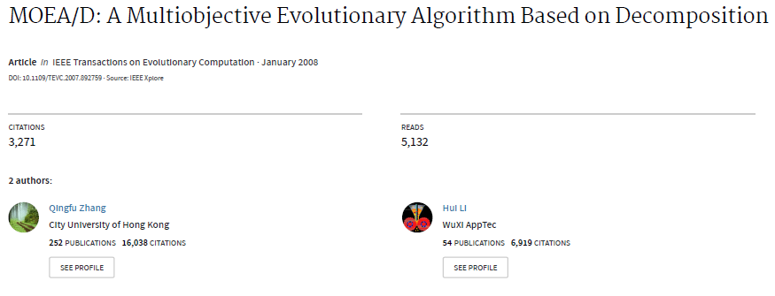

Pareto最优前沿的近似求解可以被分解为一组标量目标优化子问题。MOEA\D将多目标问题分解为N个标量的子问题，它通过进化出一个**解的种群**来同时解决所有子问题。对于每一代种群，种群是从所有代中选出每个子问题的最优解的集合。

#### 问题

- [ ] 邻域起什么作用？
- [ ] 必须两个种群？一个存储当前N个子问题的最优解，一个存储当前搜索到的非支配解？？？
-  [ ]

#### 多目标优化中的分解算法

> 将求Pareto前沿近似解的问题转化为一组标量优化问题。
>

1. 权重求和方法

将一个非负的权重向量加权到每个目标上，就可以将MOP转化为单目标子问题，如果我们用不同的权重向量就可以产生一组不同的Pareto最优解。

2. 切比雪夫聚合法

minimize $g^{t e}\left(x | \lambda, z^{*}\right)=\max _{1: i \leq m}\left\{\lambda_{i}\left|f_{i}(x)-z_{i}^{*}\right|\right\}$
subject to $x \in \Omega$
$z^*$ 是参考点，例如 $z_i^*=\max \left\{f_{i}(x) | x \in \Omega\right\}^{3}$ ，对于每一个Pareto最优解 $x^*$ 总存在一个权重向量 $\lambda$ 使得 $x^*$ 是上式的解，并且通过修改权重向量可以获得Pareto最优面上不同的解。

3. 边界交叉聚合法

#### MOEA/D框架

**初始条件：**

- 大小为N的种群， $x^1,\dots ,x^N \in \Omega$ ，其中 $x^i$ 是第 $i$ 个子问题的当前解。
- $FV^1,\dots,FV^i$ ，其中 $FV^i$ 是 $x^i$ 的目标函数值。
- $z^i$ 是目前搜索到的目标函数 $f^i$ 的最佳值。
- 一个外部种群，用来存储当前搜索到的非支配解。

每个子问题均含一解。

---

**INPUT：**

- 多目标问题
- 终止条件
- 种群大小**Ｎ**
- 均匀分布的N个权重向量
- 每个邻域中权重向量的个数**T**

> 更新方法是在临近的权重向量中选择两个，由他们对应的x产生新的解，然后就可以根据需要更新z。
>

**Step:**

1. 初始化
   1. 计算任意两个权重向量间的欧氏距离，查找每个权重向量最近的T个权重向量。
   2. 在可行空间中随机均匀采集产生初始种群 $x^1,\dots ,x^N$ 。
   3. 初始化 $z=\left(z_{1} \ldots \ldots z_{m}\right)^{T}$ ，令 $z_{i}=\min \left\{f_{i} x^{1}, f_{i} x^{2}, \ldots, f_{i} x^{N}\right\}$
   4. 设置EP(非支配解集)为空
2. 更新
   ```
   for i=1...N do 
   从第i个权重向量的邻域中随机选择两个权重向量对应的x，经过交叉变异产生新的解y
   对y利用基因测试问题的修复和改进产生y' #应该是检查边界吧~
   更新z，第i个目标上的最佳值
   ```

   更新邻域解 ==待补充==
   更新EP，从EP中移除被y‘支配的向量，如果EP中的向量都不支配y'，将y'加入EP
   输出非支配解EP

**总结：**

1. 均匀生成N个权重向量，， $\lambda^1,\lambda^2,\dots,\lambda^N$ ，并计算每个权重向量最近的T个权重向量
2. 随机初始化大小为N的种群，个体 $x^1,x^2,\dots,x^N$
3. 计算种群中每个个体的目标函数值  $FV^i$
4. 找到每个目标的最佳函数值， $z_1,z_2,\dots,z_m$
5. 对于每一个权重向量，在它的邻域中随机选择两个索引k,l，选择 $x^k,x^l$ 生成下一代个体
6. 按照 Tchebycheff 分解法判断是否需要更新邻域，
7. 更新EP，移除被新子代支配的解，如果子代y不被支配，就将y加入EP