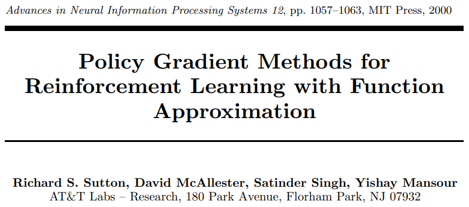
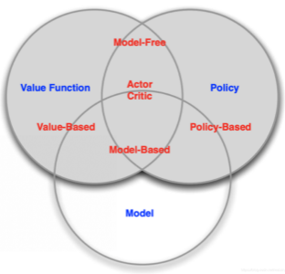

## Abstract

> Value Based的方法有许多局限，比如不能处理连续决策问题；得到的策略往往是确定的。
>

## Background Konwledge

基于值的强化学习方法，比如DQN通常有如下*局限性*：

- 对连续动作处理能力不足。DQN通常是用来选择某一个动作，但如果动作是连续不可分的，比如要在空间上选择一个向量，DQN使用离散的方式是难以表达的。
- 对动作值函数的估计会带来不连续的变化，所以Q-learning,Sarsa这种方法其实是不能保证收敛的。
- *无法解决随机策略问题*。Value Based强化学习方法对应的最优策略通常是确定性策略，因为其是从众多行为价值中选择一个最大价值的行为，而有些问题的最优策略却是随机策略，这种情况下同样是无法通过基于价值的学习来求解的。这时也可以考虑使用Policy Based强化学习方法。
- 对受限状态下的问题处理能力不足。在使用特征来描述状态空间中的某一个状态时，有可能因为个体观测的限制或者建模的局限，导致真实环境下本来不同的两个状态却再我们建模后拥有相同的特征描述，进而很有可能导致我们的value Based方法无法得到最优解。此时使用Policy Based强化学习方法也很有效。

## Proposed method

之前value based的方法对值函数做近似，提出*动作价值函数*指导动作的选择，

$$
\hat{q}(s, a, w) \approx q_{\pi}(s, a)
$$

基于解决问题的角度给出强化学习三要素(value function, policy, model)，我们可以对策略做近似，将策略 $\pi$ 表示成包含参数 $\theta$ 的状态到动作的映射

$$
\pi \theta(s, a)=P(a \mid s, \theta) \approx \pi(a \mid s)
$$

将策略表示成连续函数后就可以用连续函数的优化方法，比如梯度上升来最大化目标。

### 优化目标

通常的优化目标是在*初始状态*收获的期望，

$$
J_{1}(\theta)=V_{\pi \theta}\left(s_{1}\right)=\mathbb{E}_{\pi \theta}\left(G_{1}\right)
$$

但有些问题没有固定的初始状态，那么我们可以定义*多个状态的平均*价值，

$$
J_{a v V}(\theta)=\sum_{s} d_{\pi \theta}(s) V_{\pi \theta}(s)
$$

或者是定义*每个时间步的平均*奖励

$$
J_{a v R}(\theta)=\sum_{s} d_{\pi \theta}(s) \sum_{a} \pi_{\theta}(s, a) R_{s}^{a}
$$

但无论是哪种目标函数，对参数 $\theta$ 求导的梯度都可以表示成

$$
\nabla_{\theta} J(\theta)=\mathbb{E}_{\pi \theta}\left[\nabla_{\theta} \log _{\pi} \theta(s, a) Q_{\pi}(s, a)\right]
$$

### 策略函数

策略函数就是前面的 $\pi_\theta(s,a)$ ，常见的有以下几种策略函数

- softmax策略函数 $S_{i}=\frac{e^{i}}{\sum_{j} e^{j}}$ ，应用于离散空间，它使用一个特征 $\phi(s,a)$ 描述状态和动作，并和参数 $\theta$ 线性组合作为和softmax函数结合。 **TODO**这里的公式可能有错误

$$
\pi_\theta(s, a)=\frac{(e^{\phi(s, a)})^T\cdot\theta}{\sum_{b} e^{\phi(s, b)^{T} \theta}}
$$

- 高斯策略函数，利用高斯分布 $N(\mu,\sigma^2)$ 产生，应用于连续行为空间，
  $$
  \pi_\theta(s,a) = N(\phi(s)^T \theta,\sigma^2)
  $$

### 蒙特卡洛策略梯度算法

输入：N个完整的状态动作回报序列

1. 对每个序列使用蒙特卡洛法估计状态价值函数 $v_t$
2. 使用梯度上升更新策略函数的参数

$$
\theta=\theta+\alpha \nabla_{\theta} \log \pi \theta\left(s_{t}, a_{t}\right) v_{t}
$$

## Discussion

讨论一下启发和不足