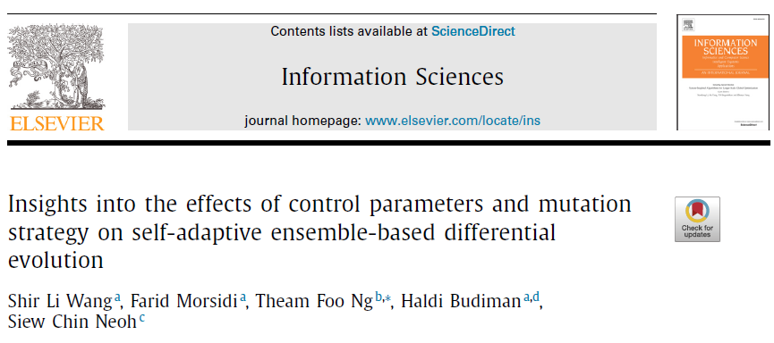
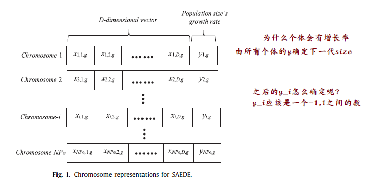
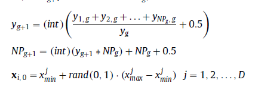

> self-adaptive ensemble-based 使用自适应集成机制设置每一代的参数。自适应指的是编码成染色体的解的进化，而集成指的是在一致的基础上从一组解构建最终解的方法。
> 自适应用来确定NP，集成用来确定F，CR，M。
>

现在的问题就是$y_{i,g}$是怎么确定的，由上面两个公式，根据$y$可以确定$NP$但是每一代的y是怎么确定的呢?

*最后一个gene也是和其它的位一样，通过交叉变异获得*

SAEDE结合了DE_Rel调整种群大小和EPSDE控制参数和变异策略。

**EPSDE的参数控制**

关于DE算法的F,CR和M等参数，由9种F，5种CR，和3种DE算子构成135种策略，初始时为每个个体随机分配一个策略，进化后

- 子代优于父代，则说明策略是有效的，保留策略，并存储到存档A中。
- 子代比父代差，则以50%的概率重新分配策略，50%的概率从存档A中选择。