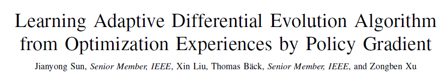

## Abstract

> 几句话介绍
>

## Background Konwledge

与论文相关的一些背景知识

## Questions

1. 强化学习的方法
2. 网络模型
3. 输入和输出
4. 强化学习的三要素
5. 控制方式，离线的还是在线的？
6. 如何更新的网络参数？

## Proposed method

这篇论文提出的方法

## Discussion

讨论一下启发和不足