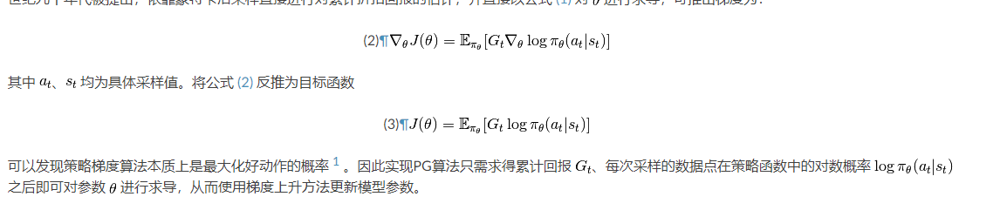
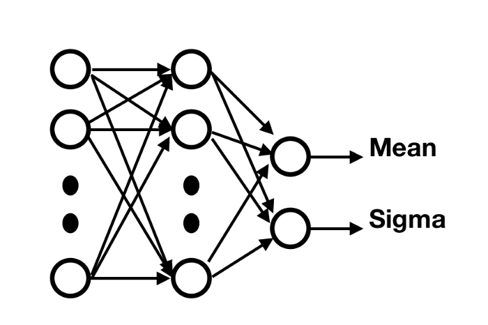

$$
\begin{aligned}
\nabla_{\boldsymbol{\theta}} J(\pi)&=\sum_{s} p_{\pi}(s) \sum_{a} Q_{\pi}(s, a) \nabla_{\boldsymbol{\theta}} \pi(a \mid \boldsymbol{s} ; \boldsymbol{\theta}) \\
&= \mathbb{E}_{s \sim \pi} \left[ \sum_a Q_\pi(s_t,a) \nabla_\pi(a|s_t,\theta) \right]
\end{aligned}
$$

## REINFORCE

又称蒙特卡洛策略梯度，使用蒙特卡洛法估计回报，利用采样的累计回报作为$Q$值。

$$
\begin{aligned}
\nabla_{\theta} J(\theta) &=\mathbb{E}_{\pi}\left[Q^{\pi}(s, a) \nabla_{\theta} \ln \pi_{\theta}(a \mid s)\right] \\
&=\mathbb{E}_{\pi}\left[G_{t} \nabla_{\theta} \ln \pi_{\theta}\left(A_{t} \mid S_{t}\right)\right] \quad ; \text { Because } Q^{\pi}\left(S_{t}, A_{t}\right)=\mathbb{E}_{\pi}\left[G_{t} \mid S_{t}, A_{t}\right]
\end{aligned}
$$

$G_t$是累计回报$G_{t}=\sum_{k=t+1}^{T} \gamma^{k-t} R_{k}$，可以通过真实采样的路径得到，这要求我们必须有完整的路径。

$$
G(t)=R_{t+1}+\gamma V\left(S_{t+1}\right)
$$

## **Reinforce**算法流程

1. 初始化策略参数$\theta$
2. 用策略采样得到路径$\tau : s_1,a_1,r_2,s_2,a_2,\dots,s_T.$
3. for t = 1,2, ... T:
   1. 用蒙特卡洛法估计累计回报$G_t$
   2. 使用梯度上升更新策略参数$\theta \leftarrow \theta+\alpha \gamma^{t} G_{t} \nabla_{\theta} \ln \pi_{\theta}\left(a_{t} \mid s_{t}\right)$

如果$G_t>0$参数更新的方向会增加它在当前状态的概率，回报越大更新幅度越大，概率增加也越大，因此但是有些动作即便比较差，$G_t$也是大于0的，同样会增加概率，一种改进方式是在$G_t$中减去一个`baseline`，这样可以减少估计梯度$\nabla_\theta J(\theta)$的方差，同时保证偏差不变。baseline应当是一个和动作无关的值，

比如一个常见的baseline是从动作值函数中减去状态值函数，这是一个和动作无关的值。$A(s,a)=G(s,a)-V(s)$



## 连续动作的处理

对于离散型的动作，神经网络输出每个动作的概率， 对于连续型动作，神经网络拟合的是概率分布的参数，比如对于正态分布，我们可以拟合其均值$\mu$和标准差$\sigma$。有了均值和标准差我们就可以求出概率密度函数，概率密度函数指示取到每个$x$的概率，其曲线下面积和应该是1。

$$
\pi(a \mid s ; \boldsymbol{\theta})=\frac{1}{\sqrt{2 \pi} \sigma(s ; \boldsymbol{\theta})} \exp \left(-\frac{(a-\mu(s ; \boldsymbol{\theta}))^{2}}{2 \sigma^{2}(s ; \boldsymbol{\theta})}\right)
$$

两边取`log`

$$
\log \left(\pi_{\theta}\left(A_{t} \mid S_{t}\right)\right)=\log \left[\frac{1}{\sqrt{2 \pi} \sigma}\right]-\frac{(x-\mu)^{2}}{2 \sigma^{2}}
$$

之后我们可以求参数的导数

$$
\nabla_{\theta} \log \pi_\theta(s, a)=\frac{\left(a-s^{T} \theta\right) s}{\sigma^{2}}
$$

```python
mu, sigma = self.policy(state)
dists = torch.distributions.Normal(mu, sigma)
action = dists.sample()
probs = dists.log_prob(action)
```

对于用神经网络近似高斯策略，网络的输出应该是动作维度，另外会有两个不同的输出神经元，分别预测$\mu$和$\sigma$。

