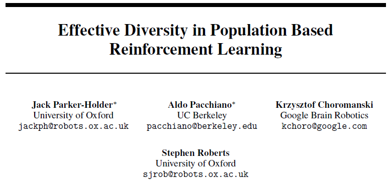
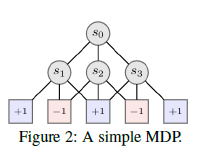
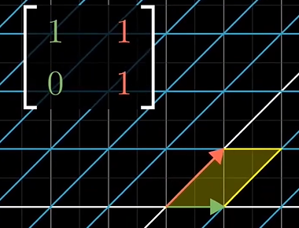
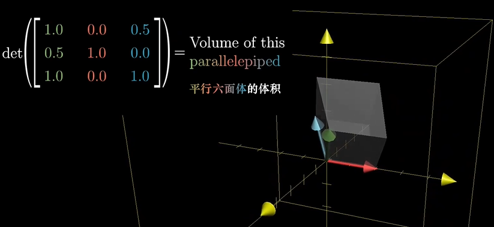
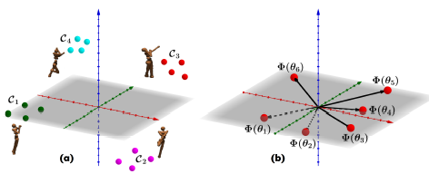

## Motivation

> 为了在强化学习中得到不同风格的agent，一个简单的方法是训练一个agent种群，为了使得种群中的agent差异更大，我们希望种群内的分布性尽可能大，而且每个agent都能获得不错的agent。
>
> 对于简单的RL测试环境，可能有最佳的agent，因此为了测试多agent的有效性，我们需要更复杂的环境，或者说原有的reward难以取得更好的效果，在同样reward的前提下，由于agent的风格多样，可能凑巧有的agent能获得很好的效果。
>
> 难度有两点：
>
> 1. 用什么办法衡量agent的多样性
> 2. 有什么先验知识使得多个agent有不同风格
>

## Abstract

> 由于agent从环境的交互中学习，所以某种程度上，维护一个agent种群可以收集多样性的交互行为。我们通过一个两目标的损失函数来促进这种多样性。
>
> 通常衡量种群多样性的方法是成对距离，但这会导致cycling behaviors and increased redundancy.
> cycling behaviors: cycles may arise, whereby different members of the population constantly switch between behaviors.
>
> increased redundancy: 冗余增加，但是成对距离也增加。
>
> 提出了基于行列式的分布性度量标准，并将它应用到了基于进化和基于梯度的两种算法上。
>

## Background Konwledge

与论文相关的一些背景知识

## Questions

DVD-ES使用的进化策略

## Proposed method

简称定义

| 简称 | 定义                         | 备注                                       |
| ---- | ---------------------------- | ------------------------------------------ |
| DvD  | Diversity via Determinants   | 行列式分布性                               |
| BC   | Behavioral characterizations | 行为特征，比如二维空间中使用坐标做行为特征 |
|      |                              |                                            |

通常的RL的目标函数是最大化期望总回报：

$$
J\left(\pi_{\theta}\right)=\mathbb{E}_{\tau \sim \pi_{\theta}}[R(\tau)]
$$

为了优化这个公式，**策略梯度**的方法是对公式$J$求导：

$$
\nabla_{\theta} J\left(\pi_{\theta}\right)=\mathbb{E}_{\tau \sim \pi_{\theta}}\left[\sum_{t=0}^{T} \nabla_{\theta} \log \pi_{\theta}\left(a_{t} \mid s_{t}\right) R(\tau)\right]
$$

可以通过对策略多次采样$a_{t} \sim \pi_{\theta}\left(a_{t} \mid s_{t}\right)$估计上述导数。

另一个方法是通过**进化策略**，将$J$作为黑盒优化函数，输入是策略$\pi_\theta$的参数$\theta$，输出是累计期望回报$R(\tau)$，进化策略的好处是它自然的维护一个策略种群，有利用提高agent的分布性。为了维护种群的多样性，我们在目标函数上额外增加一个附加项。

$$
J\left(\pi_{\theta}\right)=R\left(\tau_{\theta}\right)+\lambda d\left(\tau_{\theta}\right)
$$

通常衡量分布性是基于行为特征和其它策略的距离，比如

$$
d\left(\pi_{\theta^{i}}\right)=\frac{1}{M} \sum_{j \in M, j \neq i}\left\|B C\left(\pi_{\theta}^{i}\right)-B C\left(\pi_{\theta}^{j}\right)\right\|_{2}
$$

### Diversity via Determinants

把$\theta^i$作为神经网络的参数向量，编码了策略$\pi_{\theta^i}$。$\mathcal{S}$是状态的有限集合，我们定义行为嵌入**Behavioral Embedding**

$$
\phi\left(\theta^{i}\right)=\left\{\pi_{\theta^{i}}(. \mid s)\right\}_{s \in \mathcal{S}}
$$

这让我们以向量化的形式表示策略的行为，比如

$$
\phi^{*}=\left\{\phi\left(\theta^{i}\right)\right\}_{i=1}^{5}=\{[-1,-1],[-1,1],[0,0],[1,-1],[1,1]\}
$$

只要执行的动作一样，我们就认为策略是一样的，那么神经网络的参数不同。

$$
\phi\left(\theta^{i}\right)=\phi\left(\theta^{j}\right) \Longleftrightarrow \pi_{\theta^{i}}=\pi_{\theta j}
$$

核函数 squared exponential(平方指数)。**核函数的作用是什么????**

$$
k_{\mathrm{SE}}\left(x_{1}, x_{2}\right)=\exp \left(-\frac{\left\|x_{1}-x_{2}\right\|^{2}}{2 l^{2}}\right)
$$

扩展到相似性分析

$$
k\left(\phi\left(\theta^{i}\right), \phi\left(\theta^{j}\right)\right)=1 \Longleftrightarrow \pi_{\theta^{i}}=\pi_{\theta^{j}}
$$

如果两个策略是正交的，那么它们的核函数值是0。

**定义种群多样性**

$$
\operatorname{Div}(\Theta) \stackrel{\text { def }}{=} \operatorname{det}\left(K\left(\phi\left(\theta_{t}^{i}\right), \phi\left(\theta_{t}^{j}\right)\right)_{i, j=1}^{M}\right)=\operatorname{det}(\mathbf{K})
$$

行列式的几何意义是对超立方做线性变换后的体积

相似的行(列)会使得超体积超体积为0，所以可以用Det来描述向量之间的相似性。

在SVM里核函数是将低维向量映射到高维，将线性不可分问题转化为线性可分，高斯核函数可以将特征空间映射到无穷多维度。

$$
\mathbf{K}=\left[\begin{array}{ccccc}
\kappa\left(\boldsymbol{x}_{1}, \boldsymbol{x}_{1}\right) & \cdots & \kappa\left(\boldsymbol{x}_{1}, \boldsymbol{x}_{j}\right) & \cdots & \kappa\left(\boldsymbol{x}_{1}, \boldsymbol{x}_{m}\right) \\
\vdots & \ddots & \vdots & \ddots & \vdots \\
\kappa\left(\boldsymbol{x}_{i}, \boldsymbol{x}_{1}\right) & \cdots & \kappa\left(\boldsymbol{x}_{i}, \boldsymbol{x}_{j}\right) & \cdots & \kappa\left(\boldsymbol{x}_{i}, \boldsymbol{x}_{m}\right) \\
\vdots & \ddots & \vdots & \ddots & \vdots \\
\kappa\left(\boldsymbol{x}_{m}, \boldsymbol{x}_{1}\right) & \cdots & \kappa\left(\boldsymbol{x}_{m}, \boldsymbol{x}_{j}\right) & \cdots & \kappa\left(\boldsymbol{x}_{m}, \boldsymbol{x}_{m}\right)
\end{array}\right]
$$

计算样本在高维空间的内积。

$$
\operatorname{Div}(\Theta) \stackrel{\text { def }}{=} \operatorname{det}\left(K\left(\phi\left(\theta_{t}^{i}\right), \phi\left(\theta_{t}^{j}\right)\right)_{i, j=1}^{M}\right)
$$

这样一来，目标函数就成了

$$
J\left(\Theta_{t}\right)=\underbrace{\sum_{i=1}^{M} \mathbb{E}_{\tau \sim \pi_{\theta^{i}}}[R(\tau)]}_{\text {individual rewards }}+\underbrace{\lambda_{t} \operatorname{Div}\left(\Theta_{t}\right)}_{\text {population diversity }}
$$

Theorem3.3 这里的M必须小于实际的最优解的个数，否则必然会有两个解是相似的。

行列式多样性比点对距离的好处。大抵就是说，只要有两个解是相似的，那么行列式就接近0。

### 算法部分

**状态采样**

要构成动作序列，那么状态必须是有限可分的，所以我们需要对状态进行采样，所以我们评价策略是否相似是通过策略对采样的N个状态所采取的动作，理论上采样越多，评价越准确。本文采用的随机采样。

**自适应探索**

对目标函数的$\lambda$做的自适应。

用的汤普森采样，关键是怎么更新$\alpha, \beta$两个参数，

$$
\begin{aligned}
f(x ; \alpha, \beta) &=\text { constant } \cdot x^{\alpha-1}(1-x)^{\beta-1} \\
&=\frac{x^{\alpha-1}(1-x)^{\beta-1}}{\int_{0}^{1} u^{\alpha-1}(1-u)^{\beta-1} d u} \\
&=\frac{\Gamma(\alpha+\beta)}{\Gamma(\alpha) \Gamma(\beta)} x^{\alpha-1}(1-x)^{\beta-1} \\
&=\frac{1}{\mathrm{~B}(\alpha, \beta)} x^{\alpha-1}(1-x)^{\beta-1}
\end{aligned}
$$

有K个arm就建立K个beta分布，之后采样分布，选择回报最大的那个动作执行，之后根据反馈的真实reward更新这个beta分布的模型参数，本文采用伯努利分布的reward，任何时刻，只要$r_{t}=\mathbf{1}\left(R_{t+1}>R_{t}\right)$，

这篇论文只是提出了这样一个目标函数，可以通过TD和ES去训练神经网络。

## Discussion

讨论一下启发和不足