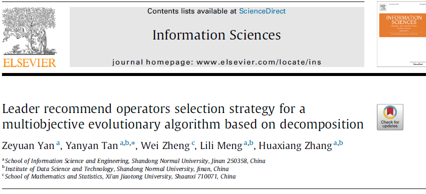

## Abstract

> 把进化过程分为多个阶段，每个阶段分为两部分
> Part1使用子种群估计算子的性能
> Part2使用Part1中性能最佳的算子，验证估计的结果。
>

第一阶段的对自种群的尝试会不会拖慢整体的效果，假设有一个特别好的算子，很多交叉的算子。

建立了re-selection mechanism在不影响性能的前提下为MOED/D找到合适的算子。

## Background Konwledge

与论文相关的一些背景知识

## Proposed method

part1为了评估算子的性能，我们需要预先分配一些个体给每个算子，以找到最适合当前情况的算子，但这时较差的算子会占用计算资源，此时会有两个冲突的目标：分配的资源越多，对算子的评估越准确，但是也会浪费一部分计算资源。

为了解决在part1中算子评估阶段消耗太多计算资源的问题，本文设计了"**re-election rule**"。

1. 当part2阶段计算的实际AFIR和part1计算的误差在可接受范围内时，那么在下一阶段不执行part1，直接用当前算子进化。
2. 当实际AFIR小于下界时，下一阶段重新执行part1。
3. 当真实AFIR大于上届时，表明part1的估计过于保守，将part1中对最佳算子的估计MAFIR更新为真实AFIR。

使用FIR作为算子的质量评估标准。

$$
F I R_{k, t}=\frac{g^{t e}\left(x^{k} \mid \lambda^{k}, z^{*}\right)-g^{t e}\left(\text { Child } \mid \lambda^{k}, z^{*}\right)}{g^{t e}\left(x^{k} \mid \lambda^{k}, z^{*}\right)}
$$

在part1中个体是随机分配给算子的吗??   L个个体按顺序分配给所有的算子。

## Discussion

讨论一下启发和不足