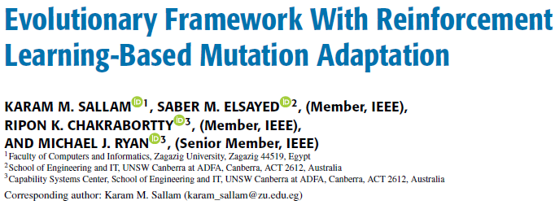
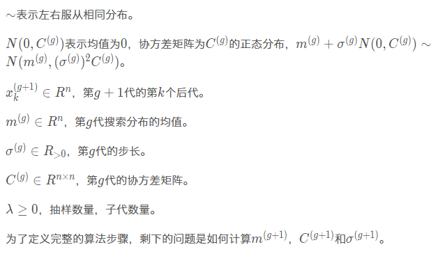
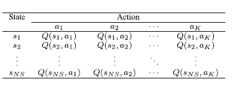

## Abstract

> This research proposes an improved optimization framework that uses the benefits of multiple algorithms, namely, a multi-operator differential evolution algorithm and a covariance matrix adaptation evolution strategy.
>
> 多算子差分进化算法和协方差矩阵自适应策略
>

## Background Konwledge

### Covariance matrix adaptation evolution strategy (CMA-ES)

对多元高斯分布进行采样得到新解，使用其中较好的解更新高斯分布的参数。

与方差(一个变量与总体的误差)不同，协方差用于衡量两个变量的总体误差

> 如果两个[变量](https://baike.baidu.com/item/%E5%8F%98%E9%87%8F/5271)的变化趋势一致，也就是说如果其中一个大于自身的期望值，另外一个也大于自身的期望值，那么两个变量之间的协方差就是正值。 如果两个变量的变化趋势相反，即其中一个大于自身的期望值，另外一个却小于自身的期望值，那么两个变量之间的协方差就是负值。
>

$$
\begin{aligned}
\operatorname{Cov}(X, Y) &=E[(X-E[X])(Y-E[Y])] \\
&=E[X Y]-2 E[Y] E[X]+E[X] E[Y] \\
&=E[X Y]-E[X] E[Y]
\end{aligned}
$$

对多元高斯分布进行采样得到新解，使用其中较好的解更新高斯分布的参数。

产生解的公式：

$$
x_{k}^{(g+1)} \sim m^{(g)}+\sigma^{(g)} N\left(0, C^{(g)}\right)
$$

$m^{g+1}$通过从种群中选择$\mu$个样本计算带权均值得到。

$$
m^{(g+1)}=\sum_{i=1}^{\mu} w_{i} x_{i: \lambda}^{(g+1)}
$$

权值和为1$\sum_{i=1}^{\mu} w_{i}=1, \quad w_{1} \geq w_{2} \geq \ldots \geq w_{\mu}>0$

自适应协方差矩阵也是通过$\mu$个被选择的样本加权计算的

$$
C_{\mu}^{(g+1)}=\sum_{i=1}^{\mu} w_{i}\left(\boldsymbol{x}_{i: \lambda}^{(g+1)}-\boldsymbol{m}^{(g)}\right)\left(\boldsymbol{x}_{i: \lambda}^{(g+1)}-\boldsymbol{m}^{(g)}\right)^{\top}
$$

步长更新公式：

$$
\sigma=\sigma \times\left(1-\frac{F E S}{F E S_{\max }}\right)
$$

艹，看不懂！！！！！！！！！！公式多的要死

### MARL

本身是用强化学习做算子选择，有两个算子，使用Q-learning的方法，使用分布性和质量表示状态，分布性用决策空间的方差表示。

$$
D i v^{t}=\sqrt{\frac{1}{N P} \sum_{i=1}^{N P}\left(x_{i, j}^{t}-\bar{x}_{i, j}\right)^{2}}
$$

质量用来自和最优质的比较

$$
I C_{k}^{t}=\frac{|fit^* - fit^{best}_{t,k}|}{f i t_{t-1, k}^{\text {best }}}
$$

**state**是分布性和质量组成的二元组

$$
s=\left[\frac{D i v^{t}}{D i v^{0}}, \frac{I C^{t}}{I C^{0}}\right]
$$

为了用Q-learning学习，我们还需要定义动作和reward。

**action**有三种，使用第一个算子，使用第二个算子和分成两个子种群，分别应用两个算子。

奖励很简单，就是子代比父代好的个数。

将状态空间离散之后可以有Q-table，之后使用Q-learning的方法更新Q-table。

$$
Q(S, A)=Q(S, A)+\alpha\left(R+\gamma \max  Q\left(S^{\prime}, A^\prime \right)-Q(S, A)\right)
$$

$$
Q(S, A)= (1-\alpha) Q(S, A)+\alpha\left(R+\gamma \max  Q\left(S^{\prime}, A^\prime \right)\right)
$$

## Questions

epoch：运行一轮
cycle：CS个epochs

## Proposed method

> 本文将种群分成两个子种群，每个子种群分别用不同的算法进化MARL和CMA-ES，两个种群之间的交互就是information sharing，初始定义两个算法的概率为1，每CS epochs更新prob1和prob2，每两个CS重置prob1 prob2。
>
> 当$FES \geq 0.75 \times MAX_{FES}$ 运行SQP。
>

### information sharing

用好种群里最好的替换差种群里最差的

### 种群减少

前期为了探索，种群可以大点，后期接近收敛了，种群就可以减小。

$$
N P_{1, t+1}=\operatorname{round}\left[\left(\frac{N P_{1}^{m i n}-N P_{1}^{i n i t}}{M A X_{F E S}}\right) \times F E S+N P_{1}^{i n i t}\right]
$$

### 更新算法应用概率

根据种群的多样性和质量更新算法的应用概率，

多样性用个体相对于最优个体的平均偏差表示：

$$
D_{C S, a l g}=\frac{1}{N P_{\text {alg }}}\left(\sum_{i=1}^{N P_{\text {alg }}} \operatorname{dis}\left(\vec{x}_{C S, \text { alg }, i}-\overrightarrow{x_{C S}}^{\text {best }}\right)\right)
$$

计算某个算法的偏差占比：

$$
D R_{C S, a l g}=\frac{D_{C S, a l g}}{\sum_{a l g=1}^{2} D_{C S, a l g}}, \quad \forall a l g=1,2
$$

质量也很迷，这样设计真的有效果吗

$$
Q R_{\text {alg }}=\frac{f\left(x_{C S, a l g}^{\text {best }}\right)}{\sum_{a l g=1}^{2} f\left(x_{C S, a l g}^{\text {best }}\right)}
$$

由于分布性越大越好，目标函数越小越好，所以简单聚合一下

$$
I R V_{\text {alg }}=\left(1-Q R_{\text {alg }}\right)+D R_{\text {alg }}
$$

根据聚合的结果更新选择概率

$$
\begin{array}{r}
\operatorname{Prob}_{a l g}=\max \left(0.1, \min \left(0.9, \frac{I R V_{a l g}}{\sum_{a l g=1}^{2} I R V_{a l g}}\right)\right), \\
\quad a \lg =1,2
\end{array}
$$

### SQP

sequential quadratic programming  序列二次规划

### MARLwCMA

**符号定义**

| 符号       | 定义           |
| ---------- | -------------- |
| NS         | 状态数         |
| K          | 动作数         |
| FES        | 评价次数       |
| NP         | 种群大小       |
| $Prob_{alg}$ | 算法的应用概率 |

**算法流程**

* 有MARL和CMA两个算法，初始时设置每个算法应用概率是1，Q-table=0，将种群分成两个子种群分别应用不同的算法
* 每CS个epochs称为一轮(cycle)，每一轮结束更新算法的应用概率，根据收敛级别的性能。
* 在每一轮结束时除了更新算法的应用概率，还会有information sharing

## Discussion

讨论一下启发和不足